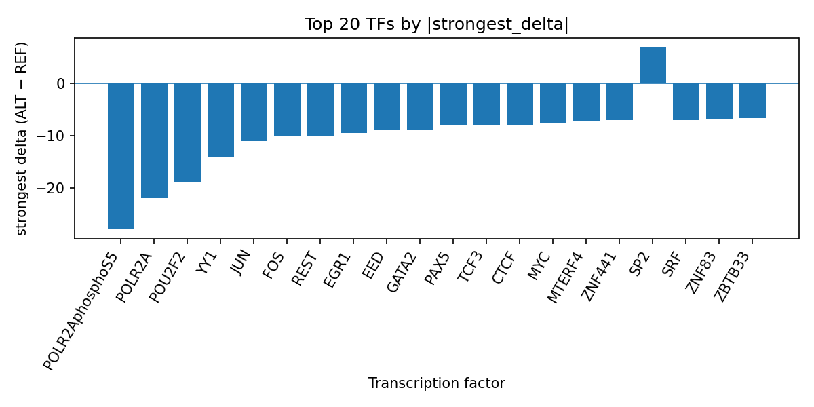

# Computational Prioritization of rs3129891 for AlphaGenome-Predicted TF ChIP-seq Changes in ACPA-positive Rheumatoid Arthritis

*Author: snv-tf-researcher*

## Abstract

ACPA-positive rheumatoid arthritis is a seropositive rheumatoid arthritis subtype with distinct clinical and molecular features reported across genetic, epigenetic, and biomarker studies [1-8]. Here, we summarize computational AlphaGenome TF ChIP-seq predictions for the candidate variant rs3129891 (chr6:32447303 G>A), selected by effect size, and integrate these predictions with literature on ACPA-positive rheumatoid arthritis. The variant was annotated as a downstream gene, intronic, and non-coding transcript variant, with no nearest genes provided. AlphaGenome predictions suggested predominantly reduced TF ChIP-seq signal for multiple factors, most notably POLR2AphosphoS5, POLR2A, POU2F2, YY1, JUN, FOS, REST, EGR1, and CTCF. These results prioritize rs3129891 for follow-up as a potential regulatory candidate, while remaining computational predictions that require experimental validation.

## Introduction

ACPA-positive rheumatoid arthritis is a biologically important rheumatoid arthritis subgroup that has been associated with distinct genetic and clinical patterns. Prior studies in ACPA-positive RA have reported associations in the HLA region and beyond, including HLA-DRB1 amino acid positions, HLA-DQB1*03:02, HLA-DOA, SPAG16, and variants emerging from genome-wide or sequence-based studies [9-13]. Broader seropositive RA analyses also suggest that genetic risk architecture differs between seropositive and seronegative disease and may be enriched for signaling pathways relevant to immune regulation [14]. In addition, multiple recent studies indicate that ACPA status can stratify disease burden, treatment response, progression, and molecular phenotypes [15-24].

Transcriptome, methylome, and multi-omic studies further support heterogeneity within ACPA-positive disease. Reported findings include differential DNA methylation in early ACPA-positive RA, methylation differences in ACPA-positive individuals, and blood proteomic/metabolomic signatures that differ by ACPA status [25-27]. These observations are consistent with a disease subtype that may have distinct regulatory biology and may benefit from locus-level prioritization of non-coding variants.

In this manuscript, we present an AlphaGenome-based interpretation of rs3129891, a candidate variant selected by effect size for ACPA-positive rheumatoid arthritis. AlphaGenome outputs are computational predictions, not experimental measurements; therefore, the variant should be considered a prioritized hypothesis rather than validated mechanism. The goal is to connect the run folder outputs, including `top_tf_effects.tsv`, to a concise literature-aware interpretation suitable for further study.

**Figure 1.** End-to-end workflow used in this run, including disease and variant retrieval, effect-size-based candidate selection, consequence annotation, AlphaGenome TF ChIP-seq prediction, TF-level summarization, literature retrieval, and manuscript generation. The workflow links the computational outputs to the run folder resources used for reporting.

## Methods

The candidate SNV rs3129891 (chr6:32447303 G>A) was provided as the focal variant for ACPA-positive rheumatoid arthritis, with a reported p value of 2 × 10^-9 and absolute log odds ratio effect size of 0.9162907318741551. The variant annotation included downstream gene variant, intron variant, and non-coding transcript variant consequences, and no nearest genes were listed.

The variant was evaluated with AlphaGenome for TF ChIP-seq impact prediction. These AlphaGenome outputs are computational predictions and not direct biochemical measurements. TF-level summaries were derived from the provided results table and interpreted at the transcription factor level by aggregating track-level deltas. The run folder reference `top_tf_effects.tsv` is part of the reporting context and is used here as the source of the summarized TF effects.

A focused PubMed-based literature list supplied in the input was used for contextual interpretation. Citations were restricted to records in that list. No external literature was added.

## Results

AlphaGenome predicted a predominantly inhibitory pattern across the top TFs associated with rs3129891. The strongest predicted effect was observed for POLR2AphosphoS5 in GM12878, with a delta of -28.0 across 26 tracks, and POLR2A in GM12878 with a delta of -22.0 across 44 tracks. Additional prominent predicted inhibitory effects included POU2F2, YY1, JUN, FOS, REST, EGR1, EED, GATA2, TCF3, CTCF, PAX5, MYC, MTERF4, ZNF441, SRF, ZNF83, ZBTB33, HNF1B, USF2, NFAT5, TIGD6, ZNF143, BRF2, MEIS2, TBX2, ZBTB26, and CEBPD. One TF, SP2, showed a positive predicted delta. The full TF prioritization is summarized in `top_tf_effects.tsv`, and the track-level prediction pattern is visualized below (Figure 2).

**Figure 2.** Top transcription factors at rs3129891 ranked by the absolute predicted ALT-versus-REF ChIP-seq delta from AlphaGenome. Negative values indicate predicted inhibition and positive values indicate predicted promotion; the strongest signed delta per TF is shown.

The literature context supports the relevance of ACPA-positive RA as a subgroup with distinct genetic and clinical features. Prior reports identified ACPA-positive associations in HLA and non-HLA loci, including HLA-DRB1, HLA-DQB1*03:02, HLA-DOA, SPAG16, and sequence variants with strong effects in seropositive disease [9-14]. Multiple studies also indicate that ACPA status is associated with differences in disease burden, radiographic progression, treatment response, and multi-omic signatures [15-27].

## Discussion

The AlphaGenome predictions for rs3129891 suggest a regulatory shift characterized mainly by reduced ChIP-seq signal across several transcription-related factors, including POLR2AphosphoS5 and POLR2A, along with multiple immune- and chromatin-associated TFs. In the context of ACPA-positive rheumatoid arthritis, this pattern may prioritize rs3129891 as a candidate regulatory variant worthy of follow-up. The result is consistent with prior evidence that ACPA-positive RA has a distinct genetic architecture and may involve variant-specific regulatory biology [9-14].

The computational predictions are also directionally compatible with the broader observation that ACPA-positive RA shows molecular stratification across epigenetic, proteomic, and clinical axes [15-27]. However, because AlphaGenome outputs are predictions rather than measurements, these data cannot establish allele-specific binding or regulatory function. Experimental assays will be required to determine whether the predicted TF changes reflect true binding differences and whether they relate to disease-relevant cell states.

## Limitations

This analysis is limited by several factors. First, the candidate variant was selected by effect size, and therefore may be in linkage disequilibrium with the true causal variant rather than being causal itself. Second, AlphaGenome provides computational predictions of TF ChIP-seq signal and does not directly measure TF binding or gene regulation. Third, the provided data do not identify a nearest gene, and the variant annotation is non-coding, which limits mechanistic interpretation. Fourth, the literature context is restricted to the provided PubMed records, and no external sources were used. Fifth, the present report does not include experimental validation; such validation is required before any biological or clinical inference can be made.

## References

1. Kremer P, Haase I, Richter J, et al. A new therapeutic frontier: CD19-targeting CAR-T cell therapy in rheumatoid arthritis: a concise report. Rheumatology (Oxford, England). 2026. PMID: 41984818. doi:10.1093/rheumatology/keag195

2. Nurgaziyev M, Kozhakhmetov S, Issilbayeva A, et al. Gut microbiome differences by serostatus in rheumatoid arthritis: a systematic review. Front Immunol. 2026;17:1722255. PMID: 41958652. doi:10.3389/fimmu.2026.1722255

3. Karpouzas GA, Pascual-Ramos V, Gonzalez-Gay MA, et al. Sex and anticitrullinated protein antibodies modify the relationship between inflammation and cardiovascular risk in rheumatoid arthritis. RMD Open. 2026;12(1). PMID: 41629127. doi:10.1136/rmdopen-2025-006420

4. Itoh K, Tsutani H, Otsuki N, et al. Anti-citrullinated Protein Antibody-positive Arthralgia Associated with an L110P-E148Q Double Heterozygote: A Case-based Review. Intern Med (Tokyo, Japan). 2026. PMID: 41621873. doi:10.2169/internalmedicine.6634-25

5. Navarrete M, Trivedi K, Klenke C, et al. The rheumatoid arthritis citrullinome is enriched in antigenic complement proteins. Arthritis Res Ther. 2026;28(1). PMID: 41593658. doi:10.1186/s13075-026-03750-9

6. Cope AP, Jasenecova M, Vasconcelos JC, et al. Long-term outcomes of abatacept in individuals at risk of developing rheumatoid arthritis (ALTO): a randomised, double-blind, placebo-controlled trial. Lancet Rheumatol. 2026;8(3):e171-e180. PMID: 41576971. doi:10.1016/S2665-9913(25)00371-6

7. Fischinger C, Popp F, Reichenberger F, et al. Early detection of RA-ILD-A novel screening protocol with pulmonary function testing and lung ultrasound: A monocentric cohort study. Z Rheumatol. 2026;85(3):200-213. PMID: 41575561. doi:10.1007/s00393-025-01775-0

8. Claassen S, Dumoulin QA, Glas HK, et al. Which arthralgia patients benefit most in reduction of subclinical joint inflammation by methotrexate treatment: results from the TREAT EARLIER trial. RMD Open. 2026;12(1). PMID: 41558803. doi:10.1136/rmdopen-2025-006102

9. Bergstra SA, Verstappen M, Niemantsverdriet E, et al. Predictors of achieving clinical remission in ACPA-positive RA-patients treated with abatacept and methotrexate and methotrexate monotherapy: a post-hoc analysis of the AVERT and AVERT-II trials. Semin Arthritis Rheum. 2026;77:152917. PMID: 41544399. doi:10.1016/j.semarthrit.2026.152917

10. Ton DA, van Dijk BT, van Steenbergen HW, van der Helm-van Mil AHM. Work-related physical strain as novel risk factor for the severity of joint inflammation at diagnosis of anti-citrullinated protein antibodies-positive rheumatoid arthritis. Rheumatology (Oxford, England). 2026;65(2). PMID: 41507089. doi:10.1093/rheumatology/keag009

11. Saleh R, Sundberg E, Hansson M, et al. Presence and reactivities of antibodies directed to citrullinated peptides in a Swedish JIA cohort. Pediatr Rheumatol Online J. 2025;23(1):129. PMID: 41275307. doi:10.1186/s12969-025-01177-1

12. Hur B, Gupta VK, Oh M, et al. Integrative multi-omic profiling in blood reveals distinct immune and metabolic signatures between ACPA-negative and ACPA-positive rheumatoid arthritis. Front Immunol. 2025;16:1667662. PMID: 41235232. doi:10.3389/fimmu.2025.1667662

13. Mole EN, Tarassi K, Tsirogianni A, et al. Impact of HLA-DRB1 SE, anti-citrullinated protein antibodies and smoking on radiographic outcome in Greek patients with Rheumatoid Arthritis. BMC Rheumatol. 2025;9(1):128. PMID: 41174822. doi:10.1186/s41927-025-00579-8

14. Nozaki Y, Murata K, Onishi A, et al. Clinical efficacy of JAK inhibitors for RA patients with poor-prognosis factors: the ANSWER cohort study. Rheumatology (Oxford, England). 2026;65(1). PMID: 41159415. doi:10.1093/rheumatology/keaf552

15. Chen Y, Wu J, Dong Q, Li J. Association of ABCB1 and MTHFR genetic polymorphisms with rheumatoid arthritis susceptibility in a Chinese population. Front Med. 2025;12:1660473. PMID: 41140690. doi:10.3389/fmed.2025.1660473

16. Maarseveen TD, Maurits MP, Coletto LA, et al. Location and amount of joint involvement differentiates rheumatoid arthritis into different clinical subsets. NPJ Digit Med. 2025;8(1):623. PMID: 41131344. doi:10.1038/s41746-025-01997-1

17. Wipfler K, Baker JF, Sayles H, et al. Burden of Disease and Drug Response for Patients With Rheumatoid Arthritis by Shared Epitope and Anticitrullinated Protein Antibody Status. J Rheumatol. 2026;53(2):144-151. PMID: 41093640. doi:10.3899/jrheum.2025-0445

18. Martinsson K, Åhammar S, Cîrciumaru A, et al. Serum test for secretory component-containing anti-citrullinated protein antibodies as a novel prognostic tool in rheumatoid arthritis at-risk subjects. J Transl Autoimmun. 2025;11:100317. PMID: 41050553. doi:10.1016/j.jtauto.2025.100317

19. Nakaphan P, Pajareya P, Jansem P, et al. Diagnostic accuracy of anti-carbamylated protein antibodies in rheumatoid arthritis: a systematic review and meta-analysis. Rheumatol Int. 2025;45(10):232. PMID: 40982032. doi:10.1007/s00296-025-05992-3

20. Tao SS, Wei HF, Xu SZ, et al. LncRNA MEG3 as a biomarker and therapeutic target in rheumatoid arthritis: Insights from gene polymorphisms, expression patterns, and functional mechanisms. Clin Immunol. 2025;281:110590. PMID: 40885371. doi:10.1016/j.clim.2025.110590

21. Svendsen AJ, Mengel-From J, Junker P, et al. Differential DNA methylation patterns in whole blood from ACPA-positive patients with DMARD-naïve rheumatoid arthritis at clinical disease onset. Front Immunol. 2025;16:1488161. PMID: 40761796. doi:10.3389/fimmu.2025.1488161

22. Leong KP, Yong MY, Koh ET, et al. Exome Sequencing of Chinese Patients With Anticitrullinated Protein Antibody-Positive Rheumatoid Arthritis in Singapore. J Rheumatol. 2025;52(4):334-343. PMID: 39617413. doi:10.3899/jrheum.2024-0140

23. Lin Q, Zhou B, Song X, et al. Genetic variant in SPAG16 is associated with the susceptibility of ACPA-positive rheumatoid arthritis possibly via regulation of MMP-3. J Orthop Surg Res. 2022;17(1):511. PMID: 36434627. doi:10.1186/s13018-022-03405-w

24. Saevarsdottir S, Stefansdottir L, Sulem P, et al. Multiomics analysis of rheumatoid arthritis yields sequence variants that have large effects on risk of the seropositive subset. Ann Rheum Dis. 2022;81(8):1085-1095. PMID: 35470158. doi:10.1136/annrheumdis-2021-221754

25. Honda S, Ikari K, Yano K, et al. Association of Polygenic Risk Scores With Radiographic Progression in Patients With Rheumatoid Arthritis. Arthritis Rheumatol. 2022;74(5):791-800. PMID: 35048562. doi:10.1002/art.42051

26. Zeng Y, Zhao K, Oros Klein K, et al. Thousands of CpGs Show DNA Methylation Differences in ACPA-Positive Individuals. Genes. 2021;12(9). PMID: 34573331. doi:10.3390/genes12091349

27. Tan LK, Too CL, Diaz-Gallo LM, et al. The spectrum of association in HLA region with rheumatoid arthritis in a diverse Asian population: evidence from the MyEIRA case-control study. Arthritis Res Ther. 2021;23(1):46. PMID: 33514426. doi:10.1186/s13075-021-02431-z

28. Gomez-Cabrero D, Almgren M, Sjöholm LK, et al. High-specificity bioinformatics framework for epigenomic profiling of discordant twins reveals specific and shared markers for ACPA and ACPA-positive rheumatoid arthritis. Genome Med. 2016;8(1):124. PMID: 27876072.

29. Leng RX, Liu J, Yang XK, et al. Evidence of epistatic interaction between DPP4 and CCR6 in patients with rheumatoid arthritis. Rheumatology (Oxford). 2016;55(12):2230-2236. PMID: 27587881.

30. Okada Y, Suzuki A, Ikari K, et al. Contribution of a Non-classical HLA Gene, HLA-DOA, to the Risk of Rheumatoid Arthritis. Am J Hum Genet. 2016;99(2):366-374. PMID: 27486778. doi:10.1016/j.ajhg.2016.06.019