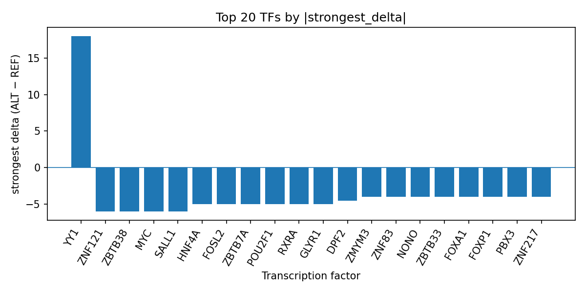

# AlphaGenome prioritization of rs116066418 for acute respiratory distress syndrome: predicted transcription factor binding perturbations

*Author: snv-tf-researcher*

## Abstract

Acute respiratory distress syndrome (ARDS) is a severe inflammatory lung syndrome with substantial critical care burden [1-4]. Here, we analyzed the intergenic GWAS candidate variant rs116066418 (chr5:75293073, T>A; risk allele rs116066418-A; p=2×10^-7; effect size 0.737) for predicted transcription factor (TF) ChIP-seq perturbations using AlphaGenome, which provides computational predictions rather than experimental measurements. The variant was prioritized by effect size and should therefore be interpreted as a candidate marker that may be in linkage disequilibrium with the true causal variant. Across AlphaGenome TF ChIP-seq tracks, the strongest predicted increases involved YY1, whereas the strongest predicted decreases involved MYC, SALL1, ZNF121, ZBTB38, GLYR1, HNF4A, FOSL2, ZBTB7A, POU2F1, RXRA, DPF2, STAG1, ATF7, ZNF527, DNMT1, SMAD4, SMAD1, ZNF230, SKIL, KDM2A, MAX, USF1, ZFX, ZNF83, NONO, ZBTB33, and FOXA1. These predictions suggest that rs116066418 may alter the local regulatory context at a noncoding locus relevant to ARDS-relevant biology, but experimental validation is required.

## Introduction

ARDS is a clinically important syndrome that remains associated with substantial morbidity and mortality in critical care settings [1-4]. Recent studies in ARDS have continued to emphasize heterogeneity in clinical trajectories and the need for improved risk stratification and mechanistic understanding [1-4]. In parallel, GWAS-based studies have identified noncoding loci associated with ARDS susceptibility, including loci prioritized through fine mapping and follow-up analyses [5,6]. Because many GWAS variants are intergenic or noncoding, computational interpretation of their regulatory potential can help prioritize variants for downstream study, provided that such predictions are treated as hypothesis-generating rather than definitive evidence.

Transcription factor binding perturbation is one plausible route by which a noncoding variant may influence gene regulation. AlphaGenome can be used to estimate allele-specific changes in TF ChIP-seq signal from sequence context, but these outputs are computational predictions and do not constitute direct measurements of TF occupancy. Accordingly, we applied AlphaGenome to rs116066418, an intergenic ARDS-associated candidate variant selected by effect size, to summarize predicted TF-level consequences and to prioritize possible regulatory hypotheses for future validation.

## Methods

### Variant selection and annotation

The candidate variant rs116066418 (chr5:75293073, T>A) was provided as an intergenic GWAS association for ARDS with reported effect size 0.737 and p=2×10^-7. The variant was selected by effect size and may be in linkage disequilibrium with the true causal variant. No nearest genes were provided. Variant consequence annotation indicated an intergenic variant.

### AlphaGenome prediction workflow

AlphaGenome was used to generate predicted allele-specific TF ChIP-seq effects for the reference and alternate alleles surrounding rs116066418. These outputs are computational predictions, not experimental binding measurements. The analysis workflow included disease and association retrieval, effect-size ranking and SNV filtering, consequence annotation, reference-allele checking, AlphaGenome TF ChIP-seq prediction, TF-level summarization, literature retrieval, and manuscript synthesis (Figure 1).

**Figure 1.** End-to-end analysis workflow used for this ARDS candidate variant. The pipeline links GWAS-derived variant prioritization with computational AlphaGenome TF ChIP-seq prediction, summary of TF-level effects, and literature-supported manuscript drafting.

### TF-level summarization

Predicted TF ChIP-seq tracks were aggregated by transcription factor name. For each TF, the number of tracks, strongest track, strongest biosample, strongest signed delta, maximum absolute delta, mean delta, median delta, and counts of promoted versus inhibited tracks were summarized from the run outputs, including `top_tf_effects.tsv` referenced in the run folder.

### Literature review

PubMed records supplied in the input literature list were used to support background statements about ARDS and related computational or clinical contexts [1-4]. No external literature beyond the provided list was used.

## Results

AlphaGenome predictions prioritized YY1 as the top TF-level signal at rs116066418, with all 10 tracks showing predicted promotion and the strongest delta observed in H1 cells (strongest delta 18.0; mean delta 7.7; median delta 7.5). MYC was the next strongest TF-level hit, but with an overall inhibitory direction across the majority of tracks (strongest delta -6.0; mean delta -1.375). Additional predicted inhibitory TFs included SALL1, ZNF121, ZBTB38, GLYR1, HNF4A, FOSL2, ZBTB7A, POU2F1, RXRA, DPF2, STAG1, ATF7, ZNF527, DNMT1, SMAD4, SMAD1, ZNF230, SKIL, KDM2A, MAX, USF1, ZFX, ZNF83, NONO, ZBTB33, and FOXA1. Among these, several TFs showed consistent negative deltas across multiple tracks, whereas a smaller subset showed mixed or positive effects.

The overall pattern is consistent with a noncoding locus that may perturb a multi-TF regulatory neighborhood rather than a single isolated factor. In particular, the strong predicted promotion of YY1 together with predicted inhibition of MYC and multiple other TFs suggests that rs116066418 may alter local regulatory balance in a direction that warrants follow-up. The ranked TF summary is shown in `top_tf_effects.tsv` in the run outputs and visualized in the bar plot below (Figure 2).

**Figure 2.** Top transcription factors predicted by AlphaGenome to be affected by rs116066418 in ARDS. Bars show the strongest signed ALT-versus-REF delta per TF across ChIP-seq tracks, with positive values indicating predicted promotion and negative values indicating predicted inhibition.

## Discussion

This analysis prioritizes rs116066418 as a noncoding ARDS-associated candidate with predicted allele-specific effects on multiple TF ChIP-seq tracks. The prominence of YY1 in the prediction output suggests a potentially important regulatory consequence, while predicted inhibition of MYC and several other TFs suggests broader transcriptional remodeling at the locus. Because AlphaGenome provides computational predictions rather than experimental measurements, these results should be interpreted as hypotheses that require experimental validation.

The ARDS literature provided with this run underscores that the syndrome remains clinically heterogeneous and that improved predictive and mechanistic frameworks are needed [1-4]. Recent GWAS work has also shown that genetic association signals in ARDS can be prioritized through fine mapping and functional annotation, supporting the use of sequence-based prediction to rank candidate noncoding variants for follow-up [5,6]. In that context, the present result suggests that rs116066418 could represent a regulatory locus of interest for future studies of ARDS biology.

However, the present findings do not establish causality. The observed variant was selected by effect size and may be in linkage disequilibrium with the true causal variant. In addition, the predictions were derived from computational TF ChIP-seq tracks rather than direct biochemical assays or in vivo measurements. Experimental assays will therefore be necessary to determine whether the predicted TF changes are reproducible and whether they are relevant to ARDS-relevant cellular contexts.

## Limitations

This study has several limitations. First, the variant was selected from the provided GWAS data by effect size and may be in linkage disequilibrium with the true causal variant. Second, AlphaGenome outputs are computational predictions, not experimental measurements, and therefore cannot establish TF occupancy or functional consequence on their own. Third, no nearest genes were provided for the candidate variant, which limits gene-level interpretation. Fourth, the present analysis is restricted to the provided literature list and cannot incorporate external evidence beyond those sources. Finally, experimental validation is required to test whether the predicted TF perturbations translate into regulatory effects in relevant biological systems.

## References

1. Hassaan N, Schmidt T, Söderlund Z, Kalafatis D, Pålman LI, Scheding S, et al. IL-1β modulates inflammatory response of human bone marrow-derived MSCs and neutrophil recruitment in vitro via NF-kB-associated signaling. Stem Cell Res Ther. 2026;17(1):. PMID: 42032676. doi:10.1186/s13287-026-05029-x

2. Chu Y, Wang J, Luo P, Chen H, Zhang Z, Zhang J, et al. CT-based AI system for quantitative and integrated management of acute respiratory distress syndrome in critical care. NPJ Digit Med. 2026;: . PMID: 42032151. doi:10.1038/s41746-026-02648-9

3. Bispo-de-Andrade MA, Ramos-Silva É, Marques-Cavalcante RC, Vieira-de-Oliveira D, de Cássia Almeida-Vieira R, Santana-Santos E. Utility of the Shock Index at ICU admission as a prognostic tool in patients with COVID-19-related ARDS: Implications for nursing practice. Enfermeria Intensiva. 2026;37(2):500591. PMID: 42030583. doi:10.1016/j.enfie.2026.500591

4. Han Q, Jiang S, Chang Y, Peng B, Zhang S, Chen W, et al. Necroptosis in Lung Diseases: Mechanism and Therapeutic Prospects. J Med Chem. 2026;: . PMID: 42030446. doi:10.1021/acs.jmedchem.5c03815

5. Guillen-Guio B, Suarez-Pajes E, Tosco-Herrera E, Hernandez-Beeftink T, Lorenzo-Salazar JM, Chang D, et al. Genome-wide association study of susceptibility to acute respiratory distress syndrome. EBioMedicine. 2025;120:105951. PMID: 41033104. doi:10.1016/j.ebiom.2025.105951

6. Liu Q, Yin C, Fan L, Li D, Wang T. Integrated Bioinformatic Identification and Experimental Validation Reveal That Aging Exacerbates ARDS Through MAPK14/ADM/MAPK8 Axis. J Inflamm Res. 2026;19:573372. PMID: 42022266. doi:10.2147/JIR.S573372