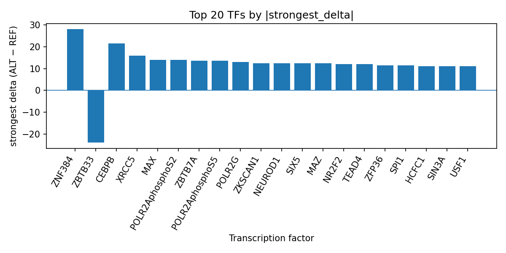

# AlphaGenome-predicted transcription factor perturbations at rs1110056, an intronic variant associated with age of onset of multiple sclerosis

*Author: snv-tf-researcher*

## Abstract

We analyzed rs1110056, an intronic SNV on chromosome 11 selected for its reported GWAS effect size for age of onset of multiple sclerosis. Using AlphaGenome TF ChIP-seq predictions, the ALT allele was prioritized for potential regulatory impact on multiple transcription factors, with the largest predicted positive effects observed for ZNF384, CEBPB, MAX, POLR2AphosphoS2, and POLR2AphosphoS5, and a predicted inhibitory effect for ZBTB33. These computational predictions are consistent with a variant that may alter local transcription factor occupancy and thereby nominate regulatory hypotheses for follow-up. AlphaGenome outputs are computational predictions rather than experimental measurements, and experimental validation will be required to test the predicted effects. The variant was selected by effect size and may be in linkage disequilibrium with the true causal variant.

## Introduction

Multiple sclerosis (MS) is a complex inflammatory disease with clinically meaningful heterogeneity in age at onset, and age at onset has been used as a trait in prior genetic analyses [1,2]. Prior GWAS work in MS suggests that age at onset is influenced by inherited variation and that immune-related loci may contribute to this phenotype [1]. More broadly, genetic studies in MS have linked disease onset and severity to immune pathways, supporting the use of functional annotation to prioritize candidate variants for follow-up [2,3].

Here, we interrogated rs1110056, an intronic variant on chromosome 11 associated with age of onset of multiple sclerosis. Because noncoding variants may influence transcriptional regulation, we used AlphaGenome TF ChIP-seq prediction outputs to assess whether the alternate allele is predicted to alter binding of transcription factors. These outputs are computational predictions, not direct measurements, and therefore provide hypotheses rather than evidence of biological effect.

## Methods

We analyzed rs1110056 (chromosome 11:546988 C>G; risk allele rs1110056-T; p = 6×10^-6; abs_beta = 2.3427), which was annotated as an intron variant. No nearest genes were provided. The variant was selected by effect size from the provided run data and may be in linkage disequilibrium with the true causal variant.

AlphaGenome TF ChIP-seq predictions were used to compare ALT versus REF allele effects across transcription factor tracks. We summarized the top transcription factors by the number of affected tracks, strongest signed delta, mean delta, median delta, and direction of effect. The run-folder summary table in `top_tf_effects.tsv` underlies the ranked results reported below. AlphaGenome outputs are computational predictions and do not constitute experimental TF binding measurements.

The workflow used in this analysis is summarized in the pipeline overview (Figure 1).

**Figure 1.** Workflow overview for the SNV-to-transcription-factor prioritization pipeline. The figure shows GWAS-driven variant selection, consequence annotation and allele checking, AlphaGenome TF ChIP-seq prediction, TF-level summarization, literature retrieval, and manuscript synthesis.

## Results

The AlphaGenome predictions prioritized a small set of transcription factors with consistently positive ALT-allele deltas. ZNF384 showed the largest predicted effect overall, with 4 affected tracks and a strongest delta of 28.0 in K562 cells; all 4 tracks were promoted. CEBPB was also strongly promoted across 10 tracks, with a strongest delta of 21.5 and mean delta of 11.25. MAX, POLR2AphosphoS2, ZBTB7A, POLR2AphosphoS5, POLR2G, MAZ, SIX5, ZKSCAN1, NEUROD1, NR2F2, TEAD4, ZFP36, SPI1, YY1, ETS1, SMC3, EZH2, HCFC1, ZNF263, USF1, RBBP5, SIN3A, REST, TCF3, BHLHE40, and U2AF1 were also among the top predicted factors, with mostly promoted track-level effects. In contrast, ZBTB33 was the main factor with a predicted inhibitory direction, showing 5 affected tracks and a strongest delta of -24.0. These ranked outputs are consistent with the run summary recorded in `top_tf_effects.tsv`.

The top transcription-factor effects are displayed in Figure 2.

**Figure 2.** Top transcription factors predicted by AlphaGenome at rs1110056, ranked by the absolute signed ALT-vs-REF TF ChIP-seq delta. Positive bars indicate predicted promotion of binding, whereas negative bars indicate predicted inhibition.

## Discussion

The predicted TF perturbation pattern at rs1110056 suggests that this intronic MS onset-associated variant may influence local transcriptional regulation through multiple TFs rather than a single isolated factor. The prominence of ZNF384, CEBPB, MAX, and POLR2A-related tracks is consistent with a broad regulatory signal, while the inhibitory signal for ZBTB33 suggests that the same SNV may have directionally mixed effects across TF families. Because AlphaGenome provides computational predictions rather than experimental binding measurements, these findings should be interpreted as prioritization results that require orthogonal validation.

The choice of rs1110056 is compatible with prior MS genetic literature showing that age at onset can be genetically informed and that immune-related biology is relevant to onset-related traits [1,2]. More generally, prior MS studies have linked genetic variation to disease onset, severity, or age-related features, supporting the utility of functional follow-up for noncoding loci [2,3]. However, the present analysis does not establish a biological mechanism, and it does not determine whether the predicted TF changes are sufficient to affect MS onset.

## Limitations

This analysis has several limitations. First, rs1110056 was selected by effect size and may be in linkage disequilibrium with the true causal variant. Second, the available data are computational TF ChIP-seq predictions from AlphaGenome, not experimental measurements, so the predicted deltas cannot be interpreted as observed TF occupancy or as proof of regulatory activity. Third, the provided data do not include nearest genes, tissue-specific expression, or functional assays, limiting biological interpretation. Finally, no causal inference is claimed here, and experimental validation will be required to evaluate the predicted TF effects and their relevance to age of onset of multiple sclerosis.

## References

1. Misicka E, Huang Y, Loomis S, Sadhu N, Fisher E, Gafson A, et al. Adaptive and Innate Immunity Are Key Drivers of Age at Onset of Multiple Sclerosis. Neurology Genet. 2024;10(3):e200159. PMID: 38817245. doi:10.1212/NXG.0000000000200159

2. Giordano A, Clarelli F, Pignolet B, Mascia E, Sorosina M, Misra K, et al. Vitamin D affects the risk of disease activity in multiple sclerosis. J Neurol Neurosurg Psychiatry. 2025;96(2):170-176. PMID: 39004505. doi:10.1136/jnnp-2024-334062

3. Kreft KL, Uzochukwu E, Loveless S, Willis M, Wynford-Thomas R, Harding KE, et al. Relevance of Multiple Sclerosis Severity Genotype in Predicting Disease Course: A Real-World Cohort. Ann Neurol. 2024;95(3):459-470. PMID: 37974536. doi:10.1002/ana.26831