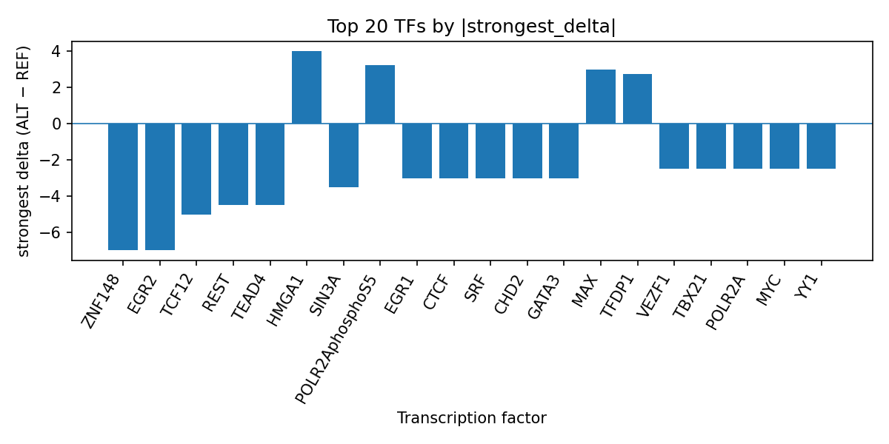

# Computational prioritization of rs549928751 as a putative transcription-factor regulatory variant in bone neoplasm

*Author: snv-tf-researcher*

## Abstract

We analyzed rs549928751 (2:141231758 C>T), an intronic GWAS candidate associated with bone neoplasm, using AlphaGenome transcription factor (TF) ChIP-seq prediction outputs. The variant had a reported effect size of 2.967 and p value of 3 × 10^-11. Computational TF profiling prioritized a predominantly inhibitory regulatory signature, with the strongest predicted decreases for ZNF148 and EGR2 (each strongest delta -7.0), followed by broad negative effects across several TFs including TCF12, REST, TEAD4, SIN3A, EGR1, CTCF, SRF, CHD2, GATA3, POLR2A, MYC, and YY1. A smaller set of TFs showed predicted increases, including HMGA1, POLR2AphosphoS5, MAX, TFDP1, SP1, JUND, FOXA1, and PBX3. These results suggest that rs549928751 may alter local regulatory grammar in a way that could prioritize TFs relevant to transcriptional control, but the outputs are computational predictions rather than experimental measurements. Experimental validation is required.

## Introduction

Bone neoplasms comprise a clinically diverse group of malignant and benign tumors, and recent literature continues to emphasize their diagnostic and biological heterogeneity [1-4]. GWAS and other genetic studies have been used to nominate inherited or germline-associated signals for bone-related phenotypes and malignancies, including bone and articular cartilage neoplasms [5-10]. However, statistical association alone does not identify the regulatory mechanisms by which a noncoding variant may act.

Noncoding variants can influence transcriptional regulation by altering TF binding motifs or local chromatin context, and computational predictors are increasingly used to prioritize such mechanisms for follow-up. In the present analysis, we applied AlphaGenome TF ChIP-seq predictions to rs549928751, an intronic GWAS candidate in bone neoplasm, to summarize predicted allele-dependent effects on TF binding. Because AlphaGenome produces in silico predictions rather than direct measurements, any inferred regulatory interpretation remains provisional and requires experimental testing.

## Methods

### Variant selection and annotation

The candidate variant rs549928751 (chromosome 2, position 141231758, C>T) was supplied as a bone neoplasm-associated GWAS signal with p value 3 × 10^-11 and effect size 2.967. The variant was annotated as an intron_variant. No nearest genes were provided.

### AlphaGenome TF ChIP-seq prediction analysis

AlphaGenome TF ChIP-seq predictions were used to estimate the effect of the C>T substitution on TF binding across available tracks. The analysis was summarized at the TF level by aggregating track-level predicted deltas and identifying the strongest signed effect per TF. These outputs are computational predictions, not experimental ChIP-seq measurements.

### Literature review

PubMed records provided in the run metadata were screened and used only for contextual discussion of bone neoplasm and related bone-tumor genetics. No external sources were added.

### Workflow overview

The end-to-end pipeline included GWAS disease and association retrieval, effect-size ranking and SNV filtering, consequence annotation, REF allele checking, AlphaGenome TF ChIP-seq prediction, TF-level summarization, PubMed literature search, and manuscript synthesis (Figure 1).

**Figure 1.** Workflow overview of the snv-tf-researcher pipeline used in this run. The figure summarizes input acquisition, variant prioritization, in silico TF binding prediction, literature retrieval, and manuscript assembly.

## Results

### Predicted TF-binding effects of rs549928751

The strongest predicted ALT-vs-REF TF ChIP-seq effect was a marked reduction in binding for ZNF148 and EGR2, each with strongest delta -7.0. Multiple additional TFs were also predicted to be inhibited, including TCF12, REST, TEAD4, SIN3A, EGR1, CTCF, SRF, CHD2, GATA3, POLR2A, MYC, YY1, POU2F2, TAF1, ZNF740, CREB1, MLLT1, TBX21, VEZF1, and RUNX3. A smaller number of TFs were predicted to show increased binding, including HMGA1, POLR2AphosphoS5, MAX, TFDP1, SP1, JUND, FOXA1, and PBX3. The full ranked summary is available in `top_tf_effects.tsv`, which records the TF-level aggregation used for this run.

The distribution of the strongest TF-level signed deltas is visualized in Figure 2, highlighting the predominance of inhibitory predictions alongside a smaller number of promoted TFs.

**Figure 2.** Top transcription factors at rs549928751 ranked by absolute predicted ALT-vs-REF binding delta from AlphaGenome TF ChIP-seq tracks. Negative bars denote predicted inhibition and positive bars denote predicted promotion, with the strongest per-TF delta shown.

### Interpretation of the TF summary

Among the prioritized TFs, ZNF148 and EGR2 had the largest predicted decreases, each supported by a single track with delta -7.0. Other TFs with notable inhibitory predictions included TCF12 and REST, whereas HMGA1 and POLR2AphosphoS5 were among the strongest predicted increases. The pattern is consistent with a regulatory perturbation that may alter the balance of TF occupancy at the variant locus rather than a unidirectional effect on all regulators.

## Discussion

The predicted TF signature at rs549928751 suggests that this intronic variant may be embedded in a regulatory element with broad TF sensitivity. The strongest predicted losses involved ZNF148 and EGR2, while additional predicted inhibition extended across TFs commonly used in ChIP-seq reference sets. Because these are computational predictions, they should be interpreted as hypothesis-generating rather than confirmatory evidence.

The bone neoplasm literature provided in the run metadata includes recent genetic and mechanistic studies focused on osteosarcoma and related bone malignancies [1,5-10]. These reports collectively reinforce that genetic architecture and molecular regulation are active areas of investigation in bone tumors [1,5-10]. In that context, a noncoding GWAS variant with a strong predicted TF-binding shift may prioritize a plausible regulatory mechanism for follow-up, especially when the association is statistically strong and the locus is intronic. However, no direct causal inference can be made from the present data.

Further, the literature list includes recent Mendelian randomization and association studies in bone and articular cartilage malignancies, as well as osteosarcoma biomarker analyses [5-10]. While these studies do not establish a mechanism for rs549928751 specifically, they illustrate that multiple layers of genomic evidence are being used to refine biological hypotheses in bone neoplasms [5-10]. The current AlphaGenome predictions are therefore best viewed as a computational prioritization layer that may help focus subsequent experiments.

## Limitations

This analysis is limited to one GWAS-selected candidate variant and one AlphaGenome prediction summary. The variant was selected by effect size and may be in linkage disequilibrium with the true causal variant, so the observed TF effects may not map to the actual functional signal. AlphaGenome outputs are computational predictions, not direct measurements, and experimental validation is required to confirm any TF-binding change or downstream regulatory consequence.

The literature context is also constrained by the provided PubMed list, which contains heterogeneous bone-neoplasm-related articles rather than studies specific to rs549928751. No gene-level annotation was provided for the variant, limiting mechanistic interpretation.

## References

1. Xu Y, Zhao X, Gao Y, Lian Y, He Y, Tao H, et al. [Glutamine metabolic reprogramming in regulating the occurrence and development of osteosarcoma]. Zhong nan da xue xue bao. Yi xue ban = Journal of Central South University. Medical sciences. 2025;50(12):2425-2437. PMID: 42033002. doi:10.11817/j.issn.1672-7347.2025.250321

2. Peng K, Zou L, Liu Y, Li B, Guo N, Mao P, et al. [Kaempferol in improving chemotherapy-induced myelosuppression: A scoping review]. Zhong nan da xue xue bao. Yi xue ban = Journal of Central South University. Medical sciences. 2025;50(12):2174-2185. PMID: 42032981. doi:10.11817/j.issn.1672-7347.2025.250476

3. Zhao Z, Li J, Wu S. Diagnostic and Treatment Strategies for Adult Non-Ossifying Fibromas: A Case Report and Literature Review. The American journal of case reports. 2026;27:e951665. PMID: 42030226. doi:10.12659/AJCR.951665

4. Kayastha SR, Pandey A, Lamichhane S, Thapa J, Parajuli B, Shrestha D. Epidemiological Characteristics of the Spine Tumors in a Single Tertiary Centre of Nepal. Kathmandu University medical journal (KUMJ). 2025;23(91):301-306. PMID: 42028761.

5. Peoples AR, Obón-Santacana M, Kim AE, Kawaguchi ES, Fu Y, Qu C, et al. Genetic risk factors modulate the association between physical activity and colorectal cancer. BMC medicine. 2026;24(1). PMID: 41645200. doi:10.1186/s12916-026-04675-5

6. Zhao L, Shen J, Zheng X, Yuan Q, Ye J. Plasma proteins and osteosarcoma: Mendelian randomization analysis and targeted therapeutic discovery. Medicine. 2025;104(49):e45704. PMID: 41366971. doi:10.1097/MD.0000000000045704

7. Liu C, Yu C, Wang W, Zhang H. Causal association between inflammatory markers and malignant neoplasms of bone and articular cartilage using Mendelian randomization. Discover oncology. 2025;16(1):2210. PMID: 41258622. doi:10.1007/s12672-025-04070-1

8. Zheng Z, Liao Z, Pang L, Xu Z, Zhu Y, Jia P, et al. MEF2C is a potential prognostic biomarker for osteosarcoma. Medicine. 2025;104(36):e44313. PMID: 40922352. doi:10.1097/MD.0000000000044313

9. Cordova-Delgado M, Scott EN, Rassekh SR, Loucks CM, Chang WC, Raack EJ, et al. Four Pharmacogenomic Variants Strongly Linked to Corticosteroid-Induced Avascular Necrosis in Children with Cancer. Journal of clinical pharmacology. 2025;65(12):1844-1854. PMID: 40709894. doi:10.1002/jcph.70084

10. Wang Z, Qu Q, Jiang R, Li Z, Ran S. The association between chronic liver disease and osteoporosis in East Asian populations: a bidirectional Mendelian randomization study. Aging clinical and experimental research. 2025;37(1):168. PMID: 40415161. doi:10.1007/s40520-025-03031-6