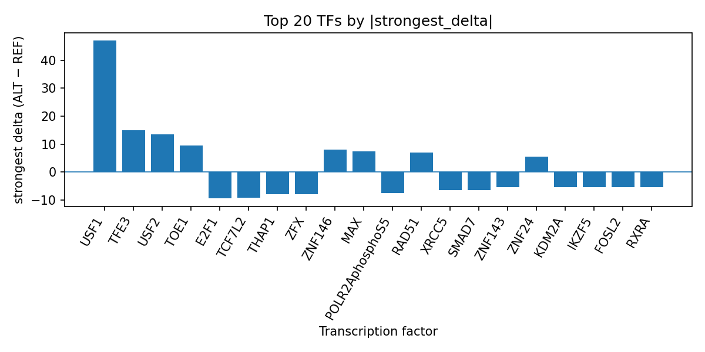

# Computational prioritization of rs76647377 for Buruli ulcer disease using AlphaGenome transcription factor ChIP-seq predictions

*Author: snv-tf-researcher*

## Abstract

Buruli ulcer disease is a neglected tropical skin disease caused by *Mycobacterium ulcerans* and characterized by severe necrotizing lesions [1]. Host genetic susceptibility has been investigated in prior genome-wide analyses, including the association of rs76647377 in *LINC01622* with Buruli ulcer risk [2,3]. Here, we computationally evaluated the non-coding variant rs76647377 (chr6:984961 G>A), which was selected by effect size from the provided run data, using AlphaGenome transcription factor (TF) ChIP-seq prediction outputs. Across the predicted tracks, the ALT allele is associated with broader TF-binding promotion for several factors, especially USF1, USF2, TFE3, TOE1, ZNF146, and RAD51, while other factors such as E2F1, TCF7L2, POLR2AphosphoS5, YY1, ZFX, and EZH2 are predicted to be inhibited. These computational predictions prioritize rs76647377 as a candidate regulatory variant in a locus previously implicated in Buruli ulcer susceptibility [2,3]. Experimental validation is required to determine whether the predicted TF-binding shifts translate into biological effects.

## Introduction

Buruli ulcer disease is a slowly progressive necrotizing disease of the skin, and its global burden is likely underestimated because of underdiagnosis and under-reporting [1]. The disease has been linked to *Mycobacterium ulcerans* infection, and current reviews emphasize the importance of early diagnosis, improved prevention, and better understanding of host factors in disease susceptibility [1]. Prior human genetic studies suggest that host variation contributes to Buruli ulcer risk, including a familial microdeletion report and a genome-wide association study (GWAS) that highlighted long non-coding RNAs and the autophagy pathway [2-4]. In that GWAS, rs76647377 was reported in *LINC01622* with genome-wide significance, motivating further computational follow-up [3].

AlphaGenome provides sequence-based predictions of molecular phenotypes, including TF ChIP-seq track responses to single-nucleotide variants. Because these are computational predictions rather than experimental measurements, they can be used to prioritize variants for follow-up but cannot establish mechanism on their own. In this manuscript, we interpret AlphaGenome predictions for rs76647377 in the context of prior Buruli ulcer genetics literature [2-4].

## Methods

The candidate variant rs76647377 (chr6:984961 G>A) was selected from the provided run data on the basis of effect size and annotated as an intron variant and non-coding transcript variant. The risk allele in the supplied data was labeled rs76647377-G. As noted in the run inputs, the variant is computationally prioritized and may be in linkage disequilibrium with the true causal variant; therefore, conclusions are limited to association-level interpretation.

AlphaGenome TF ChIP-seq predictions were summarized from the provided `tf_summary_top` table and interpreted as predicted ALT-versus-REF changes in TF binding across available tracks. The analysis focused on TF-level aggregation, including the strongest predicted delta, mean delta, median delta, number of promoted tracks, and number of inhibited tracks. No new experimental data were generated. All AlphaGenome outputs should be regarded as computational predictions and require experimental validation.

The overall workflow for variant selection, annotation, AlphaGenome prediction processing, TF summarization, and literature integration is shown in the pipeline figure (Figure 1).

**Figure 1.** Workflow overview for the snv-tf-researcher analysis. The pipeline combines disease and association inputs, effect-size-based SNV prioritization, annotation of variant consequence, AlphaGenome TF ChIP-seq prediction summarization, and literature-supported manuscript synthesis.

## Results

The prioritized variant rs76647377 maps to chromosome 6 at position 984961 and is annotated as an intronic/non-coding transcript variant. In the provided GWAS literature, rs76647377 was reported in *LINC01622* with a strong association signal in Buruli ulcer [3].

AlphaGenome TF ChIP-seq predictions suggest that the ALT allele is associated with a mixed regulatory profile, but the strongest effects were predominantly positive for several TFs. USF1 showed the largest predicted promotion, with 8 promoted tracks and a strongest delta of 47.0 in H1 cells. TFE3 and USF2 were also predicted to be promoted across all of their evaluated tracks, with strongest deltas of 15.0 and 13.5, respectively. Additional promoted factors included TOE1, ZNF146, RAD51, MAX, NFYB, ZNF24, CREB1, and TCF12. In contrast, E2F1, TCF7L2, THAP1, ZFX, POLR2AphosphoS5, XRCC5, SMAD7, FOSL2, RXRA, ZNF143, IKZF5, KDM2A, EZH2, ZNF766, YY1, ETS1, ZBTB33, and GATA2 showed predicted inhibition across at least one track, with POLR2AphosphoS5 and YY1 among the factors with broadest track coverage and net inhibitory direction.

The run-level summary is recorded in `top_tf_effects.tsv`, and the top-ranked TFs by absolute predicted delta are visualized below (Figure 2).

**Figure 2.** Top transcription factors at rs76647377 ranked by absolute predicted ALT-versus-REF binding delta from AlphaGenome TF ChIP-seq tracks. Positive bars indicate predicted promotion and negative bars indicate predicted inhibition; the plot highlights USF1, TFE3, USF2, and other TFs with the largest signed effects.

## Discussion

This analysis prioritizes rs76647377 as a non-coding Buruli ulcer-associated variant with predicted TF-binding shifts that are consistent with regulatory activity [3,4]. The strongest predicted effects were promotion of USF1, USF2, and TFE3, alongside inhibition of factors including E2F1, TCF7L2, POLR2AphosphoS5, YY1, ZFX, and EZH2. These computational results do not establish a causal mechanism, but they may help focus follow-up experiments on candidate regulatory pathways relevant to the previously reported GWAS signal [3,4].

The interpretation is limited by the fact that AlphaGenome provides predictions rather than direct molecular measurements. In addition, the variant was selected by effect size and may be in linkage disequilibrium with the true causal variant. Therefore, the present findings should be viewed as hypothesis-generating and not definitive. Experimental studies will be required to test whether the predicted TF-binding changes occur in relevant cellular contexts and whether they relate to Buruli ulcer biology [1-4].

## Limitations

This study is limited by several factors. First, all AlphaGenome outputs are computational predictions, not experimental measurements, and therefore require validation in orthogonal assays. Second, rs76647377 was selected by effect size from the provided data and may be in linkage disequilibrium with the true causal variant. Third, the analysis is restricted to the supplied TF ChIP-seq summaries and does not include additional functional genomic evidence beyond the provided run outputs. Fourth, the available literature supports the prior genetic association of rs76647377 with Buruli ulcer, but does not by itself establish a mechanism for the predicted TF changes [3,4].

## References

1. Yotsu RR, Simmonds RE, de Souza DK, Phillips RO, Amoako YA, Srivastava S, et al. Buruli ulcer. Nat Rev Dis Primers. 2025;11(1):89. PMID: 41413430. doi:10.1038/s41572-025-00672-9

2. Vincent QB, Belkadi A, Fayard C, Marion E, Adeye A, Ardant MF, et al. Microdeletion on chromosome 8p23.1 in a familial form of severe Buruli ulcer. PLoS Negl Trop Dis. 2018;12(4):e0006429. PMID: 29708969. doi:10.1371/journal.pntd.0006429

3. Manry J, Vincent QB, Johnson C, Chrabieh M, Lorenzo L, Theodorou I, et al. Genome-wide association study of Buruli ulcer in rural Benin highlights role of two LncRNAs and the autophagy pathway. Commun Biol. 2020;3(1):177. PMID: 32313116. doi:10.1038/s42003-020-0920-6

4. Manry J. Human genetics of Buruli ulcer. Hum Genet. 2020;139(6-7):847-853. PMID: 32266523. doi:10.1007/s00439-020-02163-1