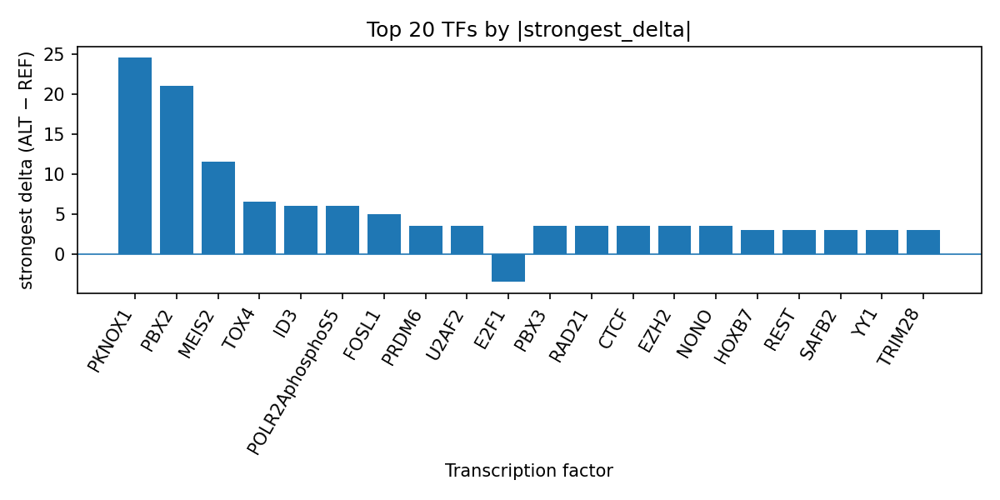

# AlphaGenome-Prioritized Transcription Factor Effects for rs1566447 in Childhood Onset Asthma

*Author: snv-tf-researcher*

## Abstract

We evaluated the intronic and non-coding transcript variant rs1566447 (C>T; chr9:8376477) as a candidate locus for childhood onset asthma using AlphaGenome transcription factor ChIP-seq predictions. The variant was selected by effect size, so it may be in linkage disequilibrium with the true causal variant. AlphaGenome outputs are computational predictions rather than experimental measurements; therefore, the results should be interpreted as prioritization signals that require laboratory validation. Across the available TF ChIP-seq tracks, the ALT allele was predicted to most strongly promote PKNOX1, PBX2, and MEIS2 binding, while also showing smaller predicted effects on multiple chromatin and transcription-associated factors. In total, the prediction profile suggests a mixed regulatory impact with a predominance of positive deltas for several TFs and isolated inhibitory effects for E2F1, MYC, and EZH2phosphoT487. These predictions provide a compact hypothesis set for follow-up functional assays in the context of childhood onset asthma.

## Introduction

Childhood onset asthma is a heterogeneous trait with genetic contributions that differ from later-onset asthma, and GWAS-based analyses have shown that childhood-onset disease can have distinct genetic architecture relative to adult-onset asthma and other asthma subtypes [1,2]. Recent genetic studies also suggest that asthma-related loci can be pleiotropic across allergic and respiratory phenotypes, while still retaining disease- or subtype-specific variants [1,2]. This context supports variant-level prioritization to identify regulatory candidates that may help explain asthma susceptibility.  

Computational variant effect prediction can be used to nominate transcription factors whose binding may be altered by a GWAS-associated SNV, but such predictions are not experimental evidence and must be validated experimentally. Here, we summarize AlphaGenome TF ChIP-seq predictions for rs1566447, an intronic/non-coding transcript variant selected by effect size in childhood onset asthma. The goal is to connect the run-folder outputs, including `top_tf_effects.tsv`, to a concise interpretation of the predicted regulatory consequences.

## Methods

rs1566447 (chr9:8376477 C>T) was selected as the candidate SNV for childhood onset asthma on the basis of reported effect size. The variant had the annotation terms intron_variant and non_coding_transcript_variant. No nearest genes were provided in the input data.

AlphaGenome was used to generate TF ChIP-seq predictions for the reference and alternate alleles across available tracks. These outputs are computational predictions of allele-specific changes in TF-associated signal and do not constitute direct measurements of TF binding or gene regulation. The resulting per-track deltas were aggregated to TF level by summarizing the number of tracks, the strongest signed delta, and the directionality across tracks. The manuscript interpretation references the run output table `top_tf_effects.tsv` to ensure traceability to the analysis folder.

A workflow overview of the automated pipeline is shown in Figure 1.

**Figure 1.** Workflow overview of the automated SNV-to-TF prioritization pipeline. The figure summarizes disease and association retrieval, effect-size based variant selection, consequence annotation and REF allele checking, AlphaGenome TF ChIP-seq prediction, TF-level summarization, literature retrieval, and manuscript synthesis.

## Results

The strongest predicted effects for rs1566447 were concentrated in a small set of TFs, with PKNOX1 showing the largest absolute delta among all summarized tracks. PKNOX1 was predicted to be promoted across four tracks, with the strongest effect in HEK293T (strongest delta 24.5). PBX2 was also strongly promoted, with a strongest delta of 21.0 in K562. MEIS2 followed with a strongest delta of 11.5 in K562. These TFs were among the top-ranked entries in `top_tf_effects.tsv`, indicating that the run output prioritizes a cluster of homeobox-related factors for this locus.

Additional predicted promotions were observed for TOX4, ID3, POLR2AphosphoS5, FOSL1, NONO, EZH2, RAD21, CTCF, PRDM6, PBX3, U2AF2, FEZF1, RCOR1, GATA2, HOXB7, YY1, TRIM28, SAFB2, REST, SP1, HMGA2, HOXB5, HOXA10, TCF7L2, and others listed in the run table. Among the negative predictions, E2F1 and MYC were the clearest inhibited TFs in the summary, and EZH2phosphoT487 also showed an inhibitory strongest track. This pattern suggests that the alternate allele may reweight multiple regulatory programs rather than producing a uniform directional shift across TFs (Figure 2).

**Figure 2.** Top transcription factors prioritized by AlphaGenome for rs1566447. Bars show the strongest signed ALT-versus-REF delta for each TF ChIP-seq summary, with positive values indicating predicted promotion and negative values indicating predicted inhibition.

## Discussion

The prediction profile for rs1566447 is consistent with a regulatory locus that may alter binding of multiple transcriptional regulators rather than a single factor. The prominence of PKNOX1, PBX2, and MEIS2 is notable because these factors appear together in the top-ranked TF summary, which may indicate a coordinated regulatory signature at this intronic site. However, because AlphaGenome outputs are computational predictions, this interpretation remains hypothetical and requires experimental validation.

The broader asthma literature supports the idea that childhood-onset asthma has a distinct genetic architecture from adult-onset asthma and that subtype-specific loci can map to different biological correlates [1,2]. Recent analyses of asthma subtypes also suggest that childhood-onset disease can exhibit distinct patterns of shared genetic architecture relative to other asthma phenotypes [1,2]. In that context, prioritizing TFs at rs1566447 may help generate testable hypotheses about regulatory mechanisms relevant to childhood onset asthma, but no mechanistic conclusion can be drawn from prediction alone.

## Limitations

This analysis has several limitations. First, the candidate variant was selected by effect size and may be in linkage disequilibrium with the true causal variant. Second, AlphaGenome provides computational predictions of TF ChIP-seq signal change rather than direct biochemical measurements, so the results cannot establish binding changes or downstream regulatory effects. Third, the input data did not include nearest genes or a study accession, limiting locus-level biological contextualization. Finally, the literature cited here supports background context for childhood-onset asthma but does not validate the specific regulatory predictions for rs1566447; experimental follow-up is required.

## References

1. Vernet R, Linhard C, Estermann A, Suzuki Y, Demenais F, Aschard H, et al. Unraveling shared genetics across asthma subtypes and 81 asthma-related traits. J Allergy Clin Immunol. 2025;156(6):1523-1536. PMID: 40947065. doi:10.1016/j.jaci.2025.07.036

2. Fischer-Rasmussen K, Granell R, Eliasen AU, Kreiner E, Pedersen CET, Luo Y, et al. Genetic characterization of preschool wheeze phenotypes. J Allergy Clin Immunol. 2025;156(6):1537-1546. PMID: 40769318. doi:10.1016/j.jaci.2025.07.015