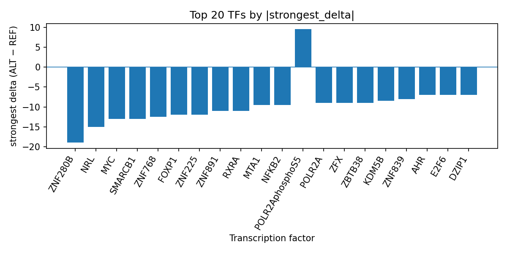

# Computational prioritization of rs2791713 for coronary atherosclerosis measurement using AlphaGenome TF ChIP-seq prediction

*Author: snv-tf-researcher*

## Abstract

We analyzed the intergenic GWAS candidate variant rs2791713 (chr1:206980536 G>A) for the trait coronary atherosclerosis measurement. The variant was selected by effect size (absolute log odds ratio 1.0986; p=2×10^-6) and is therefore a prioritized candidate rather than a confirmed causal allele. AlphaGenome TF ChIP-seq outputs, which are computational predictions rather than experimental measurements, indicated that the ALT allele is predicted to broadly inhibit transcription factor binding, with the strongest effects observed for ZNF280B, NRL, MYC, SMARCB1, and ZNF768. The strongest positive prediction among the summarized tracks was for POLR2AphosphoS5, although the overall TF-level pattern was predominantly inhibitory. These results suggest that rs2791713 may alter local regulatory programs in a direction consistent with changed transcription factor occupancy, but experimental validation is required.

## Introduction

Coronary atherosclerosis is a core biological substrate of coronary artery disease and related coronary imaging phenotypes, and multiple studies in the provided literature set use imaging-based or biomarker-based measures to stratify risk in cardiovascular disease [1-5]. Imaging-derived plaque burden and calcification measures have been used to estimate prognosis and risk in coronary and systemic vascular disease contexts [4,5], while broader work on atherosclerosis and cardiovascular risk supports the usefulness of molecular and genetic prioritization approaches for hypothesis generation [6-10].

Genome-wide association studies identify loci associated with complex traits, but a lead variant selected by association strength may not itself be the causal allele because of linkage disequilibrium. Functional prediction tools can help prioritize candidate variants by estimating potential regulatory consequences in silico. In this analysis, we used AlphaGenome TF ChIP-seq predictions to interpret the likely regulatory impact of rs2791713, an intergenic variant associated with coronary atherosclerosis measurement.

## Methods

### Variant selection and annotation

The candidate variant rs2791713 (chr1:206980536, G>A) was provided as the prioritized GWAS signal for coronary atherosclerosis measurement. It was annotated as an intergenic variant with no nearest gene listed. The variant was selected based on effect size, and therefore may be in linkage disequilibrium with the true causal variant.

### AlphaGenome transcription factor prediction

AlphaGenome TF ChIP-seq outputs were used to assess predicted allele-specific changes in transcription factor binding across available tracks. These outputs are computational predictions and do not constitute experimental binding measurements. We summarized the TF-level results using the provided `top_tf_effects.tsv` run output to identify the transcription factors with the largest absolute predicted ALT-versus-REF changes.

### Literature retrieval and manuscript synthesis

Supporting background literature was restricted to the provided PubMed records for the coronary atherosclerosis measurement query. This manuscript was synthesized directly from the supplied data and literature list, without adding external factual content.

### Workflow overview

The end-to-end workflow used for this run is summarized in the pipeline figure (Figure 1).

**Figure 1.** Workflow schematic showing GWAS variant retrieval, effect-size-based prioritization, variant annotation, AlphaGenome TF ChIP-seq prediction, TF-level summarization, literature lookup, and manuscript generation. The figure reflects the computational pipeline used for this run and does not represent experimental assay results.

## Results

The prioritized GWAS variant rs2791713 is an intergenic SNV at chr1:206980536 (G>A) with an absolute log odds ratio effect size of 1.0986 and p=2×10^-6. No nearest gene was provided, which is consistent with a distal regulatory interpretation rather than an obvious coding consequence.

AlphaGenome TF ChIP-seq predictions indicated a predominantly inhibitory allele-specific pattern for the ALT allele. The strongest predicted decreases were observed for ZNF280B (delta -19.0) and NRL (delta -15.0), followed by MYC (strongest delta -13.0 across 8 tracks), SMARCB1 (-13.0), ZNF768 (-12.5), FOXP1 (-12.0), ZNF225 (-12.0), ZNF891 (-11.0), RXRA (-11.0), and NFKB2 (-9.5). Among the summarized tracks, several additional TFs also showed predicted inhibition, including MTA1, POLR2A, ZFX, ZBTB38, KDM5B, ZNF839, HIVEP1, THAP9, DZIP1, AHR, E2F6, KDM2A, SALL1, MNX1, ZNF598, EZH2, THAP1, EED, and ZNF687. POLR2AphosphoS5 showed the strongest positive delta within the ranked list (9.5), but the overall TF summary remained dominated by negative predicted changes.

A compact summary of the top transcription-factor effects for rs2791713 is provided in the run folder table `top_tf_effects.tsv`, which corresponds to the TF ranking reported above and should be considered the reference output for this analysis.

**Figure 2.** Ranked AlphaGenome TF ChIP-seq prediction deltas for rs2791713. Bars show the strongest signed ALT-versus-REF delta for each transcription factor, with negative values indicating predicted inhibition and positive values indicating predicted promotion of binding signal. The pattern is dominated by inhibitory effects across multiple TFs.

## Discussion

The AlphaGenome predictions suggest that rs2791713 may alter a local regulatory landscape by reducing predicted binding for multiple transcription factors, including several with large-magnitude inhibitory scores. This pattern is consistent with the possibility that the variant affects transcriptional regulation in a cis-regulatory context, although the present data do not identify a specific mechanistic pathway or downstream gene target. Because AlphaGenome outputs are computational predictions, these results should be interpreted as prioritization evidence rather than direct functional measurement.

The broader literature provided for coronary atherosclerosis measurement emphasizes that imaging-derived coronary phenotypes and vascular plaque burden can carry prognostic information [1-5,9,10]. Additional studies in the supplied list show that genetic and molecular analyses can help prioritize biological hypotheses in coronary and atherosclerotic disease contexts [6-8,11-16]. Taken together, those reports support the general strategy of integrating GWAS with functional annotation to nominate candidates for downstream validation. In that context, the present variant-level prediction may be useful for follow-up work aimed at identifying allele-specific regulatory effects relevant to coronary atherosclerosis measurement.

Experimental validation will be required to determine whether the predicted TF changes are observed in relevant cellular systems and whether they translate into altered gene regulation or disease-associated biology.

## Limitations

This analysis has several limitations. First, the variant was selected by effect size and may be in linkage disequilibrium with the true causal variant, so rs2791713 should be considered a prioritized proxy rather than a definitive functional allele. Second, AlphaGenome TF ChIP-seq results are in silico predictions and not experimental binding measurements, so they require orthogonal validation. Third, no nearest gene was provided for the variant, limiting gene-centric interpretation. Fourth, the present manuscript is based only on the supplied run outputs and provided literature list; no additional external evidence was incorporated.

## References

1. von Känel R, Albertini T, Holzgang SA, Princip M, Giannopoulos AA, Buechel RR, et al. Physician burnout and type D personality relate to pericoronary fat phenotype and role of sympathetic activation: a cross-sectional study. Sci Rep. 2026. PMID: 42032258. doi:10.1038/s41598-026-50320-9

2. Dondi F, Bellini P, Bertoli M, Viganò GL, Rinaldi R, Camoni L, et al. Correlation Between Epicardial Adipose Tissue and PET Cardiac Perfusion: A Systematic Review. Med Sci (Basel). 2026;14(2). PMID: 42029618. doi:10.3390/medsci14020194

3. Oancea AF, Leonard M, Morariu PC, Godun M, Jigoranu A, Miftode IL, et al. Repurposing Coronary Risk Scores to Identify Increased Likelihood of Atrial Fibrillation in Chronic Coronary Syndrome. Med Sci (Basel). 2026;14(2). PMID: 42029585. doi:10.3390/medsci14020161

4. Sandhu AT, Furst A, Rodriguez F, Kalwani N, Maron D, Nallamshetty S, et al. Systemic Inflammation and Adverse Outcomes in Patients With Atherosclerotic Cardiovascular Disease and Chronic Kidney Disease. JACC Adv. 2026;5(5):102765. PMID: 42025258. doi:10.1016/j.jacadv.2026.102765

5. Han TH, Kim YW, Lee HJ, Kim JS, Lee SG, Yang DH, et al. Synthesis of coronary 4D CT Image by denoising diffusion probabilistic model. Comput Methods Programs Biomed. 2026;282:109382. PMID: 42025230. doi:10.1016/j.cmpb.2026.109382

6. Dikme R, Koyuncu I, Aydın MS. Nuclear factor erythroid 2 related factor 2, tumor necrosis factor alpha, interleukin-40, and endorepellin levels in patients undergoing coronary artery bypass grafting. Rev Assoc Med Bras (1992). 2026;72(2):e20251054. PMID: 42018841. doi:10.1590/1806-9282.20251054

7. Picano E, Zagatina A, Cortigiani L, Padang R, Kane GC, Villarraga HR, et al. Prognostic value of multi-marker stress echocardiography. Future Cardiol. 2026;1-11. PMID: 42017616. doi:10.1080/14796678.2026.2659089

8. Hammond B, Goldstein A, Murugesan D, Ganta A, Konda S, Egol KA. Can we predict functional recovery following non-operative treatment of proximal humerus fractures? J Clin Orthop Trauma. 2026;77:103435. PMID: 42017062. doi:10.1016/j.jcot.2026.103435

9. Li L, Hu F, Chen L, Lin J, Fan L. Ct-derived basal septal thickness predicts Post-TAVR pacemaker implantation in patients with preexisting right bundle branch block. Int J Cardiol Heart Vasc. 2026;64:101923. PMID: 42016516. doi:10.1016/j.ijcha.2026.101923

10. Adams A, Bojara W, Romanens M. Prevention of Cardiovascular Disease and Cancer Through Early Statin Treatment in Advanced Atherosclerosis: An Observational Study. Cardiol Res. 2026;17(2):120-127. PMID: 42016209. doi:10.14740/cr2196

11. Abdennadher B, Goßling A, Kellner C, Koschwitz J, Paasch L, Sørensen NA, et al. Prognostic value of cardiovascular biomarkers for cardiac stress test results and adverse cardiovascular events in patients with suspected coronary artery disease. Am J Cardiol. 2026. PMID: 42013971. doi:10.1016/j.amjcard.2026.03.071

12. Chen Q, Zhou F, Xing W, Xu Y, Hu S, Pan T, et al. A Fully Automated Deep Learning Model for Quantifying Coronary Plaque at Coronary CT Angiography. Radiology. 2026;319(1):e251967. PMID: 42012347. doi:10.1148/radiol.251967

13. Goonewardena SN, Yao S, Jurga T, Zhang L, Lloyd-Jones D, Damodaran D, et al. Lipoprotein(a)-Associated Proteomic Signature Predicts Cardiovascular Disease in Young Adults. J Clin Invest. 2026. PMID: 42012308. doi:10.1172/JCI204287

14. Itagaki T, Ueki Y, Oyama Y, Iguchi J, Fujimori K, Sunohara D, et al. Discordance in diagnostic assessment of Achilles tendon thickening between soft X-ray radiography and ultrasonography among patients with coronary artery disease. Sci Rep. 2026. PMID: 42009804. doi:10.1038/s41598-026-49444-9

15. Kwee AKAL, van Amsterdam WAC, Mohamed Hoesein FAA, Gallardo-Estrella L, Charbonnier JP, Humphries SM, et al. Small Pulmonary Artery and Vein Volumes Independently Predict Oxygen Desaturation in Smokers. Chron Obstruct Pulmon Dis. 2026. PMID: 42007640. doi:10.15326/jcopdf.2025.0694

16. Li J, Wang C, Li S, Wang Y, Zhang L, Zhang J. Prolactin-induced platelet activation and endothelial dysfunction in coronary artery disease: insights into PKC and TXA2 pathways. Am J Transl Res. 2026;18(3):2214-2224. PMID: 42007112. doi:10.62347/PIMY8425