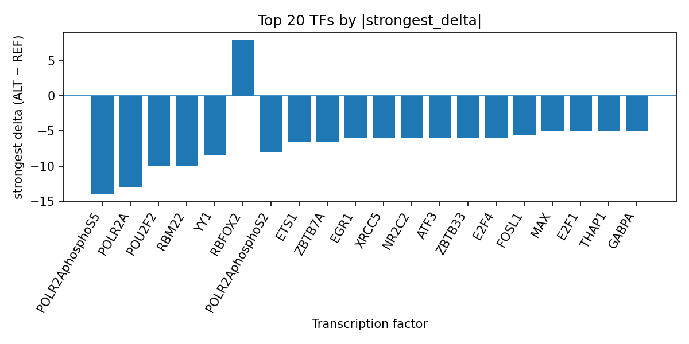

# AlphaGenome-predicted transcription factor perturbations for rs10074991 in gastric cardia carcinoma

*Author: snv-tf-researcher*

## Abstract

Background: Gastric cardia carcinoma is a clinically and genetically heterogeneous gastric cancer subtype, and prior GWAS have identified locus-specific associations at the gastro-oesophageal junction [1-4]. We evaluated rs10074991, a GWAS variant associated with gastric cardia carcinoma, using AlphaGenome TF ChIP-seq predictions, which are computational predictions rather than experimental measurements.

Methods: The variant rs10074991 (5:40790449 G>A; risk allele rs10074991-G) was prioritized by effect size and annotated as an intron/upstream/downstream/non-coding transcript variant. AlphaGenome was used to predict allele-specific effects on TF ChIP-seq tracks, and transcription factors were summarized across tracks. This computational workflow is shown in Figure 1. Literature context was assembled from the provided PubMed list.

Results: rs10074991 was predicted to inhibit binding of multiple TFs, with strongest negative effects for POLR2AphosphoS5, POLR2A, POU2F2, RBM22, and YY1. CTCF was the TF with the largest number of evaluated tracks, and the aggregated signal remained predominantly inhibitory. A smaller set of TFs, including RBFOX2, was predicted to be promoted. The summarized results are provided in the run-folder reference table `top_tf_effects.tsv` and visualized in Figure 2.

Conclusions: The AlphaGenome predictions prioritize rs10074991 as a candidate regulatory variant with predominantly inhibitory TF-binding effects. These computational results require experimental validation, and the variant may be in linkage disequilibrium with the true causal variant.

## Introduction

Gastric cancer is anatomically and biologically heterogeneous, with differences between cardia and non-cardia disease recognized in epidemiologic and genetic studies [1,2]. Genome-wide association studies have reported location-specific associations for gastric cancer, including rs10074991 at 5p13.1 for cardia and non-cardia cancers [1]. More broadly, GWAS have shown that gastric cancer risk architecture differs by subtype and that the gastro-oesophageal junction may share genetic features across related diseases [2,3]. Additional population studies have also reported subtype- and site-specific associations for gastric cancer susceptibility loci [4-7].

Because many GWAS variants fall in non-coding regions, computational fine-mapping and regulatory prediction can help prioritize variants for follow-up [2,4]. AlphaGenome TF ChIP-seq predictions provide in silico estimates of allele-dependent effects on transcription factor occupancy; however, these are not direct measurements and require orthogonal experimental validation. In this report, we interpret AlphaGenome-predicted effects for rs10074991 in the context of gastric cardia carcinoma.

## Methods

We analyzed rs10074991 (chromosome 5, position 40790449, G>A), which was selected by effect size from the provided candidate variant input. The variant was annotated with intron_variant, upstream_gene_variant, non_coding_transcript_variant, and downstream_gene_variant consequences. The risk allele was rs10074991-G, and the input GWAS p-value was 7×10^-12.

AlphaGenome was used to generate TF ChIP-seq predictions comparing ALT and REF alleles. These outputs are computational predictions, not experimental assays. We summarized TF-level effects across available tracks by direction, mean/median delta, number of promoted/inhibited tracks, and strongest observed delta. The analysis workflow, including disease and association retrieval, effect-size ranking, variant filtering, consequence annotation, REF allele checking, AlphaGenome prediction, TF summarization, literature search, and manuscript synthesis, is shown in Figure 1.

**Figure 1.** Workflow overview for this run of snv-tf-researcher. The pipeline integrates disease/variant input parsing, regulatory consequence annotation, AlphaGenome TF ChIP-seq prediction, TF-level effect summarization, and literature-supported manuscript generation.

## Results

The strongest predicted TF perturbations for rs10074991 were predominantly inhibitory. POLR2AphosphoS5 showed the largest absolute predicted change across its tracks, with the strongest effect in H1 cells and an overall inhibitory direction. POLR2A also showed a broad inhibitory pattern across many tracks, with the strongest effect in GM12878. Additional inhibitory TFs included POU2F2, RBM22, YY1, POLR2AphosphoS2, ETS1, ZBTB7A, ZBTB33, E2F4, ATF3, EGR1, XRCC5, NR2C2, FOSL1, PRDM10, REST, GABPA, MAX, THAP1, E2F1, TAF1, POLR2G, USF2, EED, MYC, TCF3, and PAX5. In contrast, RBFOX2 was the clearest promoted TF in the summary. The full ranked output is recorded in `top_tf_effects.tsv`, which provides the run-folder reference table used for this manuscript.

The TF-level profile is visualized in Figure 2, which highlights the dominant inhibitory signal across the top ranked factors and the smaller subset of positive deltas.

**Figure 2.** Top transcription factors at rs10074991 ranked by absolute predicted ALT-vs-REF binding delta from AlphaGenome TF ChIP-seq tracks. Negative values indicate predicted inhibition and positive values indicate predicted promotion; the plot emphasizes the strongest signed effect observed for each TF.

## Discussion

These AlphaGenome predictions prioritize rs10074991 as a plausible regulatory variant in gastric cardia carcinoma, because the predicted allele substitution is associated with broad inhibitory effects across multiple TF ChIP-seq tracks. The prominence of POLR2A and POLR2AphosphoS5 is notable in a general regulatory sense, while the appearance of factors such as CTCF, MYC, YY1, and EGR1 suggests that the locus may intersect with diverse transcriptional programs. Because AlphaGenome provides computational predictions rather than direct biochemical measurements, these findings should be interpreted as hypothesis-generating only.

The result is compatible with prior GWAS evidence that rs10074991 lies in a region associated with gastric cardia and non-cardia cancer risk [1]. More broadly, previous studies have shown that gastric cancer susceptibility is subtype-specific and that cardia cancer can share some genetic architecture with the gastro-oesophageal junction and related upper gastrointestinal phenotypes [2-7]. Our prediction-based prioritization is therefore consistent with a non-coding regulatory mechanism, but it does not establish mechanism or direction of biological effect. Experimental validation, such as allele-specific reporter assays or ChIP-seq-based follow-up in relevant models, is required.

## Limitations

This analysis is limited by the fact that the candidate variant was selected by effect size and may be in linkage disequilibrium with the true causal variant. The AlphaGenome output is computational and not an experimental measurement, so TF binding changes remain predictions requiring validation. In addition, the biological interpretation is constrained by the available track set and by the fact that no nearest genes were provided in the input. Finally, the literature context is limited to the supplied PubMed records and should not be interpreted as a comprehensive review.

## References

1. Hu N, Wang Z, Song X, Wei L, Kim BS, Freedman ND, et al. Genome-wide association study of gastric adenocarcinoma in Asia: a comparison of associations between cardia and non-cardia tumours. Gut. 2016;65(10):1611-1618. PMID: 26129866. doi:10.1136/gutjnl-2015-309340
2. Hess T, Maj C, Gehlen J, Borisov O, Haas SL, Gockel I, et al. Dissecting the genetic heterogeneity of gastric cancer. EBioMedicine. 2023;92:104616. PMID: 37209533. doi:10.1016/j.ebiom.2023.104616
3. Gier RA, Bracht SA, Rong J, Reyes Hueros RA, Wahlsten ML, Cote C, et al. Clonal cell states link gastroesophageal junction tissues with metaplasia and cancer. Nat Commun. 2025;16(1):10952. PMID: 41360789. doi:10.1038/s41467-025-66302-w
4. Xiao FK, Yang JX, Li XM, Zhao XK, Zheng PY, Wang LD. Interaction of 22 risk SNPs with Helicobacter pylori infection and risk of gastric cardia adenocarcinoma. Future Oncol. 2019;15(31):3579-3585. PMID: 31650851. doi:10.2217/fon-2019-0319
5. Zhang N, Zheng Y, Liu J, Lei T, Xu Y, Yang M. Genetic variations associated with telomere length confer risk of gastric cardia adenocarcinoma. Gastric Cancer. 2019;22(6):1089-1099. PMID: 30900102. doi:10.1007/s10120-019-00954-8
6. Chang J, Wei L, Miao X, Yu D, Tan W, Zhang X, et al. Two novel variants on 13q22.1 are associated with risk of esophageal squamous cell carcinoma. Cancer Epidemiol Biomarkers Prev. 2015;24(11):1774-1780. PMID: 26315552. doi:10.1158/1055-9965.EPI-15-0154-T
7. Yuan J, Li Y, Tian T, Li N, Zhu Y, Zou J, et al. Risk prediction for early-onset gastric carcinoma: a case-control study of polygenic gastric cancer in Han Chinese with hereditary background. Oncotarget. 2016;7(23):33608-33615. PMID: 27127881. doi:10.18632/oncotarget.9025