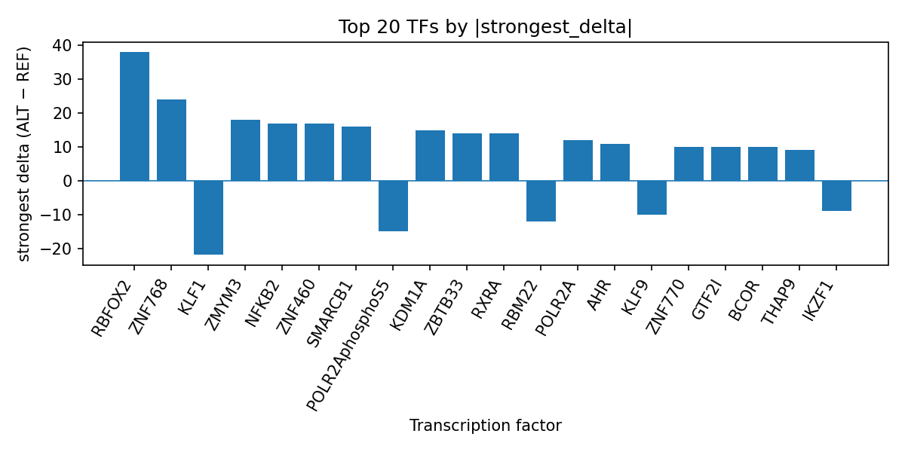

# AlphaGenome-predicted transcription factor perturbation at rs12967711 in gastric intestinal type adenocarcinoma

*Author: snv-tf-researcher*

## Abstract

The GWAS-selected variant rs12967711 (A>G; rs12967711-G) on chromosome 18 was prioritized for gastric intestinal type adenocarcinoma based on effect size and nominal association evidence (p = 3 × 10^-6; abs_log_or = 4.1957). The variant is annotated as an intron_variant, non_coding_transcript_variant, and upstream_gene_variant. AlphaGenome TF ChIP-seq predictions suggest that the ALT allele may broadly increase predicted binding for several transcription factors, with the strongest positive effects for RBFOX2, ZNF768, and ZMYM3, while a subset of tracks is predicted to be inhibited, including POLR2AphosphoS5, KLF1, RBM22, KLF9, IKZF1, USF2, and PRDM10. These results prioritize candidate regulatory factors for follow-up, but the AlphaGenome outputs are computational predictions rather than experimental measurements, and experimental validation is required.

## Introduction

Gastric adenocarcinoma remains heterogeneous at the histologic level, and intestinal-type tumors are recognized as a major subtype in multiple clinical and molecular studies [1-4]. Prior genetic studies of gastric cancer have identified germline variation associated with susceptibility and survival, including loci linked to PSCA and other upper gastrointestinal cancer risk loci [5-9]. In parallel, recent pathology and translational studies continue to refine biomarker associations in gastric cancer, including intestinal-type disease [1-4].  

Computational interpretation of GWAS variants can help prioritize noncoding candidate loci for experimental follow-up by integrating predicted regulatory consequences with disease association signals. Here, we analyze rs12967711, a candidate variant selected by effect size for gastric intestinal type adenocarcinoma, using AlphaGenome TF ChIP-seq predictions. The goal is to summarize which transcription factors are predicted to be most affected by the allele substitution and to contextualize the variant as a regulatory hypothesis rather than a measured mechanism.

## Methods

### Variant selection and annotation

The candidate variant rs12967711 (chromosome 18:48,935,813 A>G) was provided as the prioritized GWAS locus for gastric intestinal type adenocarcinoma. It was selected by effect size and has nominal association evidence (p = 3 × 10^-6; abs_log_or = 4.1956970564823886). The variant is annotated with the sequence consequences intron_variant, non_coding_transcript_variant, and upstream_gene_variant.

### AlphaGenome TF ChIP-seq prediction

AlphaGenome was used to generate computational TF ChIP-seq predictions for REF-versus-ALT sequence contexts. These outputs are predicted differences in TF track signal, not experimental chromatin immunoprecipitation measurements. The top TF-level summaries were then consolidated by transcription factor across tracks, using the provided run output table referenced in `top_tf_effects.tsv`.

### Workflow and reporting

The end-to-end analysis pipeline included disease and association retrieval, effect-size ranking, variant filtering, sequence consequence annotation, REF allele checking, AlphaGenome TF ChIP-seq prediction, TF-level summarization, literature retrieval, and AI-assisted manuscript synthesis (Figure 1).

**Figure 1.** End-to-end workflow for the variant-to-interpretation pipeline. The pipeline includes GWAS disease/association selection, effect-size prioritization, annotation, AlphaGenome TF ChIP-seq prediction, TF summary generation, literature retrieval, and manuscript drafting.

## Results

The prioritized variant rs12967711 is predicted to alter TF binding in a mixed direction, with several factors showing strong positive deltas and others showing inhibition. The top-ranked predictions suggest promotion of RBFOX2, ZNF768, ZMYM3, NFKB2, ZNF460, SMARCB1, KDM1A, RXRA, ZBTB33, AHR, ZNF770, GTF2I, BCOR, THAP9, MYC, KDM2A, CHD4, ZNF687, CBX1, MXD3, ZNF598, and ZBTB4, while inhibition is predicted for KLF1, RBM22, POLR2AphosphoS5, KLF9, IKZF1, USF2, and PRDM10. The strongest individual positive delta was observed for RBFOX2 in K562, and the strongest individual negative delta among the summarized factors was observed for KLF1 in HEK293. The full ranked transcription factor summary is provided in `top_tf_effects.tsv`, which records the track-level and factor-level outputs for this run.

A notable feature of the prediction profile is the broad effect on RNA-processing and transcription-associated factors. RBFOX2 showed the highest positive delta, while POLR2A and POLR2AphosphoS5 showed both promoted and inhibited tracks across multiple biosamples, suggesting that the variant may influence a complex regulatory context rather than a single directional TF effect. The predicted signal for MYC was mixed across tracks but overall labeled as promoted in the summary, whereas KLF9 and PRDM10 were consistently inhibited across the tracks included in the output. These computational findings are consistent with the variant acting in a noncoding regulatory region, but they do not establish a biological mechanism.

**Figure 2.** Top transcription factors prioritized at rs12967711 by the absolute ALT-versus-REF predicted binding delta from AlphaGenome TF ChIP-seq tracks. Bars show the strongest signed delta per TF, with positive values indicating predicted promotion and negative values indicating predicted inhibition.

## Discussion

The AlphaGenome predictions prioritize rs12967711 as a putative regulatory variant with broad TF-level perturbation, especially affecting RBFOX2 and several zinc-finger-associated factors, while also predicting inhibition of other transcription-associated factors. Because the input locus was chosen by effect size and may be in linkage disequilibrium with the true causal variant, these results should be interpreted as a prioritization signal rather than definitive localization of the functional allele.  

The transcriptional regulatory profile is compatible with the broader literature showing that intestinal-type gastric cancers can be distinguished by histology-linked molecular features and biomarker associations [1-4]. Prior GWAS and genetic studies in gastric cancer also support the relevance of noncoding inherited variation to susceptibility and histologic subtype differences [5-9]. However, the present analysis does not demonstrate that rs12967711 alters transcription factor occupancy in vivo, nor does it establish a direct role in gastric intestinal type adenocarcinoma biology. AlphaGenome outputs are computational predictions, and experimental validation is required to determine whether the predicted TF perturbations are reproducible in relevant gastric models and whether they are functionally meaningful.

## Limitations

This analysis is limited by the use of predicted rather than measured TF binding effects. AlphaGenome TF ChIP-seq outputs are computational inferences, so they cannot substitute for biochemical or cellular validation. The candidate variant was selected by effect size and may be in linkage disequilibrium with the true causal variant, so the observed prediction profile may reflect correlated rather than causal variation. The provided output does not include nearest-gene assignment, so gene-level interpretation remains limited. Finally, the conclusions are constrained to the single supplied locus and cannot be generalized beyond this variant without additional evidence.

## References

1. Sakamoto H, Yoshimura K, Saeki N, Katai H, Shimoda T, Matsuno Y, et al. Genetic variation in PSCA is associated with susceptibility to diffuse-type gastric cancer. Nature Genetics. 2008;40(6):730-740. PMID: 18488030. doi:10.1038/ng.152

2. Yoshida T, Ono H, Kuchiba A, Saeki N, Sakamoto H. Genome-wide germline analyses on cancer susceptibility and GeMDBJ database: Gastric cancer as an example. Cancer Science. 2010;101(7):1582-1589. PMID: 20507324. doi:10.1111/j.1349-7006.2010.01590.x

3. Lao-Sirieix P, Caldas C, Fitzgerald RC. Genetic predisposition to gastro-oesophageal cancer. Curr Opin Genet Dev. 2010;20(3):210-217. PMID: 20347291. doi:10.1016/j.gde.2010.03.002

4. Sala N, Muñoz X, Travier N, Agudo A, Duell EJ, Moreno V, et al. Prostate stem-cell antigen gene is associated with diffuse and intestinal gastric cancer in Caucasians: results from the EPIC-EURGAST study. Int J Cancer. 2012;130(10):2417-2427. PMID: 21681742. doi:10.1002/ijc.26243

5. Palmer AJ, Lochhead P, Hold GL, Rabkin CS, Chow WH, Lissowska J, et al. Genetic variation in C20orf54, PLCE1 and MUC1 and the risk of upper gastrointestinal cancers in Caucasian populations. Eur J Cancer Prev. 2012;21(6):541-544. PMID: 22805490.

6. Kang M, Ding X, Xu M, Zhu H, Liu S, Wang M, et al. Genetic variation rs10484761 on 6p21.1 derived from a genome-wide association study is associated with gastric cancer survival in a Chinese population. Gene. 2014;536(1):59-64. PMID: 24325909. doi:10.1016/j.gene.2013.11.087

7. Karimi F, Amiri-Moghaddam SM, Bagheri Z, Bahrami AR, Goshayeshi L, Allahyari A, et al. Investigating the association between rs6983267 polymorphism and susceptibility to gastrointestinal cancers in Iranian population. Mol Biol Rep. 2021;48(3):2273-2284. PMID: 33713253. doi:10.1007/s11033-021-06249-5

8. Varadan S, Balasundararajan U, Manoharan D, Mahendran BS. E-Cadherin Immunohistochemical Expression in Gastrointestinal Adenocarcinomas and Its Association With Histological and Prognostic Parameters. Cureus. 2026;18(1):e101801. PMID: 41710815. doi:10.7759/cureus.101801

9. Chen HH, Liau JY, Jeng YM, Chen KH, Tsai JH. Claudin-18.2 expression is frequent in remnant gastric carcinoma and associated with microsatellite instability and Epstein-Barr viral infection phenotypes. Pathology. 2026;58(3):276-283. PMID: 41763978. doi:10.1016/j.pathol.2025.10.015