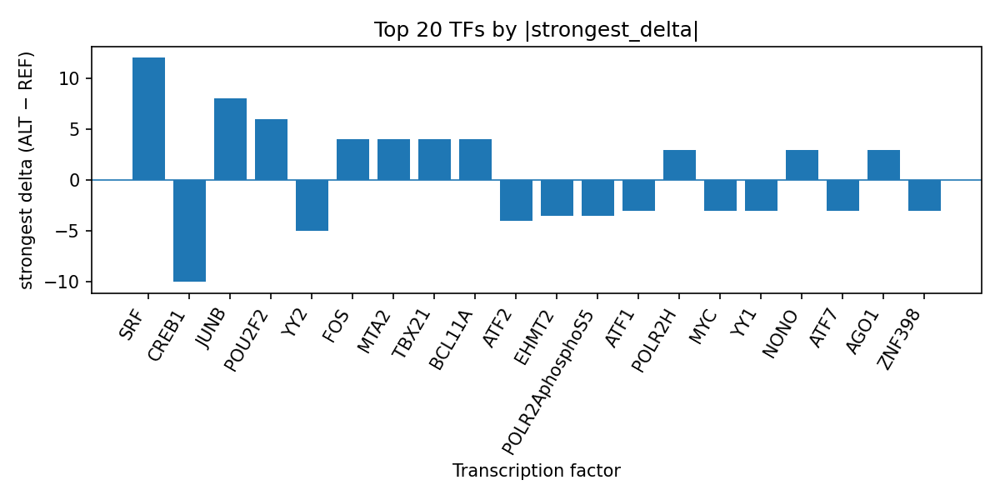

# Computational prioritization of rs3130304 at the hemorrhagic fever with renal syndrome locus suggests transcription factor binding perturbation

*Author: snv-tf-researcher*

## Abstract

Hemorrhagic fever with renal syndrome (HFRS) is a rodent-borne zoonotic disease with substantial public health impact in endemic regions [1-4]. In this manuscript, we report a computational interpretation of the GWAS-prioritized intergenic variant rs3130304 (G>A; chr6:32239404) associated with HFRS (p = 5 × 10^-12; abs_beta = 0.46). AlphaGenome TF ChIP-seq predictions, which are computational predictions rather than experimental measurements, suggested that the ALT allele may alter binding for multiple transcription factors, with the strongest predicted increases for SRF, JUNB, POU2F2, and BCL11A, and the strongest predicted decreases for CREB1, YY2, ATF2, and YY1. These predictions prioritize rs3130304 for follow-up as a potential regulatory variant, while recognizing that the selected GWAS variant may be in linkage disequilibrium with the true causal variant and that experimental validation is required.

## Introduction

HFRS is a zoonotic infectious disease associated with orthohantaviruses and remains an important health concern in endemic settings [1-4]. Recent reports continue to describe HFRS burden, clinical severity markers, and epidemiologic patterns across affected regions [1-4]. Because GWAS loci can capture noncoding regulatory variation, computational interpretation of prioritized SNVs may help identify candidate transcriptional mechanisms for downstream testing [8].

Here, we analyze rs3130304, an intergenic GWAS candidate on chromosome 6 selected by effect size for HFRS. We used AlphaGenome TF ChIP-seq prediction outputs to assess whether the reference-to-alternate allele substitution may change transcription factor binding, and we summarize the strongest TF-level effects in relation to the run-specific output table `top_tf_effects.tsv`.

## Methods

The input variant was rs3130304 (chr6:32239404 G>A), an intergenic GWAS candidate associated with HFRS (p = 5 × 10^-12; abs_beta = 0.46). The variant was selected by effect size from the provided GWAS-derived candidate list and may be in linkage disequilibrium with the true causal variant; therefore, the reported allele-specific signal should be interpreted as prioritization rather than causation.

Variant annotation information indicated an intergenic consequence. AlphaGenome TF ChIP-seq outputs were used to computationally compare predicted transcription factor binding between the reference and alternate alleles. These outputs are predictions, not direct experimental measurements, and require experimental validation.

The workflow for the run is summarized in the provided pipeline figure, which includes disease/association retrieval, effect-size ranking and SNV filtering, consequence annotation, AlphaGenome prediction, TF summarization, literature retrieval, and manuscript synthesis (Figure 1).

**Figure 1.** End-to-end workflow used for the SNV-to-transcription-factor interpretation. The pipeline integrates GWAS candidate prioritization, sequence annotation, AlphaGenome TF ChIP-seq prediction, transcription-factor-level summarization, literature retrieval, and manuscript generation.

## Results

AlphaGenome TF ChIP-seq predictions suggested that rs3130304 may alter binding of multiple transcription factors. Among the strongest predicted increases, SRF showed the largest positive effect across eight tracks, followed by JUNB, POU2F2, BCL11A, FOS, MTA2, TBX21, and POLR2AphosphoS5-related gains in selected tracks. Among the strongest predicted decreases, CREB1, YY1, ATF2, TRIM28, YY2, and ZNF398 were among the most strongly inhibited factors.

The top TF summary is also recorded in the run output table `top_tf_effects.tsv`, which provides the transcription-factor-level aggregation used for this interpretation. Overall, the prediction pattern suggested a mixed regulatory shift with both promoted and inhibited TF binding depending on the factor and biosample context.

**Figure 2.** Ranked transcription-factor effects predicted at rs3130304 by AlphaGenome TF ChIP-seq tracks. Bars show the strongest signed ALT-versus-REF delta for each TF, with positive values indicating predicted promotion and negative values indicating predicted inhibition.

The strongest predicted positive effect was observed for SRF in H1 cells, while the strongest predicted negative effect was observed for CREB1 in HepG2 cells. Additional notable predicted decreases included YY1, POLR2AphosphoS5, ATF2, and TRIM28, whereas additional predicted increases included JUNB, POU2F2, BCL11A, and FOS. These TF-level predictions prioritize rs3130304 as a putative regulatory variant at the HFRS locus.

## Discussion

The predicted allele-specific TF binding shifts at rs3130304 suggest a possible regulatory mechanism at an intergenic HFRS-associated locus. In particular, the opposing directions of predicted effects across TFs imply that the variant may influence local transcriptional programs in a context-dependent manner. Because AlphaGenome provides computational predictions rather than experimental measurements, these results should be treated as hypothesis-generating [8].

The HFRS literature provided with this run emphasizes ongoing clinical, epidemiologic, and virologic work in this disease area, including reports on disease severity, biomarkers, spatial patterns, rodent reservoirs, and orthohantavirus countermeasures [1-7]. In that context, noncoding variant prioritization may complement disease-focused studies by highlighting candidate regulatory elements for follow-up [8]. However, the present analysis does not establish a molecular mechanism, and experimental assays will be needed to test whether rs3130304 affects transcription factor occupancy or downstream gene regulation.

## Limitations

This analysis has several limitations. First, the candidate variant was selected by effect size and may be in linkage disequilibrium with the true causal variant, so rs3130304 should not be assumed to be causal. Second, AlphaGenome TF ChIP-seq outputs are computational predictions and do not measure in vivo binding directly. Third, the results are based on available prediction tracks and do not establish tissue-specific or disease-specific activity. Fourth, no nearest-gene assignment was provided in the input, limiting direct gene-centric interpretation. Finally, experimental validation is required to determine whether the predicted binding changes are reproducible and biologically meaningful.

## References

1. Fang LZ, Qiao B, Dong LY, Zhu K, Dong YH, Yan ZJ, et al. Epstein-barr virus super-infection is associated with increased severity of hemorrhagic fever with renal syndrome. BMC Infect Dis. 2026. PMID: 42021194. doi:10.1186/s12879-026-13094-z

2. Peng Y, Gu Y, Li L, Zhang G, Liu Z, Liu N, et al. A molecular survey of orthohantaviruses in rodents across the tri-border region of China, Russia, and North Korea. PLoS Negl Trop Dis. 2026;20(4):e0014134. PMID: 42008533. doi:10.1371/journal.pntd.0014134

3. Ye C, Zhang R, Wu S, Wei M, Cao J, Du X, et al. Clinical Value the Neutrophil CD64 Index in Predicting the Severity of Hemorrhagic Fever With Renal Syndrome. Immun Inflamm Dis. 2026;14(4):e70366. PMID: 41937463. doi:10.1002/iid3.70366

4. Koroknai A, Nagy A, Nagy O, Csonka N, Zsichla L, Szomor K, et al. Human Hantavirus Infections in Hungary (2018-2025): Epidemiology, Molecular Detection Across Clinical Sample Types, and Phylogenetic Analysis. Viruses. 2026;18(3). PMID: 41902274. doi:10.3390/v18030366

5. Schwarzer-Sperber HS, Mussfeldt T, Boesner J, Dluzak T, Sutter K, Schwarzer R. A Standardized workflow for Orthohantavirus production, detection, and antiviral screening. Virol J. 2026;23(1). PMID: 41864935. doi:10.1186/s12985-026-03136-y

6. Wei M, Xiao Z, Cao J, Du X, Li M, Zhang R, et al. The role of soluble thrombomodulin (sTM) in risk stratification of hemorrhagic fever with renal syndrome and prognostic assessment. PLoS Negl Trop Dis. 2026;20(3):e0014132. PMID: 41860846. doi:10.1371/journal.pntd.0014132

7. Chen S, Li Y, Zhao J, Zhao K, Wei R, Liu Z, et al. Development and application of NanoLuc-based LIPS assay for antibody detection of orthohantavirus infections and vaccine responses. Int J Biol Macromol. 2026;355:151343. PMID: 41856193. doi:10.1016/j.ijbiomac.2026.151343

8. Haapaniemi H, Strausz S, Tervi A, Jones SE, Kanerva M, Abner E, et al. Genetic analysis implicates ERAP1 and HLA as risk factors for severe Puumala virus infection. Hum Mol Genet. 2025;34(1):77-84. PMID: 39533856. doi:10.1093/hmg/ddae158