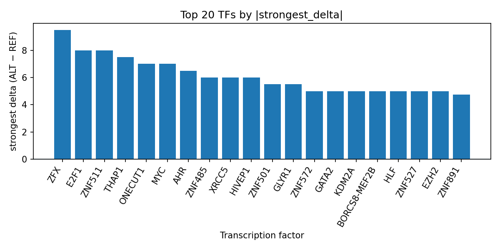

# AlphaGenome-predicted transcription factor perturbation landscape for rs148979832 in laryngeal carcinoma

*Author: snv-tf-researcher*

## Abstract

**Background:** Laryngeal carcinoma is a head and neck malignancy with a heterogeneous molecular basis [1-4]. Here, we prioritized rs148979832 (2:235110837 T>G), an intergenic GWAS variant associated with laryngeal carcinoma (P = 3 × 10^-11; abs_beta = 1.864), and interpreted AlphaGenome computational predictions of TF ChIP-seq binding changes at the variant locus.

**Methods:** The candidate variant was selected by effect size ranking and annotated as an intergenic variant. AlphaGenome TF ChIP-seq predictions were used to compare ALT versus REF allele effects across available tracks, and TF-level summaries were derived from the run outputs. Because AlphaGenome produces computational predictions rather than experimental measurements, all interpretation is provisional and requires laboratory validation.

**Results:** The predicted ALT allele was associated with broadly increased TF ChIP-seq signal across multiple factors, with the strongest positive effects observed for ZFX, ZNF511, E2F1, THAP1, ONECUT1, MYC, AHR, and several zinc-finger proteins. The largest signed effect among the summarized tracks was observed for ZFX in HEK293T (delta = 9.5), followed by ZNF511 in K562 and E2F1 in MCF-7 (delta = 8.0 each). In addition, POLR2A, EZH2, GATA2, and TCF7L2 showed mixed or context-dependent track-level effects, suggesting the variant may alter transcriptional regulatory occupancy rather than a single TF interaction. The full TF ranking is reported in `top_tf_effects.tsv` and visualized in Figure 2.

**Conclusions:** This computational interpretation prioritizes rs148979832 as a putative regulatory variant for laryngeal carcinoma and highlights TFs whose predicted binding is altered by the ALT allele. Experimental follow-up is required to determine whether these predicted changes are observed biologically and whether the signal is attributable to rs148979832 itself or to a linked variant.

## Introduction

Laryngeal carcinoma is part of the broader head and neck squamous cell carcinoma spectrum, for which genetic susceptibility has been investigated across multiple subsites [1-4]. Prior GWAS and cross-ancestral analyses have identified risk loci for head and neck and laryngeal cancer, supporting a contribution of inherited variation to disease susceptibility [1-4]. Regulatory variation can influence transcription factor occupancy and downstream gene expression, and functional follow-up of GWAS loci has previously shown that noncoding variants may alter TF binding at disease-associated regions [3,4]. However, for many associations, the relevant causal variant and regulatory mechanism remain unresolved [1-4].

In this analysis, rs148979832 was selected because it showed a strong association signal for laryngeal carcinoma and a large effect size. The variant is intergenic, with no nearest genes provided in the input, making transcriptional regulatory interpretation particularly relevant. We therefore used AlphaGenome to compute TF ChIP-seq allele-specific prediction differences at the variant locus and summarized the strongest predicted TF perturbations. Because these are computational predictions, they should be treated as prioritization signals rather than evidence of binding in vivo.

## Methods

### Variant selection and annotation

The GWAS candidate variant was rs148979832 (chromosome 2:235110837 T>G), associated with laryngeal carcinoma at P = 3 × 10^-11 and ranked by effect size (abs_beta = 1.864). The variant consequence term was intergenic_variant. No nearest genes were provided.

### AlphaGenome TF ChIP-seq prediction analysis

AlphaGenome TF ChIP-seq predictions were used to compare the ALT allele (G) against the REF allele (T) at the variant locus. TF-level summaries were derived from the provided output table, including number of tracks, strongest track, strongest biosample, strongest delta, mean delta, median delta, and counts of promoted and inhibited tracks. The output was also referenced through `top_tf_effects.tsv`, which serves as the run-level summary table for the TF ranking.

### Manuscript synthesis workflow

The overall analysis workflow included disease and association retrieval, effect-size ranking and variant filtering, consequence annotation and REF allele checking, AlphaGenome TF ChIP-seq prediction, TF-level summarization, literature retrieval, and manuscript synthesis (Figure 1).

**Figure 1.** Overview of the variant-to-interpretation workflow used in this run. The pipeline begins with GWAS disease and association retrieval, continues through effect-size prioritization, consequence annotation and allele checking, AlphaGenome TF ChIP-seq prediction, and TF-level summarization, and ends with literature retrieval and manuscript generation.

## Results

### rs148979832 is predicted to perturb a broad TF regulatory program

AlphaGenome predictions suggested that the ALT allele at rs148979832 is associated with increased TF ChIP-seq signal for multiple factors, rather than a narrowly restricted effect on one regulator. The strongest predicted increase was observed for ZFX in HEK293T (delta = 9.5). Additional high-magnitude predicted increases were observed for ZNF511 in K562 and E2F1 in MCF-7 (delta = 8.0 each), followed by THAP1 in K562 and ONECUT1 in HepG2 (delta = 7.5 and 7.0, respectively). MYC also showed a strong predicted positive effect across multiple tracks, with its strongest track in MCF-7 reaching delta = 7.0 (Figure 2).

**Figure 2.** Top transcription factors ranked by the strongest absolute predicted ALT-versus-REF delta at rs148979832 across AlphaGenome TF ChIP-seq tracks. Positive values indicate predicted promotion of TF signal by the ALT allele, while negative values indicate predicted inhibition; the plot emphasizes the strongest signed effect observed for each TF.

### Several TFs show context-dependent track-level effects

Some TFs displayed mixed track-level behavior, indicating that the predicted impact of rs148979832 may depend on biosample context and assay track. E2F1 had both promoted and inhibited tracks, with a strongest positive delta of 8.0 and a median delta of 0.0 across five tracks. MYC showed five promoted and one inhibited track across eight tracks, with a mean delta of 2.0625 and median delta of 0.75. POLR2A was represented by 44 tracks and showed a small negative mean delta (-0.05965909090909091) despite a strongest positive delta of 4.75, indicating mixed directionality across biosamples. EZH2 and GATA2 similarly showed both promoted and inhibited tracks, though their strongest predicted effects remained positive.

### The run-level TF summary prioritizes zinc-finger and proliferation-associated regulators

The TF summary prioritized multiple zinc-finger proteins, including ZFX, ZNF511, ZNF485, ZNF501, ZNF572, ZNF891, ZNF619, ZNF574, ZNF527, ZNF276, ZNF133, and ZNF485, along with broader regulatory factors such as E2F1, MYC, POLR2A, GATA2, HNF4A, TCF7L2, KDM4B, and EZH2. In the run output table `top_tf_effects.tsv`, the strongest predicted effects were dominated by positive deltas, with one notable inhibited track for ZNF133 (delta = -4.0). This pattern suggests a locus-level regulatory perturbation with both activating and repressing track-specific signatures.

## Discussion

The AlphaGenome outputs suggest that rs148979832 may prioritize a cis-regulatory mechanism in laryngeal carcinoma by altering predicted TF ChIP-seq occupancy at an intergenic locus. The prominence of ZFX, E2F1, MYC, and POLR2A is consistent with a variant affecting a broad transcriptional control module rather than a single isolated binding site. However, because these are computational predictions, they do not demonstrate physical binding changes, functional consequences in tumor cells, or directionality of disease risk [1-4].

The interpretation of noncoding susceptibility loci often depends on integrating statistical association with regulatory annotation. Prior head and neck cancer GWAS have identified larynx-associated signals and emphasized the importance of functional annotation to move from association to mechanism [1-3]. In that context, the present analysis extends the GWAS signal at rs148979832 into a hypothesis-generating regulatory framework. The predicted TF perturbations may indicate a locus that is worth testing in reporter assays, electrophoretic mobility shift assays, ChIP-based experiments, or genome editing, but such validation is not provided here and remains necessary.

The TF profile also overlaps conceptually with transcriptional programs commonly implicated in proliferation and chromatin regulation, but this manuscript does not infer specific pathways beyond what is directly supported by the prediction output. The variant is intergenic and was selected by effect size, so it may be in linkage disequilibrium with the true causal variant rather than being causal itself. Accordingly, the strongest role of this analysis is to prioritize candidate regulatory mechanisms for experimental follow-up.

## Limitations

This study is limited to in silico interpretation of AlphaGenome TF ChIP-seq predictions. AlphaGenome outputs are computational predictions, not experimental measurements, and therefore do not establish actual binding, transcriptional activity, or biological effect in laryngeal carcinoma tissue.

The candidate variant was selected by effect size and may be in linkage disequilibrium with the true causal variant, so the observed TF perturbation profile may not map uniquely to rs148979832 itself. The locus is intergenic, and no nearest genes were provided, limiting direct gene-level interpretation. In addition, the TF predictions are track- and biosample-dependent, so the strongest effects should be interpreted as prioritization signals rather than definitive tissue-specific regulatory events.

Experimental validation will be required to test whether the predicted allele-specific TF changes occur in relevant cellular contexts and whether they influence laryngeal carcinoma biology.

## References

1. Shete S, Liu H, Wang J, Yu R, Sturgis EM, Li G, et al. A Genome-Wide Association Study Identifies Two Novel Susceptible Regions for Squamous Cell Carcinoma of the Head and Neck. Cancer Res. 2020;80(12):2451-2460. PMID: 32276964. doi:10.1158/0008-5472.CAN-19-2360

2. Lesseur C, Ferreiro-Iglesias A, McKay JD, Bossé Y, Johansson M, Gaborieau V, et al. Genome-wide association meta-analysis identifies pleiotropic risk loci for aerodigestive squamous cell cancers. PLoS Genet. 2021;17(3):e1009254. PMID: 33667223. doi:10.1371/journal.pgen.1009254

3. Ji P, Chang J, Wei X, Song X, Yuan H, Gong L, et al. Genetic variants associated with expression of TCF19 contribute to the risk of head and neck cancer in Chinese population. J Med Genet. 2022;59(4):335-345. PMID: 34085947. doi:10.1136/jmedgenet-2020-107410

4. Ebrahimi E, Sangphukieo A, Park HA, Gaborieau V, Ferreiro-Iglesias A, Diergaarde B, et al. Cross-ancestral GWAS identifies 29 variants across head and neck cancer subsites. Nat Commun. 2025;16(1):8787. PMID: 41038832. doi:10.1038/s41467-025-63842-z