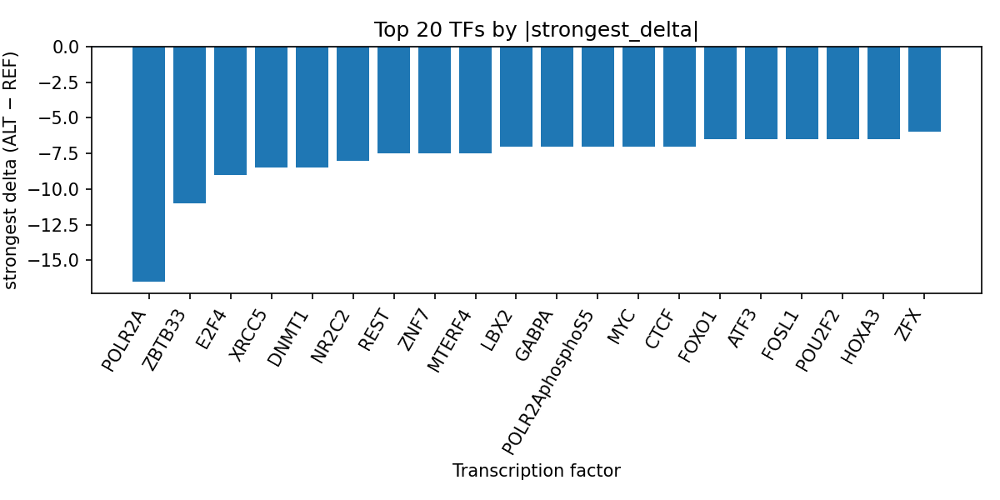

# Computational prioritization of rs554455398 for malignant renal pelvis neoplasm using AlphaGenome transcription factor ChIP-seq predictions

*Author: snv-tf-researcher*

## Abstract

Malignant renal pelvis neoplasm is a rare and clinically challenging upper urinary tract malignancy [1,2]. We evaluated the intronic candidate variant rs554455398 (1:244618234 G>A), selected by effect size from the provided GWAS data, using AlphaGenome transcription factor ChIP-seq predictions. The variant had a reported p-value of 2 × 10^-11 and an absolute effect size of 3.612. Across predicted TF ChIP-seq tracks, the ALT allele was associated predominantly with decreased predicted binding, with the largest negative effects observed for POLR2A, ZBTB33, E2F4, XRCC5, DNMT1, and NR2C2. These computational predictions prioritize potential regulatory consequences at this locus, but they are not experimental measurements and require validation in independent assays. The results are consistent with the broader literature indicating molecular heterogeneity in upper tract urothelial and renal pelvis malignancies [3,4].  

## Introduction

Malignant neoplasms of the renal pelvis are part of the upper urinary tract cancer spectrum and remain clinically important because of their rarity and aggressive behavior in many cases [1,2]. Upper tract urothelial carcinoma (UTUC), which includes renal pelvis tumors, has been described as biologically heterogeneous, with ongoing efforts to refine molecular stratification and prognostic assessment [3,6]. Prior work has also highlighted location-dependent heterogeneity within the upper urinary tract, including differences between renal pelvis and ureteral tumors [5,7].  

Genome-wide association studies can nominate non-coding risk variants that may influence disease susceptibility through regulatory mechanisms rather than protein-coding changes. In this context, in silico transcription factor perturbation analysis can help prioritize candidate variants for follow-up, while recognizing that computational predictions do not substitute for experimental data. Here, we interpret AlphaGenome TF ChIP-seq predictions for rs554455398, an intronic/non-coding transcript variant selected by effect size, in the setting of malignant renal pelvis neoplasm.

## Methods

The candidate variant rs554455398 on chromosome 1 at position 244,618,234 (G>A) was provided as the selected GWAS locus for malignant renal pelvis neoplasm. The variant was annotated as intron_variant and non_coding_transcript_variant, with the risk allele specified as rs554455398-G and a reported p-value of 2 × 10^-11.

AlphaGenome was used to generate computational TF ChIP-seq predictions for the REF and ALT alleles. These outputs are computational predictions, not measurements. The provided results were summarized at the transcription-factor level by aggregating available TF ChIP-seq tracks and ranking factors by predicted absolute effect size. The workflow for data retrieval, variant filtering, annotation, prediction, summarization, literature lookup, and manuscript generation is summarized in the run pipeline (Figure 1).

**Figure 1.** Workflow overview for the SNV-to-transcription-factor prioritization pipeline. The figure summarizes GWAS variant selection, annotation, AlphaGenome TF ChIP-seq prediction, transcription-factor-level summarization, literature retrieval, and AI-assisted manuscript synthesis.

## Results

### Variant-level summary

The provided candidate variant rs554455398 was selected by effect size for malignant renal pelvis neoplasm. It is an intronic and non-coding transcript variant with effect size 3.612 and p-value 2 × 10^-11. No nearest genes were provided.

### TF-level AlphaGenome predictions

Across predicted TF ChIP-seq tracks, the ALT allele was associated predominantly with reduced predicted binding. The strongest predicted inhibitory effect was observed for POLR2A in A549 cells, with a signed delta of -16.5. Other top predicted inhibited factors included ZBTB33, E2F4, XRCC5, DNMT1, NR2C2, REST, ZNF7, MTERF4, CTCF, MYC, POLR2AphosphoS5, GABPA, FOXO1, ATF3, FOSL1, POU2F2, HOXA3, RNF2, E2F1, ZNF441, THAP7, YY1, TIGD6, ZFX, TAF1, ZBTB26, ZNF263, and ETV5. The results table in `top_tf_effects.tsv` provides the run-level TF summary used for prioritization.

The highest-effect TFs are shown below (Figure 2).

**Figure 2.** Top transcription factors at rs554455398 ranked by absolute predicted ALT-vs-REF binding delta from AlphaGenome ChIP-seq tracks. Negative bars indicate predicted inhibition by the ALT allele relative to the REF allele, and positive bars indicate predicted promotion.

Overall, POLR2A showed the broadest track support among the listed TFs, with 44 tracks and a mean delta of -1.045. CTCF was the most broadly represented factor among the summarized set, with 153 tracks and a median delta of 0.0, but still an overall inhibited direction. Several other factors, including REST, YY1, TAF1, and GABPA, also showed predominantly negative mean deltas.

## Discussion

The AlphaGenome predictions suggest that rs554455398 may alter a non-coding regulatory context in a manner that broadly prioritizes reduced TF occupancy or reduced ChIP-seq signal for multiple factors. In particular, the large predicted decrease for POLR2A is notable because POLR2A is a central component of the transcriptional machinery; however, this remains a computational inference and should not be interpreted as direct evidence of altered transcription in tumor tissue. The multi-factor pattern is consistent with the possibility that this locus lies in a regulatory region with broad transcriptional influence, but experimental validation is required.

The renal pelvis cancer literature supports the relevance of molecular heterogeneity and regulatory stratification in upper tract disease [3,6]. Prior studies and reviews have emphasized that UTUC biology differs from other urothelial contexts and that molecular markers can help refine risk assessment [3,6]. In addition, studies of tumor location and subtype indicate that the renal pelvis and adjacent upper tract compartments may not behave uniformly [4,5,7]. These observations are compatible with the rationale for prioritizing non-coding variants that show strong predicted regulatory effects.

At the disease level, published reports and reviews describe malignant renal pelvis and upper tract tumors as clinically challenging and heterogeneous entities [1,2,3]. The present computational analysis does not establish a mechanism, but it does nominate rs554455398 as a variant with potentially important regulatory consequences in a disease-relevant context.

## Limitations

This analysis is based on AlphaGenome computational predictions, not experimental measurements. Therefore, the TF ChIP-seq deltas should be interpreted as prioritization signals rather than direct evidence of TF binding changes.

The candidate variant was selected by effect size and may be in linkage disequilibrium with the true causal variant. As a result, rs554455398 may be a proxy for the underlying functional allele rather than the causal nucleotide itself.

No tumor tissue, matched normal tissue, or orthogonal functional assay data were provided, so no conclusion can be made about cell-type specificity, directionality in vivo, or transcriptional consequence in malignant renal pelvis neoplasm. Experimental validation, such as reporter assays, electrophoretic mobility shift assays, CRISPR perturbation, or allele-specific chromatin assays, is required.

Finally, the literature cited here was limited to the supplied records, so the discussion is restricted to those sources.

## References

1. Wang S, Chen S, Ma X, et al. A bibliometric study and visualization analysis of the current status and perspectives in upper tract urothelial carcinoma. Medicine. 2026;105(13):e48126. PMID: 41894298. doi:10.1097/MD.0000000000048126

2. Li J, Wang X, Zhen J, et al. Case Report: A rare case of primary undifferentiated pleomorphic sarcoma of the renal pelvis with high PD-L1 expression and a misleading positive urine FISH. Front Immunol. 2026;17:1769769. PMID: 41853282. doi:10.3389/fimmu.2026.1769769

3. Hassler MR, Bray F, Catto JWF, et al. Molecular Characterization of Upper Tract Urothelial Carcinoma in the Era of Next-generation Sequencing: A Systematic Review of the Current Literature. Eur Urol. 2020;78(2):209-220. PMID: 32571725. doi:10.1016/j.eururo.2020.05.039

4. Wang B, Davis LE, Nandwana D, et al. Divergent Differentiation and Histologic Subtypes in Upper Tract Urothelial Carcinoma Demonstrate Distinct Patterns of Extraurothelial Recurrence. Eur Urol Open Sci. 2026;86:1-9. PMID: 41768039. doi:10.1016/j.euros.2026.02.002

5. Guan B, Peng K, Cao C, et al. Anatomical refinement matters: ureteropelvic junction location confers survival benefit for patients with upper tract urothelial carcinoma after radical nephroureterectomy. World J Urol. 2026;44(1):161. PMID: 41677900. doi:10.1007/s00345-026-06219-1

6. Bahlinger V, Maas M, Bolenz C, Hartmann A. [Localised Urothelial Carcinoma of the Upper Urinary Tract: Histopathology, Molecular Genetics, and Clinical Features]. Aktuelle Urol. 2026;57(1):60-65. PMID: 41587739. doi:10.1055/a-2768-9305

7. Farzat M, Altaie I, Leyh-Bannurah SR, et al. Impact of tumor location on oncological and perioperative outcomes after robot-assisted radical nephroureterectomy for upper tract urothelial carcinoma. PLoS One. 2026;21(1):e0341638. PMID: 41615910. doi:10.1371/journal.pone.0341638