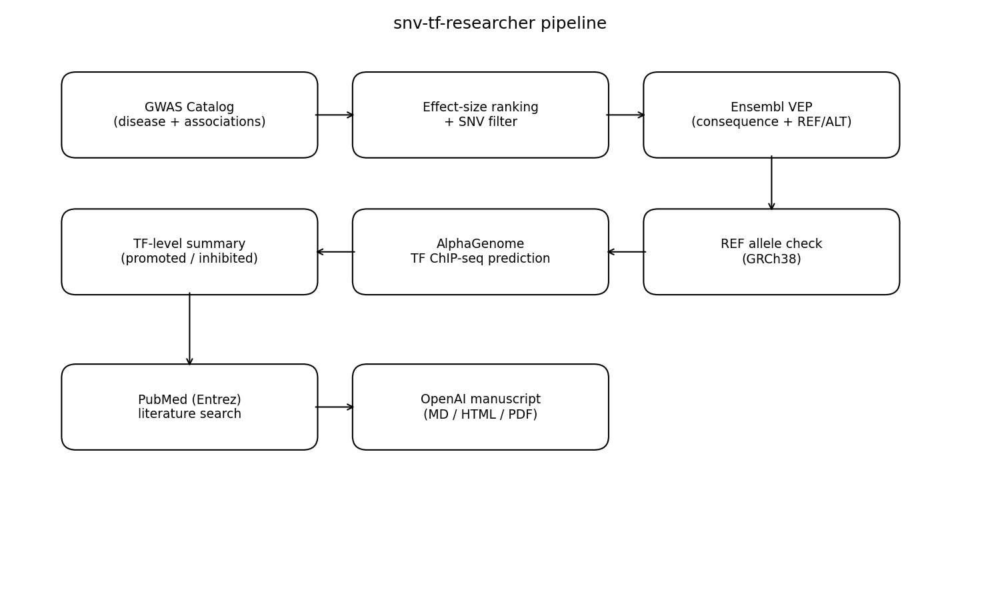
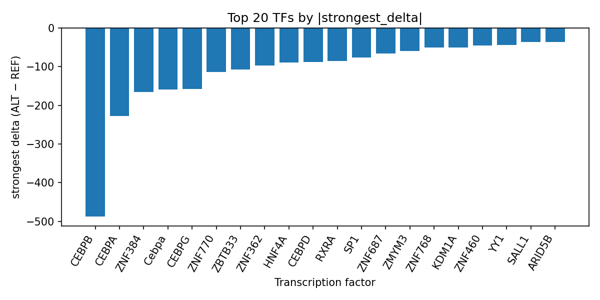

# AlphaGenome-predicted transcription factor disruption at rs112875651 in metabolic dysfunction-associated steatotic liver disease

*Author: snv-tf-researcher*

## Abstract

Background: Metabolic dysfunction-associated steatotic liver disease (MASLD) is a common chronic liver disease with substantial cardiometabolic overlap, and genetic studies continue to identify associated loci [1-3]. Here, we interpret computational AlphaGenome transcription factor (TF) ChIP-seq predictions for rs112875651, a GWAS-selected intronic variant associated with MASLD (p = 3 × 10^-22; abs_beta = 9.71).

Methods: The variant was prioritized by effect size. AlphaGenome was used to predict REF-to-ALT sequence effects on TF ChIP-seq tracks, and outputs were summarized across TFs by signed delta, track count, and direction. Because AlphaGenome produces computational predictions rather than experimental measurements, all findings should be interpreted as prioritization hypotheses requiring experimental validation. The workflow is summarized in the run pipeline figure (Figure 1).

Results: AlphaGenome predicted that the ALT allele (A) would predominantly inhibit binding across the top prioritized TFs. The strongest aggregated inhibition was observed for CEBPB, followed by CEBPA, ZNF384, Cebpa, and CEBPG. Several liver-relevant TFs were also predicted to be inhibited, including HNF4A, RXRA, SP1, and YY1. The full ranked TF summary is provided in `top_tf_effects.tsv`, and the strongest TF-level effects are visualized in the TF delta bar plot (Figure 2).

Conclusions: The rs112875651-A substitution is computationally prioritized as a putative regulatory allele that may reduce binding of multiple TFs, including factors with liver-relevant roles. These predictions suggest a regulatory mechanism worth experimental follow-up, but they do not establish causality and require independent validation.

## Introduction

Metabolic dysfunction-associated steatotic liver disease (MASLD) is increasingly recognized as a major chronic liver disease with broad metabolic and systemic consequences [1-3]. Recent literature continues to emphasize its clinical burden, the importance of noninvasive risk stratification, and the relevance of cardiometabolic comorbidity in affected populations [1-3]. Genome-wide association studies (GWAS) have also been used to prioritize loci and genes relevant to MASLD biology [9,15,18].

Computational variant-to-function models can help nominate regulatory mechanisms for noncoding GWAS signals, particularly when the associated variant lies in an intron or other noncoding region. In this analysis, we focus on rs112875651, an intronic MASLD-associated variant selected by effect size. Because such a variant may be in linkage disequilibrium with the true causal variant, functional interpretation should remain provisional. The present manuscript therefore interprets AlphaGenome TF ChIP-seq predictions as hypothesis-generating computational evidence, not as experimental proof.

## Methods

### Variant selection and annotation

rs112875651 (chromosome 8:125,494,452 G>A) was selected because it showed a strong association with MASLD (p = 3 × 10^-22; abs_beta = 9.71). The variant consequence terms were intron_variant and non_coding_transcript_variant. No nearest genes were provided in the input data.

### AlphaGenome TF ChIP-seq prediction and summarization

The REF and ALT alleles were compared using AlphaGenome TF ChIP-seq prediction outputs. Predicted changes were summarized at the TF level using the provided track-level statistics, including number of tracks, strongest track, strongest biosample, strongest signed delta, mean delta, median delta, and counts of promoted versus inhibited tracks. These outputs are computational predictions and were treated as prioritization evidence rather than experimental observation.

### Literature curation

The provided literature list was used to contextualize MASLD biology and cardiometabolic comorbidity. Citations were limited to the supplied PubMed records.

### Workflow figure

The end-to-end analysis workflow, including disease and association retrieval, effect-size ranking, consequence annotation, AlphaGenome prediction, TF summarization, literature search, and manuscript synthesis, is shown in Figure 1.

**Figure 1.** Workflow schematic for the snv-tf-researcher pipeline. The figure summarizes disease/association retrieval, variant filtering and prioritization, annotation, AlphaGenome TF ChIP-seq prediction, TF-level aggregation, PubMed literature curation, and manuscript generation.

## Results

AlphaGenome prioritized a predominantly inhibitory regulatory impact for rs112875651-A across the top TFs. CEBPB showed the largest effect, with 10 predicted tracks all inhibited and a strongest signed delta of -487.5. Additional strongly inhibited TFs included CEBPA, ZNF384, Cebpa, and CEBPG. Among liver-associated TFs, HNF4A, RXRA, SP1, and YY1 were also predicted to be inhibited, suggesting that the variant may alter a broader hepatically relevant regulatory program. The complete ranking is provided in `top_tf_effects.tsv`, which records the TF-level summary statistics used for prioritization.

The top TF effects are displayed in the bar plot in Figure 2. This visualization shows that the largest absolute predicted effects were negative, consistent with overall inhibition rather than promotion for the highest-ranked TFs.

**Figure 2.** Predicted TF ChIP-seq delta effects for rs112875651 ranked by absolute magnitude. Bars show the strongest signed ALT-vs-REF delta for each TF; negative values indicate predicted inhibition and positive values indicate predicted promotion.

## Discussion

The AlphaGenome predictions suggest that rs112875651-A may reduce binding of multiple transcription factors, with the strongest predicted effect on CEBPB and additional inhibition of CEBPA, CEBPG, HNF4A, RXRA, SP1, and YY1. This pattern is consistent with the possibility that the locus could influence regulatory activity in liver-relevant contexts, given the importance of transcriptional and metabolic pathways in MASLD biology [1-3,9,18]. However, these results remain computational and should be interpreted as candidate hypotheses requiring experimental testing.

The emphasis on inhibitory TF effects is notable in the context of MASLD, where genetic and molecular studies have highlighted the role of regulatory variants and liver-enriched gene networks [9,15,18]. Prior literature also underscores the centrality of cardiometabolic traits and shared genetic architecture in MASLD risk [8,9,18]. In that setting, the present predictions may help prioritize follow-up experiments for allele-specific binding or reporter assays, especially for factors with liver-relevant activity such as HNF4A, RXRA, SP1, and YY1. Experimental validation is required before any mechanistic conclusion can be made.

## Limitations

This analysis has several limitations. First, AlphaGenome predictions are computational and do not measure TF occupancy or causality; experimental validation is required. Second, rs112875651 was selected by effect size and may be in linkage disequilibrium with the true causal variant. Third, no nearest-gene annotation was provided, limiting locus-to-gene interpretation. Fourth, the available output consists of TF ChIP-seq prediction summaries rather than chromatin context, expression, or orthogonal functional assays. Finally, only the supplied literature list was used for contextualization.

## References

1. Mao X, Fan H, Yuen MF, Cheung R, Seto WK, Nguyen MH. GLP-1 receptor agonist-SGLT-2 inhibitor combination and risk of major adverse liver and cardiovascular outcomes in adults with MASLD and type 2 diabetes. Hepatology (Baltimore, Md.). 2026. PMID: 42029657. doi:10.1097/HEP.0000000000001771

2. Kim BK. Metabolic Dysfunction-Associated Steatotic Liver Disease and Obesity: Pathogenesis, Diagnostics, Risk Stratification, and Therapeutic Approach. Kaohsiung J Med Sci. 2026;e70227. PMID: 42028921. doi:10.1002/kjm2.70227

3. Yoon SY, El Bouzaidi Tiali S, Wing S, Davalan W, Jatana S, Slapcoff L, et al. Metabolic Dysfunction-Associated Steatotic Liver Disease and Kidney Transplant Outcomes. Kidney Int Rep. 2026;11(6):106477. PMID: 42027553. doi:10.1016/j.ekir.2026.106477

4. Zhu Z, Li H, Wang X, Chen X, Cheng L. Genome-Wide Cross-Trait Analysis Dissects the Shared Genetic Architecture Between Type 2 Diabetes Mellitus and Metabolic Dysfunction-Associated Steatotic Liver Disease. Hum Mutat. 2026;2026:9992644. PMID: 41969614. doi:10.1155/humu/9992644

5. Qiu D, Suo L, Wei T, Lu Z, Weng Q, Xiao J, et al. Mediation Role of Gut Microbiota in the Causal Relationship Between m6A Regulatory Genes and Metabolic Dysfunction-Associated Steatotic Liver Disease: A Mendelian Randomization Study. Biomedicines. 2026;14(3). PMID: 41898277. doi:10.3390/biomedicines14030630

6. Guo Y, You Y, Guan X, Yin Y, Yin Z, Zhong G, et al. DNA methylation mediates the association between organochlorine pesticides and MASLD: An epigenome-wide association study with integrated AOP framework. J Hazard Mater. 2026;507:141727. PMID: 41832812. doi:10.1016/j.jhazmat.2026.141727

7. Yi XH, Zhu HX, He MY, Gao S, Li M. Decoding Links between Gut Microbiota and Metabolic-associated Fatty Liver Disease: Meta-analysis and Mediation Study Uncover Species-specific Taxa and a Novel Bile Acid Mediator. Biomed Environ Sci. 2026;39(2):202-214. PMID: 41821330. doi:10.3967/bes2025.162

8. Ding R, Zhou M, Guan K, Xie L, Zhang Y, Chen Q, et al. Type 2 diabetes mellitus and liver diseases: a phenome-wide Mendelian randomization atlas and genome-wide genetic correlation study. Eur J Gastroenterol Hepatol. 2026;38(3):341-350. PMID: 41757613. doi:10.1097/MEG.0000000000003096

9. Karapanagiotidi F, Boutari C, Sinakos E. Genetic Predisposition to MASLD: Potential for Therapeutic Management. Int J Mol Sci. 2026;27(4). PMID: 41752069. doi:10.3390/ijms27041933

10. Du M, Yuan H, Wu T, Jiang Y, Suo C, Jin L, et al. Cross-trait genomic modeling reveals the polygenic architecture and systemic impact of MASLD. Sci Adv. 2026;12(7):eaeb5665. PMID: 41686896. doi:10.1126/sciadv.aeb5665

11. Yao W, Fan J, Lu J, Guo H, Yu C, Wang X, et al. Cross-ancestry genome-wide association studies of liver function biomarkers uncover pleiotropic variants, systemic disease links and therapeutic targets. Genome Med. 2026;18(1). PMID: 41689074. doi:10.1186/s13073-026-01606-0

12. Gobeil É, Bourgault J, Gagnon E, Samson N, Ruel LJ, Côté V, et al. Integrative genetic and liver transcriptomic analyses identify TRIB1AL as a target for steatotic liver disease. J Clin Endocrinol Metab. 2026. PMID: 41635218. doi:10.1210/clinem/dgag043

13. Zhong X, Lu J, Yang X, Chen H, Wang W, Zhang J, et al. Periportal hepatocytes secret SAA1 to recruit MoKCs and interactions through CADM1 signaling to promote MASLD. Hepatol Int. 2026. PMID: 41673374. doi:10.1007/s12072-025-11024-w

14. Lin L, Ye J, Dong Z, Deng H, Hu Y, Feng S, et al. Ethnic heterogeneity in steatosis-driven liver injury among MASLD patients: Han Chinese vs. Caucasian. Clin Exp Hepatol. 2025;11(3):249-261. PMID: 4222369?