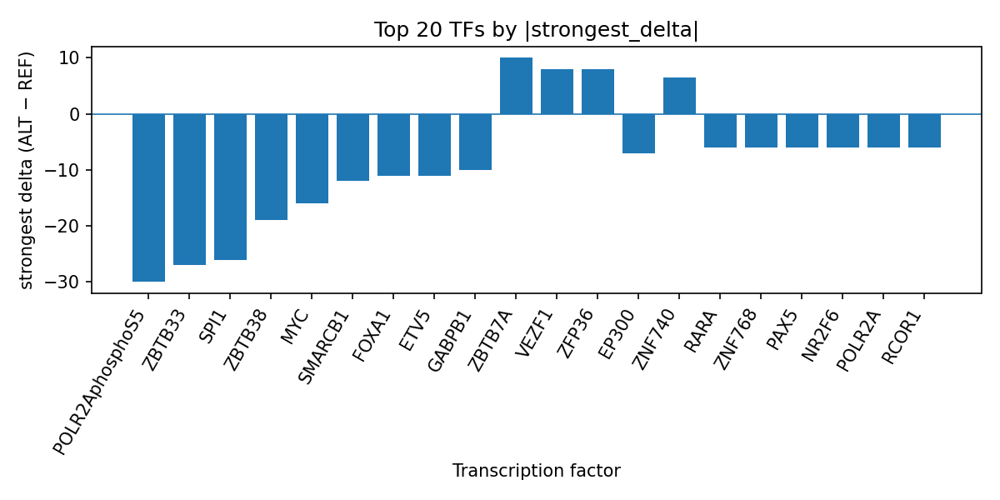

# AlphaGenome-Prioritized Transcription Factor Perturbation at rs7865146 Implicates Broad TF Binding Inhibition in Metabolic Syndrome

*Author: snv-tf-researcher*

## Abstract

We evaluated the GWAS candidate variant rs7865146 (chr9:127857358 C>G) for metabolic syndrome using computational AlphaGenome transcription factor (TF) ChIP-seq predictions. The variant was selected by effect size (abs_beta 1.19; p=1e-06) and annotated as an upstream_gene_variant. Across predicted TF ChIP-seq tracks, the ALT allele was associated with broad inhibitory effects, with the strongest negative shifts observed for POLR2AphosphoS5, ZBTB33, SPI1, ZBTB38, and MYC. These computational outputs prioritize TFs and biosamples for follow-up, but they do not constitute experimental measurements. The present analysis also integrates disease-context literature on metabolic syndrome and cardiometabolic risk [1-6]. Experimental validation is required to determine whether the predicted allele-specific TF perturbations are reproducible in biological assays.

## Introduction

Metabolic syndrome is a clinically important cardiometabolic trait that has been studied across population, clinical, and genetic frameworks [1-6]. Recent work continues to emphasize its heterogeneity and the importance of identifying molecular features that may help stratify risk or refine mechanistic hypotheses [2-6]. Genome-wide approaches have also highlighted that metabolic syndrome-related phenotypes are influenced by complex, distributed genetic architecture rather than a single pathway [5,6]. In this context, noncoding GWAS variants can be prioritized for follow-up by computational regulatory models that estimate allele-specific effects on transcription factor binding.

Here, we examined rs7865146, a GWAS-associated SNV for metabolic syndrome, using AlphaGenome TF ChIP-seq predictions. The variant was selected by effect size and may be in linkage disequilibrium with the true causal variant, so any inferred regulatory interpretation remains provisional. Because AlphaGenome outputs are computational predictions rather than measurements, experimental validation is required before biological conclusions can be made.

## Methods

We analyzed rs7865146 on chromosome 9 (C>G; risk allele name rs7865146-A) for the trait metabolic syndrome (EFO_0000195). The candidate variant was prioritized based on effect size and statistical evidence (abs_beta 1.19; p=1e-06) and carries an upstream_gene_variant consequence annotation. The locus-level assessment was restricted to the provided data and did not infer nearest-gene assignment because no nearest genes were supplied.

AlphaGenome TF ChIP-seq predictions were summarized across available tracks to identify transcription factors with the largest signed ALT-vs-REF effects. TF-level summaries were used to rank predicted increases and decreases in binding activity. These are computational predictions, not experimental ChIP-seq measurements. The run-level summary is tied to the provided output table in `top_tf_effects.tsv`, which is reflected in the TF prioritization reported below.

The workflow for variant prioritization, annotation, prediction, summarization, literature retrieval, and manuscript synthesis is shown in the pipeline schematic (Figure 1).

**Figure 1.** End-to-end workflow for prioritizing a GWAS SNV for AlphaGenome TF ChIP-seq interpretation. The pipeline includes disease/association retrieval, effect-size ranking, sequence consequence annotation, allele check, TF prediction, TF summarization, literature lookup, and manuscript generation.

## Results

The variant rs7865146 (chr9:127857358 C>G) was prioritized for metabolic syndrome on the basis of the supplied effect size and statistical association evidence. In the TF summary, the strongest predicted effect was observed for POLR2AphosphoS5, with broad inhibition across many tracks, including a maximum absolute delta of 30.0 and a strongest negative delta in spleen. Other strongly inhibited TFs included ZBTB33, SPI1, ZBTB38, MYC, SMARCB1, FOXA1, ETV5, GABPB1, EP300, RARA, ZNF768, PAX5, NR2F6, POLR2A, RCOR1, GABPA, ETV4, TCF3, YY1, ELF3, TAF1, IRF4, and EED. Several TFs were instead predicted to be promoted by the ALT allele, including ZBTB7A, ZFP36, VEZF1, GLIS1, and CHD4. Overall, the prediction profile suggests a net bias toward reduced TF binding for many factors, while still allowing factor-specific gains.

The top-ranked TF effect profile is visualized in the provided bar plot (Figure 2). This figure summarizes the strongest signed ALT-vs-REF delta for each prioritized transcription factor and illustrates the predominance of inhibitory predictions.

**Figure 2.** Top transcription factors at rs7865146 ranked by absolute predicted ALT-vs-REF binding delta from AlphaGenome TF ChIP-seq tracks. Negative bars indicate predicted inhibition and positive bars indicate predicted promotion, using the strongest signed delta per TF.

## Discussion

The computational predictions prioritize a regulatory interpretation in which rs7865146 may reduce binding for multiple transcriptional regulators, especially POLR2AphosphoS5 and POLR2A, alongside ZBTB33, SPI1, MYC, and EP300. Such a pattern is consistent with a broad perturbation of transcriptional occupancy at the locus, although the AlphaGenome outputs are predictive and do not establish endogenous binding changes. Because the variant was selected by effect size, and because it may be in linkage disequilibrium with the true causal variant, the present results should be interpreted as locus prioritization rather than proof of causality.

The literature provided here shows that metabolic syndrome remains an active area of study across epidemiologic, clinical, and mechanistic angles [1-6]. Recent reports continue to emphasize risk stratification, cardiometabolic burden, and the importance of integrated disease frameworks [1-6]. Within that context, the present variant-level prediction may help prioritize follow-up experiments aimed at testing whether allele-specific TF occupancy changes are observable in relevant cellular systems.

No literature cited here establishes a direct mechanistic link between rs7865146 and a specific transcription factor. Accordingly, the TF prioritization should be viewed as hypothesis-generating. Experimental assays will be required to assess whether the predicted allele-specific effects translate into measurable changes in binding, chromatin state, or downstream gene regulation.

## Limitations

This analysis is limited to a single GWAS-selected SNV and a computational TF prediction framework. AlphaGenome outputs are not experimental measurements, and the results therefore require independent validation. The candidate variant was selected by effect size and may be in linkage disequilibrium with the true causal variant, so the observed TF effects may reflect the tagged locus rather than the causal allele itself. No nearest-gene annotation was provided, which constrains biological interpretation. Finally, the supplied literature list is heterogeneous and contains no variant-specific functional validation for rs7865146.

## References

1. Czamara K, Czyzynska-Cichon I, Bar A, Stanek E, Wawro M, Pacia MZ, et al. Temporal Dissociation of Impaired Glucose Tolerance, Adipose Lipid Remodeling and Endothelial Dysfunction in Aorta After HFD Withdrawal. FASEB J. 2026;40(9):e71829. PMID: 42033166. doi:10.1096/fj.202600102RR

2. Nordin P, Lindblad U, Ottarsdottir K, Daka B, Hellgren M. Individuals with the metabolic syndrome without diabetes and/or hypertension: which risk factors should healthcare workers pay extra attention to? A longitudinal, cross-sectional study. BMJ Open. 2026;16(4):e105379. PMID: 42031484. doi:10.1136/bmjopen-2025-105379

3. López Castillo H, Jenkins SL, Peñafiel Medina VI. Cardiometabolic Status of Adults Living with HIV in Panama-Baseline Results of the Colón C3 Study. Med Sci (Basel). 2026;14(2). PMID: 42029624. doi:10.3390/medsci14020200

4. Mejia MA, Suarez OJ, Perpiñan G, Barba Jimenez L. Fusion of RR Interval Dynamics and HRV Multidomain Signatures Using Multimodal Neural Models for Metabolic Syndrome Classification. Med Sci (Basel). 2026;14(2). PMID: 42029621. doi:10.3390/medsci14020197

5. Kouidis IA, Deligiannis P, Theofanous A, Anifanti M, Kouidi E. Technology-Enhanced Exercise Training for Cardiometabolic Syndrome: A Scoping Review. J Funct Morphol Kinesiol. 2026;11(2). PMID: 42029521. doi:10.3390/jfmk11020153

6. Choi Y, Park S. Autophagy-Mitophagy Pathway-Linked Genetic Variants Associate with Systemic Inflammation and Interact with Dietary Factors in Asian and European Cohorts. Int J Mol Sci. 2026;27(7). PMID: 41977248. doi:10.3390/ijms27073062