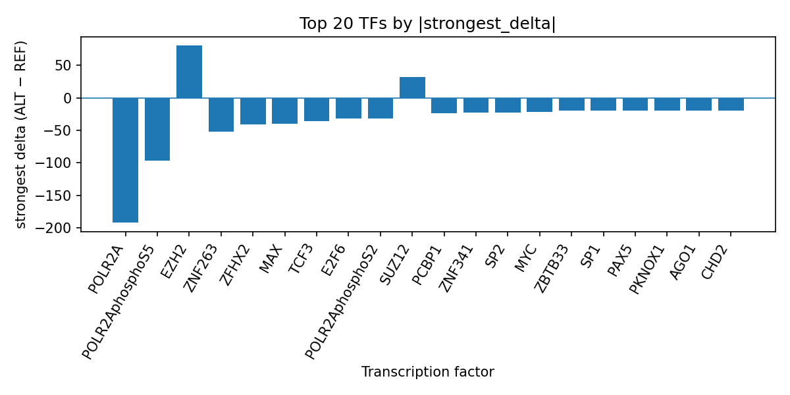

# AlphaGenome-predicted transcription factor perturbations at rs147430042 in non-melanoma skin carcinoma

*Author: snv-tf-researcher*

## Abstract

**Background:** Non-melanoma skin carcinoma is a common malignant skin cancer, and prior genetic studies have supported a polygenic contribution to risk [1-4]. Here, rs147430042 (chr6:392364 A>G) was selected as a candidate variant based on effect size for non-melanoma skin carcinoma, with the computational prediction that the ALT allele may alter transcription factor (TF) binding.

**Methods:** We interpreted AlphaGenome TF ChIP-seq predictions for the rs147430042 A>G substitution, together with the provided variant annotation and literature. AlphaGenome outputs are computational predictions rather than experimental measurements; therefore, the results are hypothesis-generating and require experimental validation. The workflow is summarized in the run overview figure (Figure 1), and TF-level outputs were prioritized using the run table `top_tf_effects.tsv`.

**Results:** The strongest predicted effects were predominantly inhibitory, especially for POLR2A, POLR2AphosphoS5, ZNF263, MAX, TCF3, E2F6, and POLR2AphosphoS2, with additional inhibition predicted for MYC, SP1, TBP, and multiple other TFs. Prominent positive effects were limited, with EZH2 and SUZ12 among the top promoted factors. These patterns suggest that rs147430042 may perturb a broad transcriptional regulatory context rather than a single TF motif. The ranked TF summary and effect sizes are presented in `top_tf_effects.tsv`, and the leading TF shifts are visualized in Figure 2.

**Conclusions:** The computational predictions prioritize rs147430042 as a potential regulatory variant in a non-melanoma skin carcinoma locus. Because the variant was selected by effect size and may be in linkage disequilibrium with the true causal variant, and because AlphaGenome predictions are not direct measurements, experimental follow-up will be required.

## Introduction

Non-melanoma skin carcinoma comprises basal cell carcinoma and cutaneous squamous cell carcinoma, and both clinical and genetic studies support substantial heterogeneity in risk and presentation [1-4]. Prior work has reported germline associations and polygenic risk contributions to non-melanoma skin cancer, including locus-level signals in GWAS and predictive performance of PRS in transplant cohorts [3,4,7-10]. More recent literature also continues to emphasize the clinical relevance of skin cancer risk stratification and the need for mechanistic prioritization of candidate loci [1,2,5,6].

In this setting, rs147430042 was selected as a candidate variant for non-melanoma skin carcinoma based on effect size. The variant is annotated as an intron_variant, non_coding_transcript_variant, NMD_transcript_variant, non_coding_transcript_exon_variant, upstream_gene_variant, and 5_prime_UTR_variant, consistent with a potential regulatory role. Because noncoding GWAS signals frequently tag broader haplotypic regions rather than a single causal allele, interpretation should remain cautious and linkage disequilibrium must be considered [7-10].

This manuscript interprets AlphaGenome TF ChIP-seq predictions for rs147430042. AlphaGenome provides computational predictions of TF occupancy changes rather than direct experimental binding measurements, so the analysis is best viewed as hypothesis generation for downstream validation.

## Methods

The candidate variant rs147430042 (chromosome 6:392364 A>G) was provided with non-melanoma skin carcinoma as the disease context, a GWAS p-value of 8 × 10^-13, and an absolute log-odds ratio effect size of 0.5447272154416712. The variant was annotated with noncoding and upstream-region consequence terms. No nearest gene was provided.

AlphaGenome TF ChIP-seq predictions were summarized at the TF level using the provided `tf_summary_top` results and the run folder table `top_tf_effects.tsv`. Effects were interpreted as ALT-vs-REF signed deltas, where negative values indicate predicted inhibition and positive values indicate predicted promotion. The strongest track and biosample for each TF were retained from the run output. These predictions are computational and do not constitute experimental evidence of TF binding or occupancy.

The end-to-end analysis workflow, including disease/association retrieval, effect-size ranking, variant filtering, consequence annotation, AlphaGenome prediction, TF summarization, literature retrieval, and manuscript synthesis, is shown in the workflow figure (Figure 1).

**Figure 1.** Workflow overview for the snv-tf-researcher run. The pipeline links the provided GWAS-derived candidate variant to consequence annotation, AlphaGenome TF ChIP-seq prediction, TF-level aggregation, literature support, and manuscript generation.

## Results

The AlphaGenome TF ChIP-seq interpretation for rs147430042 prioritized a predominantly inhibitory regulatory profile. POLR2A showed the strongest overall negative signal, with 44 tracks evaluated and a maximum absolute delta of 192.0, including the strongest negative delta in GM10847. POLR2AphosphoS5 was similarly inhibited across 26 tracks, with a strongest delta of -96.0 in GM12878. Other strongly inhibited TFs included ZNF263, MAX, TCF3, E2F6, POLR2AphosphoS2, MYC, CHD2, ZBTB33, SP1, PAX5, PKNOX1, AGO1, POLR2G, ZNF335, TFAP4, IRF4, TBP, ZNF600, POU2F2, RBFOX2, MLLT1, and ZNF280B. The TF summary table in `top_tf_effects.tsv` captures these rankings and effect sizes.

Although inhibition dominated, several TFs showed predicted promotion. EZH2 had the largest positive signal among the listed factors, with 8 tracks and a strongest delta of +80.0 in neural progenitor cells. SUZ12 was also promoted, with a strongest delta of +32.0 in H1 cells. These mixed-direction findings suggest that the allele may affect multiple regulatory programs rather than producing a uniform directional shift.

The top TF effects are visualized in Figure 2.

**Figure 2.** Top transcription factors at rs147430042 ranked by absolute predicted ALT-vs-REF binding delta from AlphaGenome TF ChIP-seq tracks. Negative bars indicate predicted inhibition and positive bars indicate predicted promotion, highlighting broad suppression of multiple TFs with a smaller set of promoted factors.

## Discussion

The AlphaGenome predictions suggest that rs147430042 may be a regulatory variant with broad effects on TF-associated chromatin occupancy. The strongest predicted inhibition involved POLR2A and POLR2AphosphoS5, which may indicate altered transcriptional machinery engagement at the locus, while the presence of predicted changes in MYC, SP1, TBP, and multiple zinc-finger and promoter-associated factors suggests a wider perturbation of gene-regulatory context. Because these are computational predictions, they should be interpreted as prioritization signals rather than evidence of mechanism.

The disease context is compatible with a regulatory interpretation. Prior studies have established genetic contributions to non-melanoma skin cancer and have identified several susceptibility loci and polygenic risk signals [7-10]. In addition, contemporary reviews and clinical studies continue to emphasize the importance of molecular stratification and personalized risk assessment in non-melanoma skin cancer [1-6]. Together, these data support the plausibility that noncoding variation may help refine disease-associated loci, although they do not establish the function of rs147430042 specifically [1-10].

The mixed predicted promotion of EZH2 and SUZ12 alongside broad inhibition of other TFs is consistent with allele-specific remodeling of a local regulatory landscape. However, no direct mechanistic inference can be made from these outputs alone. Experimental assays will be needed to determine whether the predicted TF changes are reflected in chromatin occupancy, transcriptional activity, or disease-relevant cellular phenotypes.

## Limitations

This analysis has several limitations. First, AlphaGenome outputs are computational predictions and not experimental measurements, so they require laboratory validation. Second, the candidate variant was selected by effect size and may be in linkage disequilibrium with the true causal variant, meaning the observed TF predictions may not map to the ultimately causal allele. Third, no nearest gene was provided, limiting locus-level interpretation. Fourth, the TF summary is derived from the provided run output and should be viewed as a prioritized subset rather than a complete characterization of all possible TF effects. Finally, while literature context supports the relevance of noncoding variation and polygenic risk in non-melanoma skin cancer [7-10], the present manuscript does not establish biological causality.

## References

1. Fındık DG, Türelik Ö. Epiplakin expression in non-melanoma skin cancer: associations with epithelial-mesenchymal transition markers and tumor invasion. Anais brasileiros de dermatologia. 2026;101(3):501350. PMID: 42025117. doi:10.1016/j.abd.2026.501350

2. Elbaz C, Lombart F, Batteux B, Dadban A, Arnault JP, Potereau A, et al. Systematic skin cancer screening in patients treated with biologics for chronic inflammatory rheumatic diseases: an 11-year experience. Annales de dermatologie et de venereologie. 2026;153(2):103488. PMID: 42025014. doi:10.1016/j.annder.2026.103488

3. Li Y, Li Q, Cao Z, Wu J. Multicenter proteome-wide Mendelian randomization study identifies causal plasma proteins in melanoma and non-melanoma skin cancers. Communications biology. 2024;7(1):857. PMID: 39003418. doi:10.1038/s42003-024-06538-2

4. Li Y, Wu J, Cao Z. Childhood sunburn and risk of melanoma and non-melanoma skin cancer: a Mendelian randomization study. Environmental science and pollution research international. 2023;30(58):122011-122023. PMID: 37962759. doi:10.1007/s11356-023-30535-3

5. Stapleton CP, Chang BL, Keating BJ, Conlon PJ, Cavalleri GL. Polygenic risk score of non-melanoma skin cancer predicts post-transplant skin cancer across multiple organ types. Clinical transplantation. 2020;34(8):e13904. PMID: 32400091. doi:10.1111/ctr.13904

6. Stapleton CP, Birdwell KA, McKnight AJ, Maxwell AP, Mark PB, Sanders ML, et al. Polygenic risk score as a determinant of risk of non-melanoma skin cancer in a European-descent renal transplant cohort. American journal of transplantation : official journal of the American Society of Transplantation and the American Society of Transplant Surgeons. 2019;19(3):801-810. PMID: 30085400. doi:10.1111/ajt.15057

7. Peters FS, Peeters AMA, Mandaviya PR, van Meurs JBJ, Hofland LJ, van de Wetering J, et al. Differentially methylated regions in T cells identify kidney transplant patients at risk for de novo skin cancer. Clinical epigenetics. 2018;10:81. PMID: 29946375. doi:10.1186/s13148-018-0519-7

8. Yesantharao P, Wang W, Ioannidis NM, Demehri S, Whittemore AS, Asgari MM. Cutaneous squamous cell cancer (cSCC) risk and the human leukocyte antigen (HLA) system. Human immunology. 2017;78(4):327-335. PMID: 28185865. doi:10.1016/j.humimm.2017.02.002

9. Sanders ML, Karnes JH, Denny JC, Roden DM, Ikizler TA, Birdwell KA. Clinical and Genetic Factors Associated with Cutaneous Squamous Cell Carcinoma in Kidney and Heart Transplant Recipients. Transplantation direct. 2015;1(4):PMID: 26146661. doi:10.1097/TXD.0000000000000521

10. Nan H, Xu M, Kraft P, Qureshi AA, Chen C, Guo Q, et al. Genome-wide association study identifies novel alleles associated with risk of cutaneous basal cell carcinoma and squamous cell carcinoma. Human molecular genetics. 2011;20(18):3718-24. PMID: 21700618. doi:10.1093/hmg/ddr287