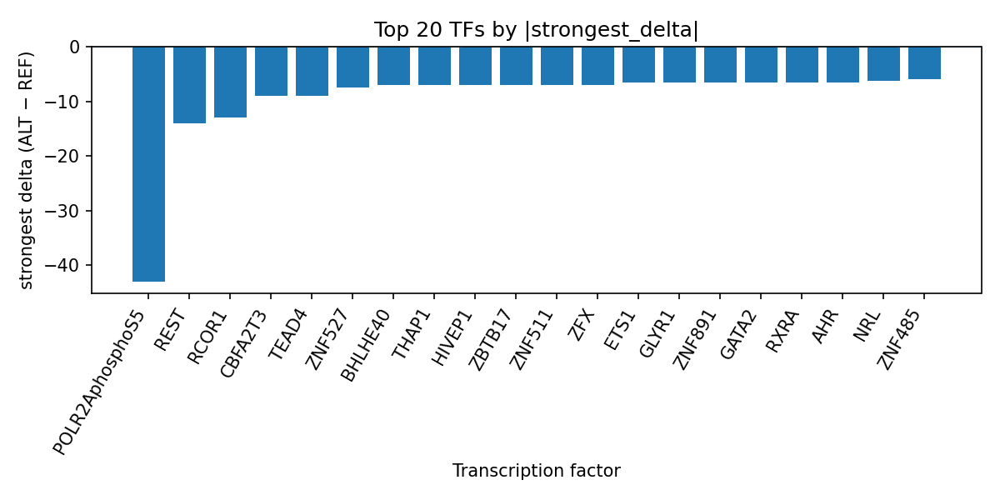

# AlphaGenome-based prioritization of transcription-factor perturbations at rs688187 in ovarian mucinous adenocarcinoma

*Author: snv-tf-researcher*

## Abstract

Ovarian mucinous adenocarcinoma is a rare epithelial ovarian cancer subtype with distinct molecular features and clinical challenges [1,2,6,7]. Here, we analyzed rs688187, a genome-wide significant susceptibility variant at 19q13.2 reported for mucinous ovarian carcinoma, using AlphaGenome transcription factor ChIP-seq predictions to assess allele-specific regulatory effects [12]. The variant (G>A) showed predominantly negative predicted effects across multiple transcription factors, with the strongest inhibition observed for POLR2AphosphoS5, REST, RCOR1, CBFA2T3, and TEAD4. These computational predictions suggest that rs688187 may prioritize transcriptional regulatory programs involving RNA polymerase II-associated and sequence-specific factors in relevant cellular contexts, but they do not establish biological mechanism. Experimental validation is required to confirm any predicted allele-specific binding effects.

## Introduction

Ovarian mucinous adenocarcinoma, including mucinous ovarian carcinoma, is uncommon and is recognized as molecularly distinct from other ovarian cancer histotypes [1,2,6,7]. Recent genomic analyses indicate recurrent alterations in genes such as *KRAS*, *TP53*, *CDKN2A*, *CDKN2B*, *ERBB2*, and *PIK3CA*, supporting a heterogeneous molecular landscape [11,13]. In parallel, histopathologic work continues to emphasize diagnostic and classification challenges in mucinous tumors involving the ovary, including primary versus metastatic disease [1,3,4].

Genome-wide association studies have identified susceptibility loci for mucinous ovarian carcinoma, including rs688187 at 19q13.2 [12]. However, statistical association alone does not reveal how a variant may act at the regulatory level. Computational models such as AlphaGenome can be used to prioritize candidate transcription-factor perturbations, but their outputs are predictions rather than experimental measurements and must be interpreted cautiously. In this manuscript, we applied AlphaGenome TF ChIP-seq prediction summarization to rs688187 and integrated the results with the published mucinous ovarian carcinoma literature.

## Methods

We analyzed the candidate variant rs688187 (chromosome 19:39242112, G>A), which was selected by effect size for the ovarian mucinous adenocarcinoma trait. The variant lies in noncoding sequence and was annotated with downstream_gene_variant, upstream_gene_variant, intron_variant, and non_coding_transcript_variant consequences.

AlphaGenome TF ChIP-seq predictions were summarized at the transcription-factor level by comparing the predicted ALT allele to the REF allele. The prediction pipeline comprised disease and association retrieval, effect-size ranking and SNV filtering, Ensembl VEP consequence annotation and REF allele check, AlphaGenome TF ChIP-seq prediction, TF-level summarization, PubMed literature search, and AI-assisted manuscript synthesis (Figure 1). These are computational predictions, not laboratory measurements. Consequently, the results should be considered hypothesis-generating and require experimental validation.

**Figure 1.** Overview of the snv-tf-researcher workflow used for this run. The pipeline integrates variant selection, consequence annotation, AlphaGenome TF ChIP-seq prediction, TF-level summarization, literature retrieval, and manuscript synthesis for the rs688187 ovarian mucinous adenocarcinoma analysis.

## Results

The variant rs688187 was reported as genome-wide significant for mucinous ovarian carcinoma in the cited GWAS, with a P value of 6.8 × 10^-13 [12]. In the present computational analysis, AlphaGenome predicted that the ALT allele would predominantly reduce TF ChIP-seq signal across the most affected tracks. The strongest negative effects were observed for POLR2AphosphoS5, REST, RCOR1, CBFA2T3, and TEAD4, with the largest signed delta for POLR2AphosphoS5 in a neural cell track.

Across the top-ranked TF summaries, inhibition was the dominant direction for nearly all reported factors, including ZNF527, BHLHE40, THAP1, HIVEP1, ZBTB17, ZNF511, ZFX, AHR, GATA2, RXRA, ETS1, ZNF891, GLYR1, NRL, ZNF485, ZNF350, ZNF619, MAX, MNX1, ZBTB40, KDM2A, THAP9, ZNF574, MYC, and FOSL2. A small number of TFs had some promoted tracks, but the overall pattern was inhibition. The top TF-level effects are summarized in the run table `top_tf_effects.tsv`, which provides the per-factor track counts and signed deltas used for this manuscript.

**Figure 2.** Top transcription factors at rs688187 ranked by absolute predicted ALT-versus-REF binding delta from AlphaGenome TF ChIP-seq tracks. Negative bars indicate predicted inhibition and positive bars indicate predicted promotion of TF-associated signal for the strongest track within each factor.

The predicted enrichment of altered binding for POLR2AphosphoS5 and REST is notable because these factors were among the strongest affected in the ranking. However, the computational output does not establish that rs688187 directly alters binding in vivo or that any specific downstream gene expression change occurs.

## Discussion

This analysis prioritizes rs688187 as a potential regulatory variant in ovarian mucinous adenocarcinoma on the basis of previously reported GWAS significance and predicted allele-specific TF perturbations [12]. The broad pattern of predicted inhibition across multiple TFs suggests that the locus may intersect shared regulatory architecture rather than a single isolated factor. The prominence of POLR2AphosphoS5, REST, RCOR1, and related factors is consistent with a regulatory effect in transcriptional control, but the AlphaGenome predictions are computational and cannot be interpreted as proof of mechanism.

The finding is situated within a disease context in which mucinous ovarian carcinoma has been associated with distinct genomic landscapes, including recurrent *KRAS*, *TP53*, *CDKN2A/CDKN2B*, *ERBB2*, and *PIK3CA* alterations [11,13]. Prior GWAS work also identified rs688187 as one of the first susceptibility variants for mucinous ovarian carcinoma and linked the locus to disease risk [12]. The present analysis adds a computational regulatory layer to that association by prioritizing TFs whose predicted ChIP-seq signals are altered by the alternate allele. This may help guide future functional studies, but experimental validation will be necessary to determine whether the predicted effects are reproducible in relevant cell types.

## Limitations

This study has several important limitations. First, AlphaGenome outputs are computational predictions rather than experimental measurements, so the reported TF effects are hypothesis-generating and require validation in orthogonal assays. Second, rs688187 was selected by effect size and may be in linkage disequilibrium with the true causal variant; therefore, the predicted regulatory effects may reflect a linked locus rather than the causal nucleotide itself. Third, the available literature indicates that ovarian mucinous tumors can be primary or metastatic, and diagnostic classification can be challenging [1,3,4]; accordingly, disease labeling in genomic studies may not map perfectly onto a single biological entity. Finally, the present analysis does not establish target genes, chromatin state, or tissue-specific activity for the variant.

## References

1. Baranova K, Ninivirta L, Lockau L, Goebel EA, Walsh JC. A mucinous tumour by any other name: variations in terminology of mucinous appendiceal neoplasms involving the ovary and omentum. Virchows Arch. 2026. PMID: 41984223. doi:10.1007/s00428-026-04520-3

2. Bahmad HF, Alloush F, Jaspe G, Abulaban A, Alghamdi S, Ruiz-Cordero R, et al. PRAME Immunohistochemical Expression as a Diagnostic Tool to Distinguish Between Endocervical and Endometrial Adenocarcinomas. Int J Gynecol Pathol. 2026. PMID: 41915930. doi:10.1097/PGP.0000000000001169

3. Chen L, Sun L. Case Report: An incidentally discovered HPV-associated endocervical adenocarcinoma presenting as pseudomyxoma peritonei. Front Oncol. 2025;15:1630879. PMID: 41584594. doi:10.3389/fonc.2025.1630879

4. Nusretoglu R, Ali AK. Mucinous adenocarcinoma with peritoneal carcinomatosis presenting as acute abdomen: a case report. Front Oncol. 2025;15:1722960. PMID: 41716712. doi:10.3389/fonc.2025.1722960

5. Jang M, Gysler S, Latif NA, Ko EM, Giuntoli RL, Kim SH, et al. Identifying and capitalizing on unique molecular alterations of mucinous ovarian carcinoma for the development of novel therapeutic strategies. Gynecol Oncol Rep. 2026;63:102008. PMID: 41567617. doi:10.1016/j.gore.2025.102008

6. Hallberg D, Eastman AC, Koul S, Bruhm DC, Papp E, Davenport S, et al. Genomic Landscapes of Endometrioid and Mucinous Ovarian Cancers and Morphologically Similar Tumor Types. Cancer Res Commun. 2025;5(11):1952-1966. PMID: 40981433. doi:10.1158/2767-9764.CRC-25-0147

7. Bartl T, Cacsire Castillo-Tong D. Targeting RAS-RAF-MEK-ERK signaling in mucinous ovarian cancer: a translational evidence synthesis and clinical framework. Int J Gynecol Cancer. 2026;36(4):104485. PMID: 41680018. doi:10.1016/j.ijgc.2026.104485

8. Yoshida A, Andrade LALD, Almeida RRGD, Machado HC, Sarian LO, Derchain S. Implementation of a new histological grading system in ovarian mucinous carcinomas and its association with the risk of recurrence: a retrospective cohort study. Sao Paulo Med J. 2026;144(1):e20253034. PMID: 41637375. doi:10.1590/1516-3180.2025.3034.12112025

9. Kunwar R, Shakya B, Vaidya KM, Dahal B, Shrivastav S. Mucinous Ovarian Cancer in a Young Woman: A Case Report. JNMA J Nepal Med Assoc. 2025;63(288):614-616. PMID: 41783677. doi:10.31729/jnma.9145

10. Li YJ, Yan SP, Ya F, Zheng G, Fu HL, Mao M, et al. Oncological and reproductive outcomes in patients with malignant transformation of ovarian mature cystic teratoma. Zhonghua Fu Chan Ke Za Zhi. 2026;61(3):227-235. PMID: 41866202. doi:10.3760/cma.j.cn112141-20251126-00578

11. Jang M, Gysler S, Latif NA, Ko EM, Giuntoli RL, Kim SH, et al. Identifying and capitalizing on unique molecular alterations of mucinous ovarian carcinoma for the development of novel therapeutic strategies. Gynecol Oncol Rep. 2026;63:102008. PMID: 41567617. doi:10.1016/j.gore.2025.102008

12. Kelemen LE, Lawrenson K, Tyrer J, Li Q, Lee JM, Seo JH, et al. Genome-wide significant risk associations for mucinous ovarian carcinoma. Nat Genet. 2015;47(8):888-97. PMID: 26075790. doi:10.1038/ng.3336

13. Hallberg D, Eastman AC, Koul S, Bruhm DC, Papp E, Davenport S, et al. Genomic Landscapes of Endometrioid and Mucinous Ovarian Cancers and Morphologically Similar Tumor Types. Cancer Res Commun. 2025;5(11):1952-1966. PMID: 40981433. doi:10.1158/2767-9764.CRC-25-0147