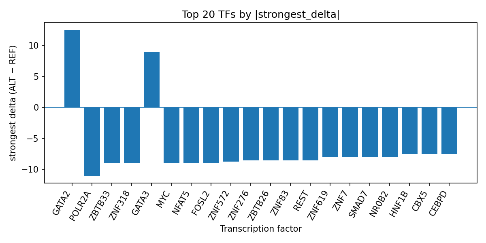

# Computational prioritization of rs186862478 for transcription factor perturbation in parasitic infectious disease

*Author: snv-tf-researcher*

## Abstract

We prioritized rs186862478 (chromosome 8:29565571, G>A) as a candidate variant for parasitic infectious disease based on its GWAS association signal (p = 2 × 10^-12; absolute effect size = 4.174) and evaluated predicted transcription factor (TF) binding consequences using AlphaGenome TF ChIP-seq tracks. AlphaGenome outputs are computational predictions rather than experimental measurements, and the results therefore require experimental validation. The ALT allele was predicted to alter binding of multiple TFs, with strongest signed effects showing promotion of GATA2 and GATA3 and inhibition of POLR2A, ZBTB33, ZNF318, MYC, and several other TFs. These predictions may help prioritize regulatory hypotheses for follow-up studies in parasitic infectious disease. Literature retrieved for this trait highlights the breadth of parasitic infections, the importance of host-pathogen interactions, and the potential value of computational methods in infectious disease research [1-4].

## Introduction

Parasitic infectious diseases remain an important global health concern and encompass diverse protozoan, helminth, and vector-borne infections [1-4]. Recent literature in this domain includes studies of toxoplasmosis, cryptosporidiosis, giardiasis, trichomoniasis, echinococcosis, malaria, and other parasitic or parasite-related conditions, underscoring the heterogeneity of biological mechanisms and clinical presentations [1-4]. Computational approaches are increasingly used to integrate large biomedical datasets for disease prioritization and hypothesis generation, including in infectious disease contexts [4]. However, association signals identified by GWAS do not by themselves establish mechanism, and follow-up functional work is required to determine how candidate variants might relate to disease biology [5].

Here, we analyzed rs186862478, a variant selected on the basis of effect size and GWAS significance for parasitic infectious disease. Because the selected variant may be in linkage disequilibrium with the true causal variant, the present analysis should be interpreted as prioritization rather than proof of causality. We used AlphaGenome TF ChIP-seq predictions to evaluate whether the alternate allele is associated with altered predicted TF binding, and we summarized the strongest TF-level effects using the run output table `top_tf_effects.tsv`.

## Methods

### Variant selection and annotation

The candidate variant rs186862478 (8:29565571, G>A) was selected because it showed a strong association with parasitic infectious disease (p = 2 × 10^-12) and a reported absolute effect size of 4.174. The variant was annotated as downstream_gene_variant, intron_variant, non_coding_transcript_variant, upstream_gene_variant, and non_coding_transcript_exon_variant. No nearest genes were provided in the input data.

### AlphaGenome TF ChIP-seq prediction workflow

The analysis pipeline is summarized in Figure 1. Briefly, the workflow included disease and association retrieval, effect-size-based SNV ranking and filtering, sequence consequence annotation, REF allele checking, AlphaGenome TF ChIP-seq prediction, TF-level summarization, literature retrieval, and manuscript synthesis. AlphaGenome predictions are computational outputs and not direct measurements; therefore, they were used here only to prioritize candidate regulatory effects and not to infer experimentally verified binding changes.

**Figure 1.** Workflow for the rs186862478 prioritization analysis. The pipeline links a GWAS-derived candidate variant to consequence annotation, AlphaGenome TF ChIP-seq prediction, TF-level summarization, and literature-supported manuscript synthesis.

### TF-level summarization

Predicted TF effects were summarized across all available TF ChIP-seq tracks. The run-level summary table `top_tf_effects.tsv` was used to identify the most affected transcription factors and to extract the strongest signed delta, track count, mean delta, median delta, and direction of effect for each TF. TFs were then ranked by absolute predicted change, and the top predictions were used for reporting in the Results.

## Results

### rs186862478 prioritized for predicted regulatory effects

The candidate variant rs186862478 was prioritized because of its strong GWAS association with parasitic infectious disease and substantial reported effect size. In the AlphaGenome TF ChIP-seq predictions, the alternate allele was associated with both positive and negative signed deltas across TFs, suggesting allele-specific regulatory perturbation. The top-ranked TF-level summary from `top_tf_effects.tsv` indicates that GATA2 was the strongest promoted TF, while POLR2A showed the strongest inhibited effect across the available tracks.

**Figure 2.** Predicted TF-level effects of rs186862478 from AlphaGenome TF ChIP-seq tracks. Bars show the strongest signed ALT-versus-REF delta per TF, with positive values indicating predicted promotion and negative values indicating predicted inhibition.

Among the strongest predicted effects, GATA2 showed the largest positive delta (12.5) across six tracks, all in the promoted direction. GATA3 was also consistently promoted, with a strongest delta of 9.0 across four tracks. In contrast, POLR2A showed the largest negative delta (−11.0) across 44 tracks, with a predominance of inhibited tracks over promoted tracks. Other strongly inhibited TFs included ZBTB33, ZNF318, MYC, NFAT5, FOSL2, ZNF572, REST, ZNF83, ZNF276, ZBTB26, ZNF619, ZNF7, SMAD7, NR0B2, FOXC1, USF1, YY1, HNF1B, CEBPD, CBX5, POU2F1, XRCC5, ZNF605, FOSL1, POU2F2, ZNF574, and EGR1, each with negative signed effects in the summarized tracks. These predictions suggest that rs186862478 may lie in a regulatory context affecting multiple TF programs, although the outputs remain computational and require experimental validation.

### Literature context for parasitic infectious disease

The literature retrieved for parasitic infectious disease included reports spanning protozoan, helminth, and mosquito-borne settings. Examples included detection of Toxoplasma gondii in zoo soil [1], Giardia and Cryptosporidium in captive primates [2], a protocol for Trichomonas vaginalis treatment refinement [3], and a review of artificial intelligence applications in emerging infectious and parasitic diseases [4]. Additional records in the literature list addressed echinococcosis, malaria-related immune and epidemiologic studies, coccidiosis resistance, and parasitic disease GWAS in animal and human systems [5-16]. Collectively, these records indicate that parasitic infectious disease research spans both pathogen biology and host genetic susceptibility, which is consistent with the current GWAS-based prioritization framework [4,5,12,15,16].

## Discussion

The AlphaGenome predictions suggest that rs186862478 may have allele-specific regulatory consequences with a mixture of predicted TF activation and repression. The strongest promoted signals were observed for GATA2 and GATA3, whereas the strongest inhibited signal was observed for POLR2A. Because AlphaGenome provides computational predictions rather than experimental measurements, these results should be considered hypothesis-generating and not definitive evidence of altered transcription factor occupancy or gene regulation.

The finding that a single GWAS-prioritized variant is associated with predicted changes across multiple TF ChIP-seq tracks is consistent with a potential regulatory locus rather than a protein-coding change. However, the biological interpretation remains limited because the variant may be in linkage disequilibrium with the true causal variant, and no nearest gene was provided in the input data. In addition, the disease label “parasitic infectious disease” aggregates diverse conditions, so the present analysis cannot infer pathogen-specific mechanisms from the available information alone.

Published literature in the provided set reinforces the relevance of host-pathogen interaction, immune regulation, and genomic prioritization approaches in parasitic disease research [1-4,8,12-16]. For example, GWAS-based studies have been used to identify host or parasite loci associated with disease resistance or susceptibility in coccidiosis, trichuriasis, malaria-related traits, and other infection contexts [12,13,15,16]. This broader literature supports the use of computational variant-to-regulatory prediction pipelines as a rational first step for follow-up studies [4,5,12,15,16]. Experimental validation, such as allele-specific reporter assays, electrophoretic mobility shift assays, or TF ChIP-seq in relevant cell types, will be required to test whether the predicted TF perturbations at rs186862478 are realized in biological systems.

## Limitations

This analysis has several limitations. First, rs186862478 was selected by effect size and may be in linkage disequilibrium with the true causal variant, so the present results should be interpreted as prioritization rather than causal inference. Second, AlphaGenome TF ChIP-seq outputs are computational predictions and not experimental measurements; therefore, the TF effects reported here require laboratory validation. Third, no nearest genes were provided, limiting downstream gene-centric interpretation. Fourth, the disease term is broad and may encompass multiple parasitic conditions with distinct biology, which constrains mechanistic interpretation. Finally, the summary depends on the available TF tracks and the run-specific `top_tf_effects.tsv` output, so conclusions are limited to the predictions present in this run.

## References

1. Ribeiro E, Sabioni MS, Pinto MS, Neto JAB, Santos WJ, Guiraldi LM, et al. Molecular Detection of Toxoplasma gondii in Enclosures of African Primates (Papio papio and Papio hamadryas) at the Municipal Zoo of Bauru, São Paulo State, Brazil. J Med Primatol. 2026;55(3):e70077. PMID: 42032444. doi:10.1111/jmp.70077

2. Pantoja DKSQ, Silva MCM, Neto RDN, Castilho MS, Bernal MKM, Pereira WLA. Cryptosporidium and Giardia in Captive Primates. J Med Primatol. 2026;55(3):e70075. PMID: 42032374. doi:10.1111/jmp.70075

3. Muzny CA, Lillis RA, Chavoustie SE, Arbuckle JL, Van Gerwen OT, Sagoe M, et al. Refining Trichomonas vaginalis treatment in women and men: protocol for an open-label randomised comparison of multi-dose oral metronidazole versus single-dose oral secnidazole. BMJ Open. 2026;16(4):e116003. PMID: 42031495. doi:10.1136/bmjopen-2025-116003

4. Nasr DS, Alraee NB, Katbi SWA, Kouli NM, Asaad NI, Ismail MM, et al. Artificial intelligence at the frontlines: Emerging infectious and parasitic diseases in the digital era. New Microbes New Infect. 2026;71:101751. PMID: 42027758. doi:10.1016/j.nmni.2026.101751

5. Ahsan E, Gupta A, Singh K, Phulware RH. Giant primary splenic hydatid cyst: diagnostic and therapeutic challenges. BMJ Case Rep. 2026;19(4):. PMID: 42031385. doi:10.1136/bcr-2026-272523

6. Menoia MV, Pinto GB, Ishigaki EY, Delmondes NCA, Ninomiya DA, Leite OHM, et al. Impact of the COVID-19 pandemic on outpatient follow-up among people living with HIV retained in care at a University Center in Brazil. Clinics (Sao Paulo). 2026;81:100966. PMID: 42030685. doi:10.1016/j.clinsp.2026.100966

7. Larbi AA, Etsey M, Brew O, Koduah B, Mawuenyega RE, Amewu EK, et al. Gut microbiome alterations among Ghanaian children with asymptomatic malaria infections. PLoS One. 2026;21(4):e0348120. PMID: 42030348. doi:10.1371/journal.pone.0348120

8. Salsabila ZZ, Kochayoo P, Khunsri T, Tianpothong P, Leepiyasakulchai C, Thawornpan P, et al. A functional crosstalk between circulating follicular helper 2 T cells and memory B cells drives anti-Plasmodium vivax antibodies. PLoS Negl Trop Dis. 2026;20(4):e0014232. PMID: 42030338. doi:10.1371/journal.pntd.0014232

9. Zhu D, Yan L, Sun J, Chen S, Xi Y, Zhang K, et al. Iron overload is associated with increased susceptibility to pulmonary Pythium insidiosum infection in mice. PLoS Negl Trop Dis. 2026;20(4):e0014246. PMID: 42030325. doi:10.1371/journal.pntd.0014246

10. Barreto I, Deibel A, Fehr J, Mülhaupt B, Kremer AE, Petrowsky H, et al. Surgical management of cystic echinococcosis-A 20-year case series and outcome analysis. PLoS Negl Trop Dis. 2026;20(4):e0013661. PMID: 42030278. doi:10.1371/journal.pntd.0013661

11. Lindström A, Lilja T, Eklöf D, Waldeck M. [Mosquitoes, climate change and new diseases]. Lakartidningen. 2026;123:. PMID: 42029018.

12. Bär MA, Kouamé NA, Touré S, Coulibaly JT, Schneeberger PHH, Keiser J. Characterisation of Trichuris incognita n sp in Côte d'Ivoire: a morphological, genomic, and genome-wide association with drug sensitivity study. Lancet Microbe. 2026;7(2):101264. PMID: 41655578. doi:10.1016/j.lanmic.2025.101264

13. Varela-Martínez E, Afonso A, Mainou D, Teixeira F, Nunes T, Vieira P, et al. Claudin and Rab proteins are key molecular components involved in coccidiosis resistance in Portuguese Merino sheep. Genet Sel Evol. 2025;58(1):2. PMID: 41408150. doi:10.1186/s12711-025-01020-x

14. Agrohi P, Garg S, Biswas S, Maurya P, Kumar V, Sharma J, et al. Decoding the multifaceted role of erythrocyte PMCA4b in oxidative stress-mediated malaria protection and artemisinin resistance. mBio. 2026;17(1):e0173825. PMID: 41400477. doi:10.1128/mbio.01738-25

15. Ajasa AA, Boison SA, Aslam ML, Lillehammer M, Gjøen HM. Investigating the genetic basis of susceptibility to amoebic gill disease and idiopathic gill lesions in Atlantic salmon populations using field data. Genet Sel Evol. 2026;58(1):10. PMID: 41572146. doi:10.1186/s12711-025-01025-6

16. Kato I, Canzian F, Rizzato C, Rodriguez A, Torres J. Systematic Review of Mendelian Randomization Studies on Helicobacter pylori-Associated Health Outcomes. Interdiscip Perspect Infect Dis. 2025;2025:7756944. PMID: 41170532. doi:10.1155/ipid/7756944