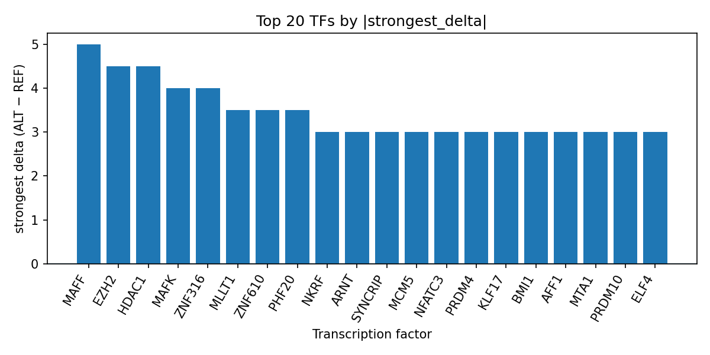

# Predicted Transcription Factor Perturbation at rs184426772 in Peptic Ulcer Disease

*Author: snv-tf-researcher*

## Abstract

The intronic GWAS candidate variant rs184426772 (T>C) on chromosome 2 was selected for peptic ulcer disease on the basis of effect size and genome-wide significance (p = 2 × 10^-8). AlphaGenome TF ChIP-seq predictions, which are computational and not experimental measurements, suggest that the ALT allele is associated with broad increases in predicted binding across multiple transcription factors, with MAFF, HDAC1, EZH2, and MAFK among the top-ranked factors by predicted delta. The strongest predicted effect was observed for MAFF in HepG2, followed by HDAC1 in K562 and EZH2 in HepG2. These results prioritize rs184426772 as a non-coding regulatory candidate for follow-up in peptic ulcer disease, while experimental validation remains required.

## Introduction

Peptic ulcer disease is a clinically important gastrointestinal disorder with heterogeneous genetic and environmental contributors [1-3]. Recent literature in related gastrointestinal contexts has also emphasized the relevance of Helicobacter pylori infection and ulcer-related outcomes [4,5], and population studies continue to examine comorbidity patterns and complications involving peptic ulcer disease [6-8]. Genetic studies have begun to connect peptic ulcer disease with broader gastrointestinal and systemic trait architectures, including Mendelian randomization and cross-trait analyses [9-12].

Here, we applied a computational SNV-to-TF prioritization workflow to rs184426772, an intronic GWAS variant associated with peptic ulcer disease. Because the variant was selected by effect size, it may be in linkage disequilibrium with the true causal variant, and this possibility should be considered when interpreting downstream predictions. We used AlphaGenome TF ChIP-seq tracks to assess whether the ALT allele may alter predicted transcription factor binding and to identify candidate regulatory factors for future experimental testing.

## Methods

The variant rs184426772 (chromosome 2:181638133; T>C) was provided as the candidate SNV for peptic ulcer disease, with genome-wide significance and the following consequence annotations: intron_variant, NMD_transcript_variant, and non_coding_transcript_variant. The variant selection was based on effect size, and no nearest gene was provided in the input.

The analysis workflow was as follows: disease and association retrieval, effect-size ranking and SNV filtering, Ensembl VEP consequence annotation and REF allele check, AlphaGenome TF ChIP-seq prediction, TF-level summarization, PubMed literature search, and AI-assisted manuscript synthesis (Figure 1). AlphaGenome outputs are computational predictions rather than direct experimental measurements; therefore, all reported transcription factor effects should be interpreted as prioritization signals, not binding assays. The manuscript was generated from the supplied data only, and all literature claims are restricted to the provided PubMed records.

**Figure 1.** Overview of the snv-tf-researcher workflow used in this run. The pipeline links the supplied GWAS variant to consequence annotation, AlphaGenome TF ChIP-seq prediction, TF-level aggregation, and literature retrieval before producing the final manuscript.

## Results

The candidate variant rs184426772 is an intronic SNV on chromosome 2 at position 181638133, with reference allele T and risk/ALT allele C. It was selected for peptic ulcer disease at p = 2 × 10^-8 with an absolute effect size of 0.7957. No nearest gene was provided in the input, so this variant should be considered a non-coding candidate without immediate gene-level assignment.

Across the AlphaGenome TF ChIP-seq predictions, the ALT allele was associated predominantly with increased predicted TF binding. The top-ranked factor by strongest delta was MAFF, with a maximum predicted increase of 5.0 in HepG2, and all three MAFF tracks were promoted. HDAC1 showed the next largest predicted increase, with a strongest delta of 4.5 in K562. EZH2 and MAFK also showed strong positive shifts, with strongest deltas of 4.5 and 4.0, respectively. Several additional factors, including ZNF316, MLLT1, ZNF610, PHF20, PKNOX1, BCOR, GATAD2A, ELF4, PRDM10, MTA1, AFF1, NKRF, KLF17, BMI1, PRDM4, NFATC3, MCM5, SYNCRIP, ARNT, HDAC3, HDGF, MTA2, ZNF146, FOXK2, ZFP91, and ZBTB48, were also promoted to varying degrees. The summarized results are provided in the run table `top_tf_effects.tsv`, which records the highest-effect TF tracks and their signed deltas.

**Figure 2.** Top transcription factors at rs184426772 ranked by absolute predicted ALT-versus-REF binding delta from AlphaGenome TF ChIP-seq tracks. Positive bars indicate promoted predicted binding in the ALT allele, and the plot highlights MAFF, HDAC1, EZH2, and MAFK among the strongest effects.

## Discussion

The prediction profile suggests that rs184426772 may influence a regulatory region with broad transcription factor sensitivity, especially for factors among the top ranked MAFF, HDAC1, EZH2, and MAFK tracks. Because AlphaGenome outputs are computational predictions, these results should be interpreted as hypothesis-generating rather than as direct evidence of altered binding. The predominance of promoted predicted effects is consistent with the possibility that the ALT allele shifts local regulatory activity, but this remains untested experimentally.

The implicated factors are not interpreted here as established mediators of peptic ulcer disease, because no such mechanism is demonstrated by the supplied data. Instead, the main value of these results is prioritization: rs184426772 emerges as a non-coding candidate whose predicted TF perturbation could be examined in reporter assays, electrophoretic mobility shift assays, or other experimental systems. Given that the variant was selected by effect size, the true causal variant may differ if rs184426772 is in linkage disequilibrium with another associated SNV.

The literature supplied for this run indicates that peptic ulcer disease is part of a broader network of clinical outcomes and genetic associations [1-12], but none of the provided records establish a direct mechanistic link between rs184426772 and any specific TF. Accordingly, the present analysis should be viewed as a computational prioritization step that may help guide future functional studies in peptic ulcer disease.

## Limitations

This analysis has several limitations. First, AlphaGenome provides computational predictions and not direct measurements of TF binding or chromatin occupancy, so experimental validation is required. Second, rs184426772 was selected by effect size and may be in linkage disequilibrium with the true causal variant rather than being causal itself. Third, no nearest gene was provided, limiting interpretation at the gene or pathway level. Fourth, the available output is restricted to TF ChIP-seq prediction summaries; no additional molecular or clinical annotations beyond the supplied data were used. Finally, the literature available for citation in this run is limited to the provided PubMed records.

## References

1. Christanto AGR, Adrianto AA. Comparative accuracy of Boey score and PULP score for predicting prognosis in patients with perforated peptic ulcer: A systematic review and meta-analysis. Journal of visceral surgery. 2026. PMID: 42031639. doi:10.1016/j.jviscsurg.2026.02.010

2. Kaewmanee T, Limsuwan S, Sanpinit S, Na-Phatthalung P, Kehinde SA, Issuriya A, et al. Pregelatinized green banana flour snack bars: Physicochemical properties, sensory quality, and gastroprotective potential in an ethanol-induced ulcer model. PLoS One. 2026;21(4):e0347771. PMID: 42030291. doi:10.1371/journal.pone.0347771

3. Hsieh HH, Lee WY, Lin CL, Chen CH, Tsai FJ, You BJ, et al. Impact of anti-peptic ulcer disease (PUD) medications on hyperlipidemia risk in patients with PUD: a population-based retrospective cohort study. Ther Adv Endocrinol Metab. 2026;17:20420188261442014. PMID: 42027967. doi:10.1177/20420188261442014

4. Osundina MA, Alimi HA, Badmos TA, Ijikoyejo MK, Nwanji ID, Otegbayo JA. Correlation between upper gastrointestinal endoscopic findings and Helicobacter pylori detection in gastric biopsy specimens: a retrospective study. Pan Afr Med J. 2026;53:12. PMID: 42027378. doi:10.11604/pamj.2026.53.12.49759

5. Miyashita Y, Koiwai A, Urita E, Takemoto M, Itoh T, Inomata N, et al. A Case of Refractory Peptic Ulcer with Choledochoduodenal Fistula Successfully Treated by Biliary Stent Placement Using an Ultrathin Endoscopic Rendezvous Technique: A Case Report. DEN Open. 2026;6:e70338. PMID: 42022221. doi:10.1002/deo2.70338

6. Hirai Y, Fujimoto A, Sasaki M, Shimoda M, Yahagi N. Use of rebamipide solution as a submucosal injection material to prevent esophageal stricture after endoscopic submucosal dissection: Animal study. Endosc Int Open. 2026;14:a28203721. PMID: 42016521. doi:10.1055/a-2820-3721

7. Yuan XL, Liu PP, Zuo JJ, Dou PC, Mao CD, Kang L, et al. [Network pharmacology and experimental validation reveal therapeutic mechanism of Yuyang Jianpi Pills for gastric ulcer with spleen-stomach deficiency-cold syndrome by inhibiting inflammation and apoptosis via IL-6/JAK2/STAT3 pathway]. Zhongguo Zhong Yao Za Zhi. 2026;51(6):1688-1700. PMID: 42011617. doi:10.19540/j.cnki.cjcmm.20251124.801

8. Yu L, Jinglei Z. Multimodal Diagnosis and Management of Gastric Tuberculosis: A Case Report. J Vis Exp. 2026;230. PMID: 42008372. doi:10.3791/70224

9. Jiang P, Fang Y, Liu Z, Du H, Bai X, Chen H, et al. Genome-wide association and integrative analyses of relative handgrip strength identify polygenic determinants of gastrointestinal disorder susceptibility. BMC Gastroenterol. 2026;26(1):138. PMID: 41593506. doi:10.1186/s12876-026-04624-9

10. Yang L, Li L, Chen L, Liu Z, Cai J, Wang W, et al. Bidirectional and mediation Mendelian randomization of dietary intake and risks of gastric ulcer and gastric cancer. Medicine (Baltimore). 2026;105(3):e46820. PMID: 41560067. doi:10.1097/MD.0000000000046820

11. Wang YQ, Jiang JS, Qin YT, Wang WQ, Li JY, Li XY, et al. Causal relationship between chronic hepatitis B infection and gastric ulcer: A Mendelian randomization study. Medicine (Baltimore). 2025;104(38):e44560. PMID: 40988231. doi:10.1097/MD.0000000000044560

12. Wan Z, Mi J, Bai X, Wu D, Wong SH. Helicobacter pylori, peptic ulcer disease, and colorectal cancer: a prospective study with genome-wide interaction analysis and Mendelian randomization. Infect Agents Cancer. 2025;20(1):61. PMID: 40883828. doi:10.1186/s13027-025-00686-8