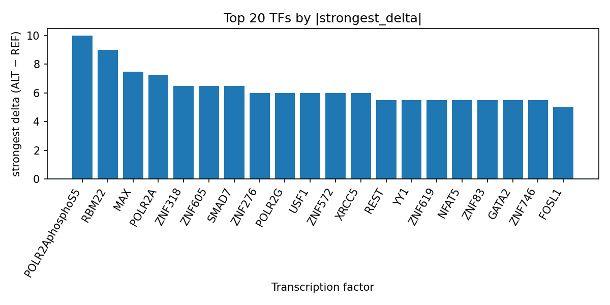

# AlphaGenome-predicted transcription factor perturbation landscape for rs76770509 in restless legs syndrome

*Author: snv-tf-researcher*

## Abstract

Restless legs syndrome (RLS) is a common sensorimotor sleep disorder with a substantial genetic component and ongoing efforts to refine disease biology from genome-wide association studies (GWAS) [1,2]. Here, we interpret AlphaGenome computational predictions for the GWAS-implicated variant rs76770509 (chr12:102208544 T>G), a non-coding transcript exon variant selected by effect size. AlphaGenome TF ChIP-seq outputs suggest that the ALT allele broadly increases predicted binding across multiple transcription factors, with the strongest effects observed for POLR2AphosphoS5, RBM22, MAX, and POLR2A. The associated TF-level summary prioritizes promoters and RNA polymerase-associated tracks among the strongest predicted perturbations. Because these are computational predictions rather than experimental measurements, they should be considered hypothesis-generating and require orthogonal validation. Overall, the variant is prioritized as a potential regulatory candidate for follow-up in RLS, while acknowledging that it may be in linkage disequilibrium with the true causal variant.

## Introduction

Restless legs syndrome (RLS) is a prevalent neurological/sensorimotor disorder characterized by an urge to move the legs and sleep disruption, and recent literature continues to expand its clinical and genetic framing [1,2]. Large-scale GWAS have identified many loci for RLS and have highlighted the disorder’s polygenic architecture, including common-variant contributions and prioritized genes relevant to disease biology [3,4]. However, even when a GWAS signal is strong, the lead variant is not necessarily causal; variants selected on effect size may tag the true functional allele through linkage disequilibrium, and downstream interpretation therefore benefits from functional prioritization strategies [3,4].

Computational sequence-based models can be used to nominate regulatory mechanisms for non-coding variants by estimating whether allelic substitution alters predicted transcription factor occupancy. In the present analysis, AlphaGenome TF ChIP-seq predictions were used to assess the potential regulatory impact of rs76770509 in the context of RLS. These predictions are not experimental measurements and should be interpreted as in silico hypotheses requiring validation in relevant biological systems.

## Methods

The candidate SNV rs76770509 (chr12:102208544 T>G; risk allele rs76770509-G) was selected as provided, based on effect size for restless legs syndrome. The variant is annotated as a non-coding transcript exon variant. AlphaGenome TF ChIP-seq predictions were then used to estimate the allele-specific effect of the ALT allele relative to REF across available transcription factor tracks.

The analysis output was summarized at the transcription-factor level using the run-provided results table, specifically `top_tf_effects.tsv`, and the TF summaries were interpreted alongside the available figure set. The workflow for this run comprised disease and association retrieval, effect-size ranking and SNV filtering, consequence annotation and REF allele checking, AlphaGenome TF ChIP-seq prediction, transcription-factor summarization, literature retrieval, and manuscript synthesis (Figure 1). As stated above, AlphaGenome outputs are computational predictions rather than measured binding data.

**Figure 1.** End-to-end pipeline overview for the snv-tf-researcher run. The workflow spans disease/variant retrieval, filtering and annotation, AlphaGenome TF ChIP-seq prediction, summarization of predicted transcription factor effects, literature retrieval, and manuscript generation.

## Results

Across the AlphaGenome TF ChIP-seq tracks, rs76770509-G was predicted to predominantly increase TF-associated signal. The strongest effect was observed for POLR2AphosphoS5, which had 26 tracks with a maximum signed delta of 10.0 and a promoted direction. Other high-priority predicted effects included RBM22 in HepG2 (delta 9.0), MAX in K562 (delta 7.5), and POLR2A in A549 (delta 7.25). Additional promoted TFs included ZNF318, ZNF605, SMAD7, ZNF276, POLR2G, USF1, ZNF572, XRCC5, NFAT5, ZNF746, GATA2, ZNF83, REST, ZNF619, YY1, ATF3, STAG1, POU2F1, CBX5, POU2F2, ZNF7, FOSL1, HNF1B, THAP7, FOXC1, and ZBTB33, all of which showed positive predicted deltas in at least one track. The detailed TF-level output is provided in the run summary table `top_tf_effects.tsv`, which is the primary source for these ranked effects.

**Figure 2.** Top transcription factors at rs76770509 ranked by the strongest absolute predicted ALT-versus-REF delta from AlphaGenome TF ChIP-seq tracks. Positive bars indicate predicted promotion of binding/signal by the ALT allele, while negative bars indicate predicted inhibition.

**Figure 2.** Top transcription factors at rs76770509 ranked by the strongest absolute predicted ALT-versus-REF delta from AlphaGenome TF ChIP-seq tracks. Positive bars indicate predicted promotion of binding/signal by the ALT allele, while negative bars indicate predicted inhibition.

The predicted signal is notable for enrichment among RNA polymerase-associated factors and multiple zinc-finger proteins. In particular, POLR2AphosphoS5 and POLR2A are among the strongest predicted promoted factors, and the TF summary also highlights MAX, YY1, REST, and GATA2 as recurrently affected factors across multiple tracks. Taken together, these results prioritize rs76770509 as a candidate regulatory variant with broad predicted effects on transcriptional occupancy.

## Discussion

The AlphaGenome predictions suggest that rs76770509-G may alter a regulatory sequence in a way that preferentially increases predicted occupancy for several transcription factors, especially POLR2A/POLR2AphosphoS5 and other transcription-associated factors. This pattern is consistent with a potential effect on transcriptional regulation, but it remains a computational inference rather than direct evidence of altered binding or expression. In the context of RLS, such prioritization is relevant because GWAS have shown that the disorder has a substantial polygenic basis and that non-coding loci may help refine disease mechanisms [3,4].

The appearance of RNA polymerase-associated factors among the top predicted effects may indicate that the variant lies in a transcriptionally active regulatory context. Likewise, the presence of multiple zinc-finger and chromatin-associated factors suggests broader regulatory complexity, although no mechanistic conclusion can be drawn from the prediction alone. More generally, recent RLS studies continue to support biological heterogeneity across clinical contexts, including pregnancy, comorbid disease states, and sleep-related phenotypes, underscoring the value of variant-level functional prioritization [1,2,5-8]. However, the present analysis does not establish disease mechanism, tissue relevance, or direction of effect in vivo.

These computational results are best viewed as a hypothesis-generating layer to complement GWAS discovery. Experimental validation would be required to determine whether rs76770509 truly modifies transcription factor binding, alters chromatin state, or changes gene expression in a disease-relevant cell type.

## Limitations

This analysis has several important limitations. First, the predictions come from AlphaGenome and therefore represent computational estimates rather than experimental binding measurements. Second, the variant was selected by effect size and may be in linkage disequilibrium with the true causal variant, so rs76770509 may be a marker rather than the functional allele. Third, the TF track summaries are derived from available assay contexts and cell types, which may not correspond to the most relevant biological context for restless legs syndrome. Fourth, no experimental validation was performed here, so the results should not be interpreted as proof of altered transcription factor binding or downstream functional impact.

## References

1. Schormair B, Zhao C, Bell S, Didriksen M, Nawaz MS, Schandra N, et al. Genome-wide meta-analyses of restless legs syndrome yield insights into genetic architecture, disease biology and risk prediction. Nat Genet. 2024;56(6):1090-1099. PMID: 38839884. doi:10.1038/s41588-024-01763-1

2. Akçimen F, Chia R, Saez-Atienzar S, Ruffo P, Rasheed M, Ross JP, et al. Genomic Analysis Identifies Risk Factors in Restless Legs Syndrome. Ann Neurol. 2024;96(5):994-1005. PMID: 39078117. doi:10.1002/ana.27040

3. Schormair B. Genetics of Restless Legs Syndrome: Insights from Genome-Wide Association Studies. Sleep Med Clin. 2025;20(2):193-202. PMID: 40348531. doi:10.1016/j.jsmc.2025.02.008

4. Schormair B, Zhao C, Bell S, Didriksen M, Nawaz MS, Schandra N, et al. Genome-wide meta-analyses of restless legs syndrome yield insights into genetic architecture, disease biology and risk prediction. Nat Genet. 2024;56(6):1090-1099. PMID: 38839884. doi:10.1038/s41588-024-01763-1

5. Altalbawy FMA, Kareem M, Sanghvi G, R, Roopashree, Kashyap A, Indumathi SM, et al. Prevalence of restless legs syndrome during pregnancy: a systematic review and meta-analysis. Sleep Med. 2026;144:108904. PMID: 41980535. doi:10.1016/j.sleep.2026.108904

6. Nguyen HT, Hai Ly NT, Liao WC, Huang LC. The association of restless leg syndrome with sleep quality, depression symptoms, and quality of life in pregnancy: A systematic review and meta-analysis. Sleep Med. 2026;143:108902. PMID: 41932169. doi:10.1016/j.sleep.2026.108902

7. Kızıltepe M, Kaplan H, Oğuz Kökoğlu E, İçer Sİ, Cengiz G, Çalış M. Restless legs syndrome in axial spondyloarthritis: predictors and clinical correlates. Clin Rheumatol. 2026. PMID: 41915330. doi:10.1007/s10067-026-08097-9

8. Palsa K, Sahu AP, Rye DB, Trotti LM, Elcheva IA, Spiegelman VS, et al. Cerebrospinal Fluid from Restless Legs Syndrome Patients Reduces Iron Uptake in Blood-Brain Barrier Endothelial Cells by Disrupting the Regulation of Transferrin Receptors. Ann Neurol. 2026. PMID: 41947413. doi:10.1002/ana.78221