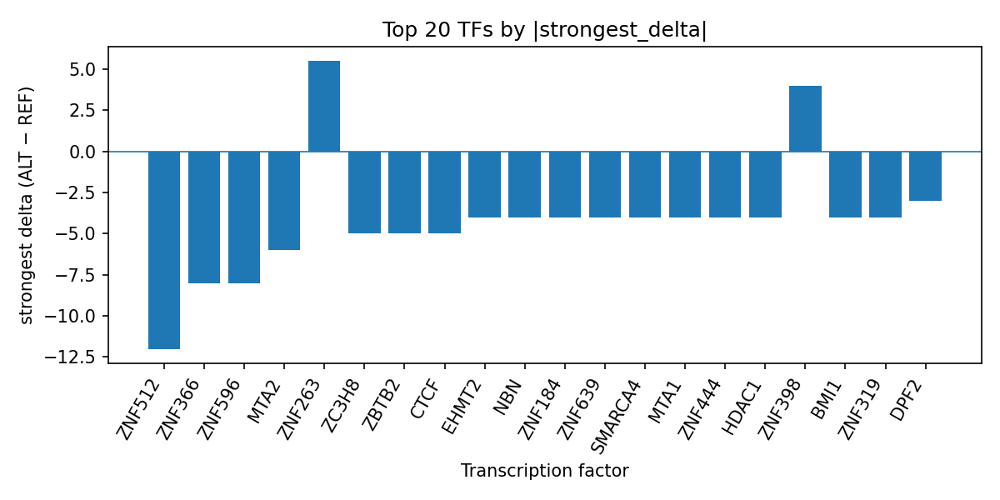

# Computational prioritization of rs200620206 for transcription-factor binding changes in a GWAS signal for susceptibility to infectious disease measurement

*Author: snv-tf-researcher*

## Abstract

Genome-wide association studies (GWAS) can nominate non-coding variants that may influence disease susceptibility through altered regulatory function. Here, we analyzed rs200620206, an intronic/non-coding transcript/downstream variant on chromosome 17 associated with susceptibility to infectious disease measurement, using AlphaGenome transcription factor (TF) ChIP-seq predictions. The variant showed a modest GWAS effect size and was computationally prioritized because of its association signal. AlphaGenome predicted a predominantly inhibitory TF-binding profile at the variant locus, with the strongest predicted decrease for ZNF512 and additional inhibition for ZNF596, ZNF366, MTA2, ZC3H8, ZBTB2, CTCF, and multiple other TFs. A smaller subset of TFs, including ZNF263, ZNF398, YY2, STAG1, ZNF572, and EZH2, showed predicted binding increases. These results suggest that rs200620206 may affect local regulatory occupancy in a cell-type- and TF-specific manner. Because AlphaGenome produces computational predictions rather than experimental measurements, orthogonal validation will be required before any functional interpretation can be confirmed.

## Introduction

Susceptibility to infectious disease is a complex phenotype that can be shaped by host genetic variation, immune status, and environmental context. Prior studies across infectious and immune-mediated conditions have used GWAS and related analyses to prioritize variants that may influence disease risk through regulatory or coding mechanisms [1-6]. In parallel, susceptibility-related biomarkers and host factors have been examined in contexts ranging from viral progression to bacterial and fungal infection outcomes [2,4,5,7]. Non-coding GWAS loci are particularly likely to implicate regulatory variation, motivating computational follow-up to identify candidate transcriptional mechanisms [8].

AlphaGenome can be used to predict TF ChIP-seq signal changes caused by single-nucleotide variants, providing a computational route for prioritizing potential regulatory effects. In the present analysis, rs200620206 was selected from the provided GWAS-derived candidate set by effect size and interpreted as a non-coding locus with possible regulatory relevance. Because the selected variant may be in linkage disequilibrium with the true causal variant, any mechanistic inference should be considered provisional. We therefore used AlphaGenome predictions to summarize TF-level effects at rs200620206 and to contextualize the resulting profile in the framework of a GWAS-nominated susceptibility locus.

## Methods

### Variant selection and annotation

The candidate variant rs200620206 (chromosome 17:74055065, T>C) was supplied as a GWAS-associated SNV for susceptibility to infectious disease measurement (EFO_0008422). The reported GWAS p value was 2×10^-6 and the absolute log odds ratio effect size was 0.345361184038459. The variant consequence annotations provided were intron_variant, non_coding_transcript_variant, and downstream_gene_variant. No nearest gene was supplied.

### AlphaGenome TF ChIP-seq prediction

AlphaGenome TF ChIP-seq predictions were used to estimate the signed effect of the ALT allele relative to the REF allele at the rs200620206 locus. These outputs are computational predictions, not direct experimental measurements. The resulting TF-level summary was used to identify the most strongly promoted and inhibited TF ChIP-seq tracks, and the run folder summary table `top_tf_effects.tsv` was used as the reference for reporting top effects.

### Literature context

PubMed-indexed articles provided in the input literature list were used only for general background on infectious-disease susceptibility, host genetic factors, and the interpretation of predictive genomic analyses [1-6]. No additional external sources were consulted.

**Figure 1.** Workflow overview for the snv-tf-researcher analysis pipeline. The pipeline combines GWAS-derived variant prioritization, consequence annotation, AlphaGenome TF ChIP-seq prediction, TF-level effect summarization, PubMed literature retrieval, and manuscript synthesis.

## Results

The candidate variant rs200620206 is a non-coding GWAS signal on chromosome 17 associated with susceptibility to infectious disease measurement, with the ALT allele designated rs200620206-C. Because the variant was selected by effect size, it should be interpreted as a prioritized locus rather than a confirmed causal variant.

AlphaGenome TF ChIP-seq predictions suggested a largely inhibitory regulatory profile at this site. The strongest predicted decrease was observed for ZNF512 in K562 cells (strongest delta = -12.0), followed by inhibition of ZNF596 and ZNF366 (each strongest delta = -8.0), MTA2 (strongest delta = -6.0), ZC3H8 and ZBTB2 (each strongest delta = -5.0), and CTCF (strongest delta = -5.0). Additional inhibited factors included ZNF319, BMI1, HDAC1, ZNF444, EHMT2, MTA1, SMARCA4, ZNF639, ZNF184, NBN, ZNF407, DDX20, HLTF, TARDBP, SMARCA5, and NFATC3, among others. Predicted increases were also observed for a smaller set of TFs, most notably ZNF263, along with ZNF398, YY2, STAG1, ZNF572, EZH2, and ZNF639 in specific tracks. The full ranked TF summary is provided in `top_tf_effects.tsv`, and the top signed effects are visualized below (Figure 2).

**Figure 2.** Top transcription factors at rs200620206 ranked by the absolute signed ALT-vs-REF predicted delta from AlphaGenome TF ChIP-seq tracks. Negative bars denote predicted inhibition and positive bars denote predicted promotion, highlighting a dominant inhibitory pattern with a smaller subset of promoted TFs.

## Discussion

The AlphaGenome predictions at rs200620206 suggest that this non-coding GWAS locus may alter local TF occupancy in a directionally mixed but predominantly inhibitory manner. Such a profile is consistent with a potential regulatory effect on chromatin-associated and sequence-specific TF binding, including factors involved in transcriptional control and chromatin organization. In the broader literature, host genetic variation has been used to prioritize susceptibility loci for infectious and immune-related phenotypes, including bacteremia, sepsis, malaria-related serology, HIV progression, and cervical carcinogenesis [2,4-6,8]. More generally, studies of infectious-disease susceptibility continue to emphasize the importance of host factors and genetic background in shaping outcomes [1,3,7].

At the same time, these predictions should be interpreted cautiously. AlphaGenome outputs are computational predictions rather than experimental measurements, so they provide a hypothesis-generating view of TF perturbation rather than proof of altered binding in vivo. The present analysis does not establish which gene, if any, is functionally regulated by rs200620206, and the locus may be in linkage disequilibrium with the true causal variant. Experimental validation, such as targeted reporter assays, electrophoretic mobility shift assays, or allele-specific chromatin profiling, will be required to confirm whether the predicted TF changes reflect biological activity.

## Limitations

This analysis has several limitations. First, the variant was selected by effect size and may be in linkage disequilibrium with the true causal variant. Second, the interpretation is based on AlphaGenome TF ChIP-seq predictions, which are computational and not direct measurements. Third, no nearest gene or GWAS study accession was provided, limiting locus-level biological contextualization. Fourth, the available output is restricted to TF ChIP-seq prediction summaries, so no independent expression, epigenomic, or experimental validation data were available. Fifth, because the literature list provided for this run contains only broad background sources and not variant-specific studies, the discussion is necessarily limited to general context.

## References

1. Inman K, Chernus J, Lee M, Alder JK, Shah FA, Mayr FB, et al. Genetic Variation in the Alternative Complement Pathway Contributes to Individual Susceptibility to Bacteremia and Sepsis. Crit Care Explor. 2025;7(11):e1339. PMID: 41165296. doi:10.1097/CCE.0000000000001339

2. Omole TE, Nguyen HM, Marcinow A, Jahan N, Severini G, Naicker N, et al. Pre-Human Immunodeficiency Virus (HIV) infection Th17 CD4+ T cells as predictors of early HIV disease progression. PLoS Pathog. 2026;22(4):e1013852. PMID: 42030410. doi:10.1371/journal.ppat.1013852

3. Park K, Kim H, Huh HJ, Namkoong H, Hasegawa N, Nishimura T, et al. Novel Genetic Loci for Nontuberculous Mycobacterial Pulmonary Disease and Potential Protective Effect of Body Mass Index. Am J Respir Crit Care Med. 2025;211(11):2191-2202. PMID: 40938630. doi:10.1164/rccm.202406-1253OC

4. Simpson-Yap S, Morwitch E, Tanner SA, Thomson SM, Eisner A, Lea RA, et al. Epstein-Barr Virus, Lower Vitamin D, Low Sun Exposure, and HLA-DRB1*1501 Risk Variant Share Common Epigenetic Pathways Leading to Multiple Sclerosis Onset. Ann Neurol. 2026;99(2):341-355. PMID: 41070760. doi:10.1002/ana.78043

5. Singh A, Sahani P, Singh S, Ojha A, Gupta P, Awasthi CP, et al. Role of human papillomavirus (HPV) variants and host genetic susceptibility in cervical carcinogenesis. Arch Microbiol. 2026;208(4):198. PMID: 41697429. doi:10.1007/s00203-026-04722-y

6. Davis H, Owen KA, Labonte AC, Hubbard EL, Kerns S, Kain J, et al. Genes causative of primary immunodeficiency are risk factors for and are over-expressed in systemic lupus erythematosus. Front Immunol. 2026;17:1494343. PMID: 41929508. doi:10.3389/fimmu.2026.1494343

7. Bell L, Kalmos K, Taissets A, Toa F, Natuman S, Stoové M, et al. Hepatitis B knowledge, attitudes and practices among health-care workers in Vanuatu, 2024. West Pac Surveill Response J. 2026;17(2):1-9. PMID: 41970948. doi:10.5365/wpsar.2026.17.2.1209

8. Argyropoulou M, Stylianakis E, Ricaño-Ponce I, Keur N, Kanni T, Stergianou D, et al. Genomic and proteomic insights into hidradenitis suppurativa. J Eur Acad Dermatol Venereol. 2026. PMID: 41793208. doi:10.1111/jdv.70390