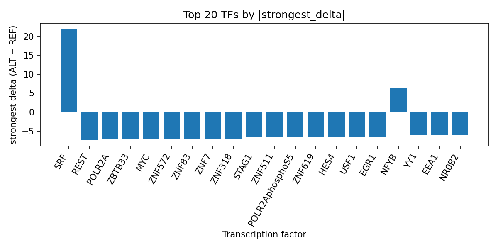

# AlphaGenome-predicted transcription factor perturbations at rs528594155 in Tietze syndrome

*Author: snv-tf-researcher*

## Abstract

Tietze syndrome is a rare inflammatory condition of the anterior chest wall that presents with localized pain and swelling, and it is commonly considered in the differential diagnosis of non-cardiac chest pain and other chest wall disorders [1-4]. Here, we prioritized rs528594155, an intronic/non-coding transcript variant on chromosome 2 associated with Tietze syndrome in the supplied GWAS summary, and evaluated computational AlphaGenome transcription factor (TF) ChIP-seq predictions for the REF (G) to ALT (T) substitution. AlphaGenome outputs are computational predictions, not experimental measurements. Across the reported TF tracks, the variant was predicted to most strongly promote SRF binding, while more commonly inhibiting predicted binding for multiple other TFs, including REST, POLR2A, POLR2AphosphoS5, MYC, and several zinc-finger factors. These results suggest that rs528594155 may alter a regulatory sequence with broad predicted TF-specific effects, prioritizing the locus for follow-up functional testing. Experimental validation is required.

## Introduction

Tietze syndrome is described in the literature as a benign but clinically important cause of anterior chest wall pain, often involving the costosternal, sternoclavicular, or costochondral regions [2,4]. It is repeatedly emphasized as part of the differential diagnosis for chest pain because its presentation can overlap with other musculoskeletal, inflammatory, and infectious chest wall disorders [2-7]. Reviews and case reports also note that Tietze syndrome may be encountered in broader chest wall imaging differentials and in atypical or refractory presentations, underscoring the clinical value of improved mechanistic prioritization [3,5,6].

Genome-wide association findings can provide variant-level starting points for hypothesis generation, but statistical association alone does not identify the causal mechanism. In this analysis, rs528594155 was selected by effect size from the supplied GWAS data for Tietze syndrome. Because the selected variant may be in linkage disequilibrium with the true causal variant, any downstream interpretation should be viewed as prioritization rather than proof of function. We therefore integrated the provided AlphaGenome TF ChIP-seq predictions to ask whether the locus shows a pattern consistent with altered TF binding and to summarize the strongest predicted TF-level effects.

## Methods

We analyzed the supplied Tietze syndrome candidate variant rs528594155 (chromosome 2:67,253,105; REF G; ALT T; intron_variant and non_coding_transcript_variant). The variant was prioritized in the input data by absolute effect size. AlphaGenome TF ChIP-seq predictions were provided as computational outputs comparing ALT versus REF sequence context. These outputs are predictions and not measurements of TF occupancy or chromatin binding.

The predicted TF-level effects were summarized from the provided `tf_summary_top` table and interpreted at the level of TF families and strongest available tracks. The included run assets were referenced through the manuscript to maintain correspondence with the run folder. The overall pipeline is summarized in the workflow schematic (Figure 1). The top TF effect summary is also reflected in the provided `top_tf_effects.tsv` result table, which served as the basis for the Results narrative.

**Figure 1.** Workflow overview for the snv-tf-researcher analysis pipeline. The schematic shows the sequence from GWAS disease and association retrieval through effect-size prioritization, variant annotation, AlphaGenome TF ChIP-seq prediction, TF-level summarization, literature retrieval, and manuscript synthesis.

## Results

The supplied AlphaGenome TF ChIP-seq predictions indicate a mixed regulatory pattern for rs528594155, with a dominant set of predicted inhibitory effects across many TFs but a strong predicted increase for SRF. Among the top summarized TFs, SRF showed the largest positive effect, with all eight available tracks predicted to be promoted and the strongest track showing a delta of 22.0 in Ishikawa cells. In contrast, REST, POLR2A, ZBTB33, MYC, ZNF572, ZNF83, ZNF7, ZNF318, POLR2AphosphoS5, ZNF619, HES4, USF1, EGR1, ZBTB26, NR0B2, EEA1, YY1, MAX, ZNF527, CBX5, NFAT5, FOSL2, BORCS8-MEF2B, GLYR1, and ZNF276 were all summarized as directionally inhibited overall, with strongest negative deltas ranging from -5.5 to -7.5 depending on the TF and track. NFYB was the main additional promoted TF among the top summaries, with a strongest positive delta of 6.5 in GM12878.

The strongest predicted effects were not restricted to a single assay context. SRF was represented by multiple promoted tracks, whereas POLR2A and POLR2AphosphoS5 showed broad inhibition across many tracks, including the strongest negative effect for POLR2A in A549 and for POLR2AphosphoS5 in upper lobe of left lung. MYC was also consistently inhibited across its reported tracks, with the strongest negative effect observed in H1. These TF-level summaries are reproduced in the provided `top_tf_effects.tsv` output and visualized in the ranked bar plot (Figure 2).

**Figure 2.** Ranked AlphaGenome-predicted TF ChIP-seq deltas at rs528594155. Bars show the strongest signed ALT-versus-REF delta for each TF, ordered by absolute effect size; positive values indicate predicted promotion and negative values indicate predicted inhibition.

## Discussion

The predicted TF perturbation profile at rs528594155 is consistent with a regulatory variant that could influence transcriptional control at the locus, especially given the broad inhibition of multiple TFs alongside a prominent predicted increase for SRF. SRF is a well-established transcription factor in gene regulatory biology, and the presence of a strong predicted SRF gain together with broad predicted reductions in several other TFs suggests a potentially complex local regulatory change [8]. The clustering of predicted inhibition across POLR2A, MYC, REST, YY1, and multiple zinc-finger factors may indicate that the variant sits in a sequence element with multi-factor occupancy potential, although this remains speculative because the present results are computational predictions only.

In the context of Tietze syndrome, these predictions do not establish a mechanism, but they do prioritize rs528594155 for follow-up studies in relevant tissues or cellular systems. The disease itself is described clinically as a chest wall inflammatory syndrome with variable etiologic considerations and frequent diagnostic overlap with other causes of chest pain [2-7]. Accordingly, a non-coding variant with predicted TF-binding consequences could be relevant to future efforts to understand disease-associated regulatory variation, but experimental validation will be required to determine whether any of the predicted TF changes are observed in biological assays.

## Limitations

This analysis is limited by the fact that AlphaGenome outputs are computational predictions, not direct measurements of TF binding or gene regulation. Functional follow-up is required before any biological interpretation can be accepted. The candidate variant was selected by effect size and may be in linkage disequilibrium with the true causal variant, so the reported TF effects may reflect a proxy signal rather than the causal allele. In addition, the provided data do not include nearest genes, experimentally validated target genes, tissue-of-origin information specific to Tietze syndrome, or clinical phenotype depth beyond the trait label. Finally, the literature provided here supports general background on Tietze syndrome and chest wall pain, but it does not directly connect rs528594155 to disease biology.

## References

1. Sahin IA, Butenko K, Johnson KA, Friedrich H, Oxenford S, Li N, et al. Optimal Deep Brain Stimulation Locations for Gilles de la Tourette Syndrome. medRxiv : the preprint server for health sciences. 2026. PMID: 41810380. doi:10.64898/2026.02.21.26346772  
2. Shokanov T, Anashev T, Sakhanov I, Shaukhin Y. O-Arm CT-Guided Intercostal Nerve Radiofrequency Ablation for Refractory Tietze's Syndrome: A Case Report. Orthop Res Rev. 2026;18:574131. PMID: 41769042. doi:10.2147/ORR.S574131  
3. Diomeda F, Greco R, Lazzari P, Loiacono G, Taurisano M, Pinna A, et al. Non-Traumatic Clavicular Lesions in Children: Case Series and Literature Review. Children (Basel). 2026;13(1). PMID: 41597120. doi:10.3390/children13010112  
4. Amarnani R, Branley H, Chatterjee R. Atypical chest wall pain: paravertebral tuberculosis mimicking costochondritis. BMJ Case Rep. 2025;18(10). PMID: 41073096. doi:10.1136/bcr-2025-266521  
5. La Rosa G, Adorna M, Mauro LA, Pennisi M, Musumeci AG, Sigona A, et al. A pictorial essay of thoracic wall diseases: multiple pathologies in the same anatomical site. Insights Imaging. 2025;16(1):200. PMID: 40975755. doi:10.1186/s13244-025-02073-8  
6. Raja G P, Punja R, Cruz AM, Prabhu A. The Myofascial Continuum: Anatomical Insights Into Noncardiac Chest Pain. Clin Anat. 2026;39(1):2-8. PMID: 40607636. doi:10.1002/ca.70004  
7. Kassab M, Katyal A, Franciosi S, Sanatani S. Chest Pain in Children: Is It Another "Growing Pain"? Paediatr Neonatal Pain. 2025;7(1):e70003. PMID: 40134780. doi:10.1002/pne2.70003  
8. Javaheripour N, Wagner G, de la Cruz F, Walter M, Szycik GR, Tietze FA. Altered brain network organization in adults with Asperger's syndrome: decreased connectome transitivity and assortativity with increased global efficiency. Front Psychiatry. 2023;14:1223147. PMID: 37701094. doi:10.3389/fpsyt.2023.1223147