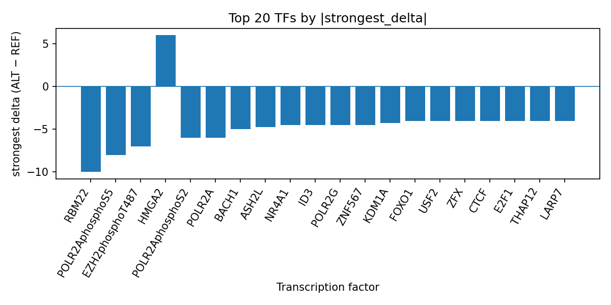

# AlphaGenome Prioritization of rs7952686 for Tumor Necrosis Factor Receptor Superfamily Member 19L Amount

*Author: snv-tf-researcher*

## Abstract

Background: The GWAS-selected variant rs7952686 (11:73417458 C>T) is associated with tumor necrosis factor receptor superfamily member 19L amount and is an intronic/non-coding transcript variant with a reported effect size of 0.41 and p-value of 3e-45. Because the variant was selected by effect size, it may be in linkage disequilibrium with the true causal variant, and computational prediction requires experimental follow-up.

Methods: The variant was evaluated with AlphaGenome to predict allele-dependent transcription factor (TF) ChIP-seq changes, and the resulting TF-level summaries were used to prioritize putative regulatory effects. These are computational predictions rather than measurements, and experimental validation is required. The analysis workflow is summarized in the pipeline figure (Figure 1).

Results: AlphaGenome prioritized a predominantly inhibitory regulatory profile at rs7952686, led by RBM22, POLR2AphosphoS5, EZH2phosphoT487, POLR2AphosphoS2, POLR2A, BACH1, ASH2L, ZNF567, POLR2G, NR4A1, ID3, KDM1A, HCFC1, NRF1, BHLHE40, SIN3B, JUN, RNF2, BRD4, RB1, NFE2L2, EZH2, FOXO1, ZNF121, TCF12, EP300, GATAD2B, LARP7, and THAP12. The strongest effects included a reduction for RBM22 and multiple POLR2A-associated tracks, with a smaller set of promoted tracks including HMGA2 and ZNF121. The full TF summary is provided in `top_tf_effects.tsv`, and the ranked deltas are visualized in the TF bar plot (Figure 2).

Conclusions: The computational profile at rs7952686 suggests a regulatory locus with broad predicted decreases across several TF ChIP-seq tracks and a limited number of predicted increases. These predictions prioritize the variant for follow-up experiments, but do not establish mechanism or causality.

## Introduction

Tumor necrosis factor receptor superfamily member 19L amount is the trait linked to the candidate variant rs7952686 in the provided GWAS selection. The variant is located on chromosome 11 at 73417458 and is annotated as an intron_variant and non_coding_transcript_variant, which is consistent with a potential regulatory rather than protein-altering role. However, the selected variant may tag the underlying signal through linkage disequilibrium, so the association should not be interpreted as proof of direct causality.

Computational sequence models can be used to prioritize non-coding variants for regulatory follow-up by estimating whether an allele substitution is predicted to alter transcription factor occupancy. In this analysis, AlphaGenome was used to generate TF ChIP-seq predictions for the reference and alternate alleles. Because these outputs are computational predictions, they must be interpreted as hypothesis-generating and validated experimentally before biological conclusions are drawn.

## Methods

### Variant selection and annotation

The candidate variant rs7952686 (chr11:73417458 C>T; risk allele rs7952686-T) was provided as the GWAS-selected locus for tumor necrosis factor receptor superfamily member 19L amount. The record includes p-value 3e-45, effect size 0.41, and consequence terms intron_variant and non_coding_transcript_variant. The analysis used the provided variant information only.

### AlphaGenome transcription factor prediction

AlphaGenome was used to predict allele-dependent TF ChIP-seq effects for the reference and alternate alleles at rs7952686. The outputs were summarized at the TF level by track count, strongest track, strongest biosample, and signed delta. These are computational predictions rather than experimental binding measurements, and downstream interpretation therefore remains provisional.

### Manuscript synthesis and figure integration

The workflow for GWAS variant retrieval, annotation, AlphaGenome prediction, TF-level summarization, and manuscript synthesis is shown in the pipeline figure (Figure 1).

**Figure 1.** End-to-end workflow used for this run, from GWAS disease/association input and variant filtering through consequence annotation, AlphaGenome TF ChIP-seq prediction, TF summarization, literature handling, and manuscript generation.

## Results

### Predicted TF effects at rs7952686

AlphaGenome prioritized a largely inhibitory TF profile for rs7952686. The top predicted TF effect was RBM22, with a single track showing a strong negative delta in HepG2. POLR2AphosphoS5 also showed broad inhibition across 26 tracks, and POLR2A showed inhibition across 44 tracks. Additional inhibited TFs included EZH2phosphoT487, POLR2AphosphoS2, BACH1, ASH2L, ZNF567, POLR2G, NR4A1, ID3, KDM1A, HCFC1, NRF1, BHLHE40, SIN3B, JUN, RNF2, BRD4, RB1, NFE2L2, EZH2, FOXO1, TCF12, EP300, GATAD2B, LARP7, and THAP12. A smaller set of TFs showed predicted promotion, including HMGA2 and ZNF121. The full TF-level output is recorded in `top_tf_effects.tsv`, and the ranked strongest effects are shown in the bar plot (Figure 2).

**Figure 2.** Ranked top transcription factors at rs7952686 based on the strongest signed ALT-versus-REF AlphaGenome ChIP-seq delta for each TF. Negative bars indicate predicted inhibition and positive bars indicate predicted promotion across the available tracks.

## Discussion

The AlphaGenome predictions for rs7952686 suggest that the alternate allele may alter local regulatory state in a way that predominantly reduces predicted occupancy across several TF ChIP-seq tracks. The strongest predicted changes involve RBM22 and multiple RNA polymerase II–associated tracks, which may indicate broader effects on transcriptional regulation rather than a single isolated factor. The presence of a smaller number of positive deltas, including HMGA2 and ZNF121, suggests that the allelic effect is not uniformly directional across all TFs.

Because these results are computational predictions, they should be viewed as prioritization signals rather than direct evidence of altered TF binding or expression. Experimental validation, such as allele-specific reporter assays, electrophoretic mobility shift assays, or perturbation experiments, is required to test whether the predicted effects occur in biological systems. The variant was selected by effect size and may be in linkage disequilibrium with the true causal variant, so locus-level interpretation remains provisional.

## Limitations

This analysis is limited by the use of a single GWAS-selected variant rather than a fine-mapped credible set. The candidate variant rs7952686 may be in linkage disequilibrium with the true causal variant, and the computational predictions cannot distinguish the selected marker from a linked functional allele. AlphaGenome outputs are predicted TF ChIP-seq effects, not measurements, and they do not establish causality or direction of phenotypic change. No experimental validation data were provided, so mechanistic interpretation remains speculative.

## References

No literature entries were provided in the input, so no references are listed.