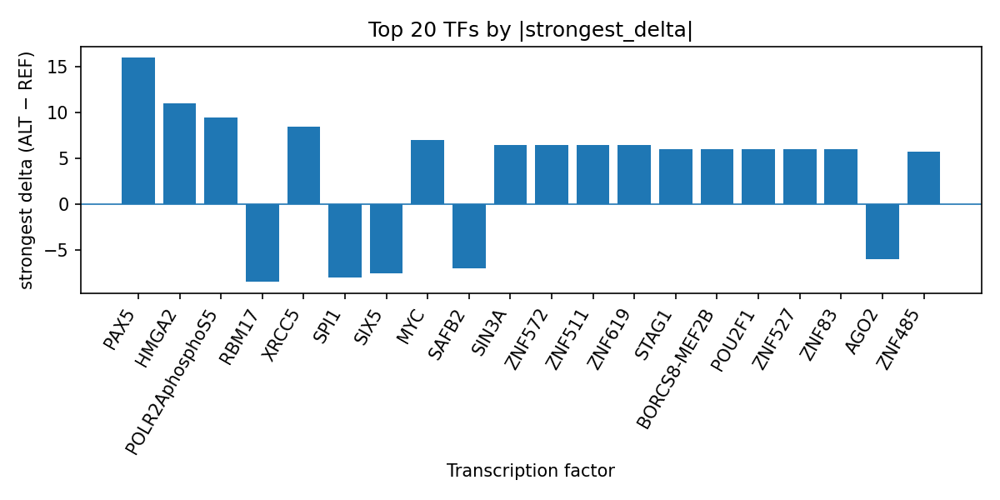

# Computational prioritization of rs74480769 for tumor necrosis factor receptor superfamily member 3 amount

*Author: snv-tf-researcher*

## Abstract

This manuscript summarizes an AlphaGenome-based computational analysis of the GWAS candidate variant rs74480769 (A>G; chr5:40972109) for tumor necrosis factor receptor superfamily member 3 amount. The variant is annotated as an intron_variant, upstream_gene_variant, and non_coding_transcript_variant, and it was selected by effect size (abs_beta = 0.85635). AlphaGenome TF ChIP-seq predictions suggest that the ALT allele may alter transcription factor binding, with the strongest promoted signals for PAX5, HMGA2, POLR2AphosphoS5, XRCC5, and MYC, and the strongest inhibited signals for RBM17, SPI1, SIX5, SAFB2, AGO2, and U2AF2. These results prioritize rs74480769 as a candidate regulatory variant for further study, but they remain computational predictions and require experimental validation.

## Introduction

Tumor necrosis factor receptor superfamily member 3 amount is the queried trait in this analysis, and the selected variant rs74480769 was provided as a GWAS candidate with a highly significant association p-value and a moderate effect-size ranking. Because the variant lies outside coding sequence annotations, sequence-based regulatory interpretation is appropriate as an initial hypothesis-generating step.

The literature provided with this run supports the broader relevance of the TNF receptor superfamily and related inflammatory signaling in human disease. Studies of the TNF/lymphotoxin receptor system in lymphoma tissue reported widespread expression of these transcripts and heterogeneity across histological subtypes [2]. Prior work also showed that lymphotoxin-beta receptor signaling recruits TRAF3 and participates in downstream cell-death and NF-κB-related signaling events [3]. In addition, leukocyte-based studies of the NF-κB pathway highlighted the utility of primary blood cell populations for ChIP and gene-expression analyses in inflammatory settings [1]. These publications do not establish a role for rs74480769, but they provide biological context for considering regulatory variation in immune-associated pathways [1-3].

## Methods

The input variant rs74480769 (chr5:40972109 A>G) was treated as a GWAS-selected candidate for tumor necrosis factor receptor superfamily member 3 amount. The variant was selected by effect size, and this prioritization does not exclude linkage disequilibrium with the true causal variant. Functional consequence annotations provided with the run identified the site as an intron_variant, upstream_gene_variant, and non_coding_transcript_variant.

The analysis used AlphaGenome TF ChIP-seq predictions, which are computational predictions rather than direct experimental measurements. Predicted ALT-versus-REF differences were summarized across transcription factor tracks, and TF-level aggregation was used to rank the strongest predicted effects. The workflow for variant retrieval, annotation, AlphaGenome prediction, summarization, literature lookup, and manuscript synthesis is shown (Figure 1).

**Figure 1.** End-to-end snv-tf-researcher workflow for this run. The pipeline retrieves the GWAS candidate, applies effect-size prioritization and sequence-context annotation, queries AlphaGenome for TF ChIP-seq prediction differences, summarizes TF-level effects, and integrates literature context for manuscript synthesis.

## Results

AlphaGenome predictions suggest that rs74480769 may alter TF ChIP-seq signal for multiple factors. The strongest promoted TF-level effects were observed for PAX5 (+16.0), HMGA2 (+11.0), POLR2AphosphoS5 (+9.5), XRCC5 (+8.5), and MYC (+7.0). The strongest inhibited TF-level effects were observed for RBM17 (-8.5), SPI1 (-8.0), SIX5 (-7.5), SAFB2 (-7.0), AGO2 (-6.0), and U2AF2 (-5.5). Additional promoted TFs included SIN3A, CTCF, CREB1, and POLR2A, and several ZNF-family factors also showed positive predicted shifts. These ranked summary values are reflected in the run output table `top_tf_effects.tsv` and the TF effect bar plot (Figure 2).

**Figure 2.** Top transcription factors at rs74480769 ranked by absolute predicted ALT-vs-REF ChIP-seq delta from AlphaGenome. Positive bars indicate predicted promotion of TF binding signal by the ALT allele, whereas negative bars indicate predicted inhibition; the plot highlights both single-track extremes and TF-level aggregation.

The strongest promoted track for PAX5 was observed in GM12878, and the strongest promoted track for HMGA2 was observed in WTC11. Among factors with multiple tracks, POLR2AphosphoS5, POLR2A, CTCF, and CREB1 each showed mixed track-level behavior but an overall positive mean effect. In contrast, SPI1 showed consistent inhibition across its four tracks, and RBM17, AGO2, and U2AF2 each had single-track negative effects.

## Discussion

This computational analysis prioritizes rs74480769 as a candidate regulatory variant for tumor necrosis factor receptor superfamily member 3 amount because the ALT allele is predicted to shift binding for a broad set of transcription factors. The presence of strong predicted effects for PAX5, MYC, POLR2A, and CTCF suggests potential involvement of regulatory architecture and transcriptional control, but these predictions do not by themselves establish mechanism or direction of gene expression change.

The literature provided for this trait offers contextual support for considering immune and TNF-family signaling biology. TNF/lymphotoxin receptor system expression has been documented in lymphoma tissues [2], and LTβ receptor signaling has been linked to TRAF3 recruitment and NF-κB/cell-death pathways [3]. Separately, the NF-κB pathway has been studied in leukocyte populations with methods relevant to chromatin-based assays [1]. Taken together, these sources are consistent with a broader regulatory and immune-signaling context, but they do not validate the specific AlphaGenome-predicted TF shifts at rs74480769 [1-3].

Experimental follow-up would be required to test whether the predicted TF binding changes are observed in relevant cellular systems and whether they relate to the trait of interest. Such validation could include allele-specific reporter assays, electrophoretic mobility shift assays, or ChIP-based experiments in appropriate cells.

## Limitations

This study is limited by its reliance on computational AlphaGenome TF ChIP-seq predictions rather than direct experimental measurements. The selected variant rs74480769 was chosen by effect size and may be in linkage disequilibrium with the true causal variant. The trait annotation also does not identify a nearest gene in the provided data, which limits locus-to-gene interpretation. Finally, the literature cited here provides only general biological context and does not establish a direct link between rs74480769 and tumor necrosis factor receptor superfamily member 3 amount.

## References

1. Reilly SJ, Odeberg J, Tornvall P. Use of the whole leucocyte population in the study of the NFκB pathway. Scand J Immunol. 2011;73(4):338-343. PMID: 21231951. doi:10.1111/j.1365-3083.2011.02517.x  
2. Warzocha K, Ribeiro P, Renard N, Bienvenu J, Charlot C, Coiffier B, et al. Expression of genes coding for the tumor necrosis factor and lymphotoxin ligand-receptor system in non-Hodgkin's lymphomas. Cancer Immunol Immunother. 2000;49(9):469-475. PMID: 11092613.  
3. VanArsdale TL, VanArsdale SL, Force WR, Walter BN, Mosialos G, Kieff E, et al. Lymphotoxin-beta receptor signaling complex: role of tumor necrosis factor receptor-associated factor 3 recruitment in cell death and activation of nuclear factor kappaB. Proc Natl Acad Sci U S A. 1997;94(6):2460-2465. PMID: 9122217.